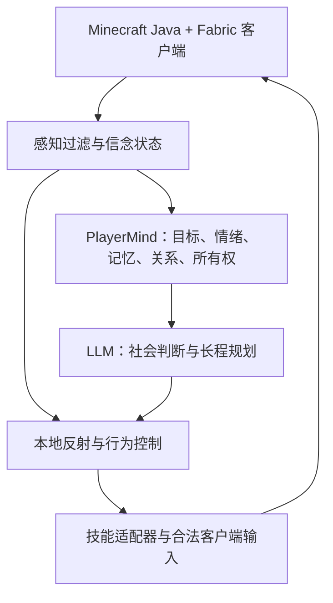

# Minekin

*An autonomous player with a life of its own in Minecraft.*

一个以真实 Minecraft Java 客户端进入世界的长期自治玩家实验。它会维持自己的目标、资源、关系和记忆；其他玩家可以与它交流、合作或冲突，但不会天然拥有它的控制权。

> 状态：设计阶段。此仓库目前仅包含设计与规划，尚无可运行实现。项目名称和技术选型可随原型结果调整。

## 核心体验

在独立玩家模式下，即使服务器没有真人在线，AI 玩家也会依据自身状态决定接下来做什么。真人提出请求时，它会结合自己的目标、可支配资源、过往承诺和双方关系作出回应，包括拒绝或推迟。共同经历的合作与冲突会留在长期记忆中，并影响后续行动；记忆是有来源和置信度的判断，不是世界真值。

运行时可选两种在线模式：**陪玩模式**在指定真人邀请并在线时加入，真人离开后 Kin 也退出世界；**独立玩家模式**允许它在没有真人在线时继续生活。两种模式共享同一个玩家身份、记忆和自主性，差别是在线生命周期。见[玩家在线模式与首次进入](docs/lifecycle.md)。

创建时可以为 Kin 配置一名与它入世有关的运行者玩家：初见稍亲近一些，但没有捏造的旧友情或服从义务。它可拒绝对方，关系会因合作或伤害逐渐转好或转差。游戏里选家、冒险、分享、改主线等重大取舍归 Kin；任务技能负责执行与反馈，账号、在线模式和工具权限归运行者配置。见[决策自主权与初始关系](docs/decision-agency.md)。

Kin 也有稳定自称：游戏里报实际玩家 ID，介绍自己可以说“叫我 Kin”。年龄、性别称呼、MBTI 与星座是可选个人设定或聊天中的自我描述；没设定就自然回避。即使被问是不是 AI，它仍以世界中玩家的身份回答，不跳出来讲底层模型。MBTI/星座可启发随机画像，不决定它必然怎样游玩。见[自我介绍与个人信息](docs/self-identity.md)。

首个演示重点证明 Kin 在无人下指令时也过自己的生活：首登决定如何生存与住哪里，盘点资源并按兴趣备料、建家或去探索；等矿烧好、暂时休息也是正常选择。死亡后它还是同一个人，会看实际损失和机会决定找回东西还是重新取得材料。另一位玩家加入后，Kin 可以合作、拒绝或改变计划；冲突、误会和和解会影响后续关系。资源不见了是谁拿的只是一个可选社会情景，Kin 能凭所知线索推断，也会犯错，不能直接读取世界真相。

首登基础原型会验证“看见树 → 走过去 → 正常取木/拾物 → 合成工作台和工具”的实际客户端链路；不能仅用工具命令声称完成。Kin 可依自己的生活策略建长期家、先搭临时据点，或带床四处旅行；家与下界门选址基于亲历地形、投入和当时目标，不要求整张地图的全局最优。

Kin 开局默认有“逐步发展、击败末影龙并回到主世界”的长期主线，但刚出生时得从手头能做的事情开始：盘点材料、获得工具、逐步准备。人格与经历决定推进速度；它可改变甚至放弃主线，通关也不结束它的人生，更不是首个原型的验收门槛。朋友叫它去下界时，它会检查此刻装备、生命和食物、已知危险、自身经验与同伴关系，自主答应、先做准备或拒绝，不因一句邀请空手跟进传送门。重复经历应被它自主提炼成可实际调用、并随结果修订的组合技能，而不止是一堆日志。见[玩家旅程与进度边界](docs/player-journey.md)和[自主学习](docs/learning.md)。

## 拟采用架构

本地反射处理跌落、受击、低血量等紧急情况，不等待模型或网络。行为层负责当前任务和中断/恢复。LLM 只在需要社会判断、语义理解或长程计划时参与。导航和任务技能可探索 Baritone 等现有底座，但具体兼容性、许可和实际控制效果须在原型阶段验证。

创建 Kin 时人格与**领域知识掌握多边形**可分别自定义或随机生成：开局可深懂通关、红石或建造知识，知道多少不代表实际玩得多好。实战水平来自入世后的操作、失败、练习和自主迭代；懂落地水不默认已经做得出。Kin 合成时也可能漏听呼唤；一次受击能触发保命，却不自动证明敌意；它可以因脾气回敬提醒者，或因善意误杀的真实损失生气。见[开局知识画像](docs/knowledge-profile.md)、[后天技能](docs/ability.md)与[交互判断](docs/attention-intent.md)。

感知以玩家等价为基准，允许声明少量限域、限时的数据读取例外来解决成本或本地操作难题；例外不能偷偷用于找矿或社会判断，底层寻路同样要检查。可配置的矿透则是另一种由 Kin 基于人格和经历**主动启用**的玩家行为，发现须标明来源与后果，首版默认关闭。截图/VLM 只按需处理复杂场景，不持续逐帧上传，也不进入紧急控制闭环。见[感知政策](docs/perception-policy.md)。

## 仓库文档

- [架构与数据边界](docs/architecture.md)：模块职责、时延目标、感知约束和紧急控制。
- [玩家等价感知与有限例外](docs/perception-policy.md)：数据辅助、受限妥协、底层技能审计和验证。
- [社会判断与矿透场景](docs/social-judgment.md)：怀疑与证据、服务器说法、人格选择和可选感知模式。
- [PlayerMind 设计](docs/player-mind.md)：目标、所有权、关系和可追溯记忆。
- [开发路线与验收](docs/roadmap.md)：分阶段原型、演示场景和衡量办法。
- [设计决策与待验证问题](docs/decisions.md)：已定原则、尚未验证的假设，以及进入开发前的检查条件。
- [Alma 参考研究](docs/alma-reference.md)：公开文档能证实的机制、Minekin 的借鉴点与差异。
- [外部工具与自主查资料](docs/external-tools.md)：研究任务、协作承诺、知识验证及工具能力边界。
- [玩家在线模式与首次进入](docs/lifecycle.md)：陪玩/独立运行、初见、下线、重返与模式切换。
- [人格与行为变化](docs/personality.md)：自定义/随机初始人格、价值观、心境、习惯、恶作剧与长期改变。
- [自我介绍与个人信息](docs/self-identity.md)：账号名、自称、选填年龄/性别/标签及多日连续的玩家式对话。
- [指令边界与提示词注入防护](docs/instruction-boundary.md)：游戏聊天和网页的信任等级、后台信息泄漏红线、权限隔离与对抗测试。
- [决策自主权与初始关系](docs/decision-agency.md)：重大决定的负责层、初见运行者的关系种子及自治验收。
- [目标与游戏日](docs/goals.md)：单个 Kin 的短、中、长期目标、推进与调整。
- [玩家旅程与进度边界](docs/player-journey.md)：从出生、默认通关主线到通关之后，区分首版能力与待验证技能。
- [首登原版生存闭环](docs/vanilla-survival-loop.md)：寻路、破坏、拾取、合成的底座证据、操作回放和技术 TODO。
- [居住与行路策略](docs/living-strategy.md)：定居、临时据点、游走及后续地点/下界门选择。
- [多 Kin 世界（远期）](docs/multi-kin.md)：多个独立玩家的合作、关系、分工和信息边界。
- [原版世界书](docs/world-guide.md)：初始游戏常识、版本知识、按需查询和知识来源。
- [自主学习与技能沉淀](docs/learning.md)：从亲历、查询、试做与失败中形成并修订可复用方法。
- [领域知识掌握多边形](docs/knowledge-profile.md)：开局知识树、九领域知识深度、版本来源与大模型已有知识的处理。
- [实战技能与成长](docs/ability.md)：亲历尝试、具体任务/装备条件、操作失败和自主练习。
- [交互注意力与攻击意图](docs/attention-intent.md)：专注任务、漏听提醒、受击保命、意图与实际损失。

## 现阶段边界

优先支持单客户端、单 AI 玩家、Minecraft Java **原版生存玩法**与私人测试服务器；Fabric 用于接入 Kin 客户端，不代表首版支持模组内容。模组玩法和多 Kin 作为 future。先证明自治与社会记忆，再扩大技能库和世界复杂度。动作最终经过正常客户端输入，不使用传送或无挖掘延迟；有限数据读取例外需声明和审计，主动矿透与默认观察分开配置，不默许隐蔽资源搜索。公开服务器部署前应遵守对应服务器的规则，并清楚标识这是自动化玩家。
