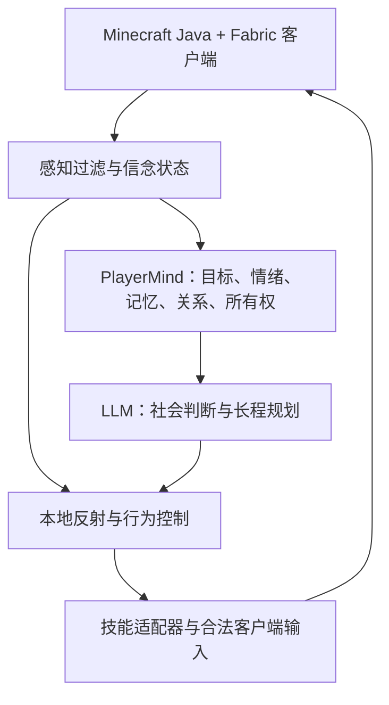

# Minekin

*An autonomous player with a life of its own in Minecraft.*

一个以真实 Minecraft Java 客户端进入世界的长期自治玩家实验。它会维持自己的目标、资源、关系和记忆；其他玩家可以与它交流、合作或冲突，但不会天然拥有它的控制权。

> 状态：设计阶段。此仓库目前仅包含设计与规划，尚无可运行实现。项目名称和技术选型可随原型结果调整。

## 核心体验

在独立玩家模式下，即使服务器没有真人在线，AI 玩家也会依据自身状态决定接下来做什么。真人提出请求时，它会结合自己的目标、可支配资源、过往承诺和双方关系作出回应，包括拒绝或推迟。共同经历的合作与冲突会留在长期记忆中，并影响后续行动；记忆是有来源和置信度的判断，不是世界真值。

运行时可选两种在线模式：**陪玩模式**在指定真人邀请并在线时加入，真人离开后 Kin 也退出世界；**独立玩家模式**允许它在没有真人在线时继续生活。两种模式共享同一个玩家身份、记忆和自主性，差别是在线生命周期。见[玩家在线模式与首次进入](docs/lifecycle.md)。

首个演示围绕自主目标、所有权、关系、长期记忆、情绪与拒绝。目标是在一个可控的私人测试世界里展示：共同建家 → 私人资源不见了，AI 难过并调查 → 根据可观察的线索判断发生了什么，而不是凭空知道是谁拿的 → 选择索回、改变共享边界或放弃 → 新经历影响后续信任。单独运行时，它也应主动开展生存或建造任务。

## 拟采用架构

本地反射处理跌落、受击、低血量等紧急情况，不等待模型或网络。行为层负责当前任务和中断/恢复。LLM 只在需要社会判断、语义理解或长程计划时参与。导航和任务技能可探索 Baritone 等现有底座，但具体兼容性、许可和实际控制效果须在原型阶段验证。

感知以玩家等价为基准，允许声明少量限域、限时的数据读取例外来解决成本或本地操作难题；例外不能偷偷用于找矿或社会判断，底层寻路同样要检查。截图/VLM 只按需处理复杂场景，不持续逐帧上传，也不进入紧急控制闭环。见[感知政策](docs/perception-policy.md)。

## 仓库文档

- [架构与数据边界](docs/architecture.md)：模块职责、时延目标、感知约束和紧急控制。
- [玩家等价感知与有限例外](docs/perception-policy.md)：数据辅助、受限妥协、底层技能审计和验证。
- [PlayerMind 设计](docs/player-mind.md)：目标、所有权、关系和可追溯记忆。
- [开发路线与验收](docs/roadmap.md)：分阶段原型、演示场景和衡量办法。
- [设计决策与待验证问题](docs/decisions.md)：已定原则、尚未验证的假设，以及进入开发前的检查条件。
- [Alma 参考研究](docs/alma-reference.md)：公开文档能证实的机制、Minekin 的借鉴点与差异。
- [外部工具与自主查资料](docs/external-tools.md)：研究任务、协作承诺、知识验证及工具能力边界。
- [玩家在线模式与首次进入](docs/lifecycle.md)：陪玩/独立运行、初见、下线、重返与模式切换。
- [人格与行为变化](docs/personality.md)：自定义/随机初始人格、价值观、心境、习惯、恶作剧与长期改变。
- [目标与游戏日](docs/goals.md)：单个 Kin 的短、中、长期目标、推进与调整。
- [多 Kin 世界（远期）](docs/multi-kin.md)：多个独立玩家的合作、关系、分工和信息边界。
- [原版世界书](docs/world-guide.md)：初始游戏常识、版本知识、按需查询和知识来源。
- [自主学习与技能沉淀](docs/learning.md)：从亲历、查询、试做与失败中形成并修订可复用方法。

## 现阶段边界

优先支持单客户端、单 AI 玩家、Minecraft Java **原版生存玩法**与私人测试服务器；Fabric 用于接入 Kin 客户端，不代表首版支持模组内容。模组玩法和多 Kin 作为 future。先证明自治与社会记忆，再扩大技能库和世界复杂度。动作最终经过正常客户端输入，不使用传送或无挖掘延迟；有限数据读取例外需声明和审计，不默许未观察世界的资源搜索。公开服务器部署前应遵守对应服务器的规则，并清楚标识这是自动化玩家。
