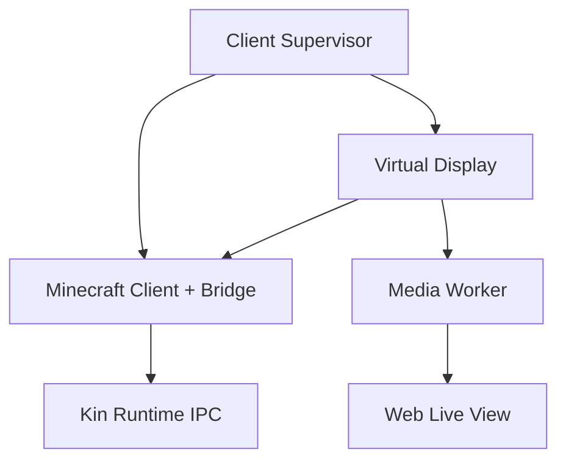

# Linux 无窗口真实客户端、渲染与 Live View 契约

研究时间：2026-09-16。本文件定义 Linux 服务器上“没有前台游戏窗口，但仍运行真实 Minecraft Java Client”的实现边界，以及 Dashboard 第一人称观战如何与 Kin 的控制/感知彻底分离。

## 关键定义

- **无前台窗口**：运行者不需要桌面会话、启动器 UI 或可交互游戏窗口。
- **真实客户端**：仍运行 Minecraft client、render thread、GLFW/OpenGL、客户端网络/GUI/输入状态和 Thin Bridge。
- **Live View**：给人类观察的旁路媒体输出，不是 Kin 的默认视觉输入，也不授予浏览器逐帧遥控能力。
- **headless profile**：一组经测试的虚拟显示、renderer、分辨率、帧率和捕获配置；不是简单设置 `java.awt.headless=true`。

因此首版不采用把 LWJGL 函数全部 stub 掉或删除渲染的路线。HeadlessMc 证明命令行启动、LWJGL patch、版本相关优化 Mod 和 Xvfb 等路线确实存在，但它的 stub/dummy-assets 路线会削弱真实画面与观战依据，不能直接成为 Minekin 的默认身体。可借鉴其 launcher/测试经验，须单独审许可和代码边界。

## 首版基线

首要候选是：**虚拟 X11 显示 + 隐藏/无装饰的正常 Minecraft 窗口 + 正常 OpenGL 渲染 + 独立媒体捕获进程**。

GLFW 官方文档说明 windowed window 可以创建为不可见，并提供 Native、EGL、OSMesa context creation API；同时明确这些 API 是硬约束且 Linux/X11 混用 native 与 EGL 可能崩溃。它只能支持候选方向，不能证明 Minecraft/LWJGL 在目标驱动和版本上稳定。因此执行顺序为：

1. 用虚拟显示跑通完整客户端与 Bridge；
2. 在同一版本上分别测 Mesa 软件渲染与 GPU 透传；
3. 只有证据显示收益明显，才评估 EGL/OSMesa 或更深离屏改造；
4. 任一路线都必须保留与人类实际看到相符的帧，不能一边删除渲染一边声称有真实第一人称观战。

## 渲染执行档

| 档位 | 用途 | 优点 | 主要风险 |
| --- | --- | --- | --- |
| `x11-software` | 无 GPU 的 CI/低并发服务器基线 | 部署普遍、易复现；Mesa llvmpipe 是多线程软件光栅器 | 高 CPU、帧抖动可能抢占 tick/反射，机器密度低 |
| `x11-gpu` | 有 GPU 的长期运行候选 | 降低软件光栅 CPU；可配硬件编码 | 驱动/宿主依赖、容器设备与安全面、不同 GPU 行为差异 |
| `egl-experimental` | 后续更彻底的离屏候选 | 可能减少 display server 依赖 | Minecraft/LWJGL/Mod 兼容和帧捕获未证实 |
| `osmesa-experimental` | 测试性 CPU 离屏 | GLFW 有 API 且可直接取 framebuffer | OSMesa swap 不更新窗口内容；游戏兼容、性能与观战链路未知 |

Mesa 官方文档把 llvmpipe定义为使用 LLVM JIT、能利用多核的 software rasterizer；这不等于性能足以长期跑 Minecraft。NVIDIA Container Toolkit 文档区分 `graphics`（OpenGL/EGL/Vulkan）与 `display`（X11/Wayland）能力，说明 GPU 容器必须显式暴露最小所需能力，不能默认把整块设备和全部 driver capabilities 给所有进程。

## 进程与故障隔离

- Minecraft/Bridge、Media Worker、Gateway/Dashboard 至少是不同进程；生产部署优先分容器或分 uid。
- Client Supervisor 独占启动、信号、资源限制和 session generation；Media Worker 没有游戏输入 lease。
- Dashboard 关闭、WebRTC/编码器故障或慢客户端只会停止/降级媒体，不影响 Bridge 本地反射和现有身体动作。
- Runtime/Bridge 失联则由 Bridge 本地进入安全动作、松开租约输入并阻断新高层意图；视频正常不能掩盖控制面失联。
- 虚拟显示死亡属于客户端图形故障，Supervisor 保存诊断后结束该 session，不让客户端在无有效渲染上下文中假装 PLAYABLE。

## 资源与调度预算

每个 headless profile 要冻结并测量：

- framebuffer 尺寸、GUI scale、FOV、渲染距离、实体距离、粒子与帧率上限；
- CPU quota/affinity、内存上限、GPU/VRAM、磁盘和网络；
- client tick、render frame、Bridge reflex、媒体 capture/encode 的 P50/P95/P99 延迟；
- 当编码或渲染占满资源时，`event_to_input_ticks` 是否恶化；
- 无观众时是否暂停编码但保持客户端正常渲染；
- 降级顺序：降低媒体 FPS/码率 → 降低观战分辨率 → 停止媒体。不得先降低本地反射优先级。

首版推荐保留一个小而稳定的渲染基线，例如固定分辨率和帧率上限；具体数值只能由原型测出，不在文档中假装已有最优值。

## Live View 管线

FFmpeg 官方 `x11grab` 能捕获 X11 display 或指定 window，是首个验证候选；KMS capture 需要更高设备权限，不作为默认。媒体链路建议分两阶段：

1. 原型：从虚拟显示/指定 window 捕获，编码为受控的低延迟流，记录端到端延迟、CPU/GPU 与掉帧；
2. 产品候选：浏览器用 WebRTC 观战，Gateway 只签发短期观看授权，媒体服务独立做编码/中继。

必须满足：

- 观战默认关闭录制；用户明确开启时记录谁、何时、保留多久，并过滤聊天/服务器地址等隐私字段的导出；
- 同一个 session 只捕获其窗口/display，不采集宿主桌面或其他 Kin；
- 观看 token 短期、单用途、可撤销；远程 Dashboard 需要 TLS、登录与 CSRF/origin 检查；
- 视频帧不进入 LLM、embedding、长期记忆或网页研究请求；若将来配置一次性视觉任务，须走另一个显式、限帧、限字段、计费的感知审批路径；
- 浏览器播放控制（暂停、音量、清晰度）只影响媒体，不映射为游戏按键。紧急停止通过管理 API 使 Supervisor 撤销 lease，而不是 WebRTC data channel 直达客户端。

## 画面真实性

Live View 的画面必须来自本 session 的实际 framebuffer，并能与 Bridge 时间线关联：

- 帧元数据只附 session id、generation、capture timestamp、frame sequence 和展示尺寸；
- 不在画面上伪造 Kin “看见”的目标框。Dashboard 可以另层显示调试 overlay，但需明确标为系统观察，且不能回写人物信念；
- HUD、GUI、受伤、死亡、暂停菜单、资源包提示和断线画面都应可见；只有完整链路测试后才能声称观战等价于真实客户端视角；
- 图形关闭、窗口未映射、黑帧或卡帧时 Dashboard 要显示媒体状态，不能重复最后一帧伪装为实时。

## Linux 安全基线

- 默认 rootless/非 root 容器或专用系统用户；只读 bundle，session overlay 可写，secrets 单独挂载；
- 禁止 privileged、host PID、host network 和无界 `/dev` 透传；GPU 只暴露选定设备及必要 `graphics/display/video/utility` 能力；
- 虚拟显示仅监听本地 Unix socket，不开放未鉴权 TCP；每 session 独立 display/cookie；
- Media Worker 只读其显示/帧源和短期发布凭据，拿不到 Minecraft refresh token、Kin 记忆库、工具密钥或游戏输入 IPC；
- crash/core dump 默认禁用或加密隔离；诊断包先做 secrets/路径/聊天隐私审查。

## 原型矩阵

首个 1.21.4 bundle 至少测试：

| 维度 | 样本 |
| --- | --- |
| 图形 | X11 virtual display + llvmpipe；X11 + 一种受支持 GPU |
| 负载 | 无观众、单观众、慢网络观众、编码器崩溃、Dashboard 关闭 |
| 游戏 | 主菜单、入服、移动/转视角、GUI 合成、受击反射、死亡、断线、资源包提示 |
| 资源 | CPU/内存压力、GPU 重置候选、磁盘满、display 死亡 |
| 媒体 | 黑帧/卡帧检测、窗口重建、分辨率变化、端到端延迟、带宽与掉帧 |
| 隔离 | 跨 session 捕获、浏览器直控、视频误送 VLM、token/聊天进入日志与录制 |

通过条件不是“能看到一次画面”，而是：真实客户端保持 PLAYABLE；媒体失败时本地反射时延不明显越界；没有跨 session 采集或默认视觉调用；软件/GPU 档的资源成本有实测分布；失败能解释并安全结束。

## 待原型选择

- 虚拟显示首选 Xvfb、Xorg dummy 还是 Wayland compositor；
- 采集首版使用 FFmpeg x11grab、PipeWire 还是 Bridge framebuffer tap；
- 编码器与 WebRTC server/gateway 的具体库；
- GPU 供应商与无 GPU 平台的正式支持等级；
- 是否保留音频。音频也可能包含聊天/环境隐私，默认可不做首版。

