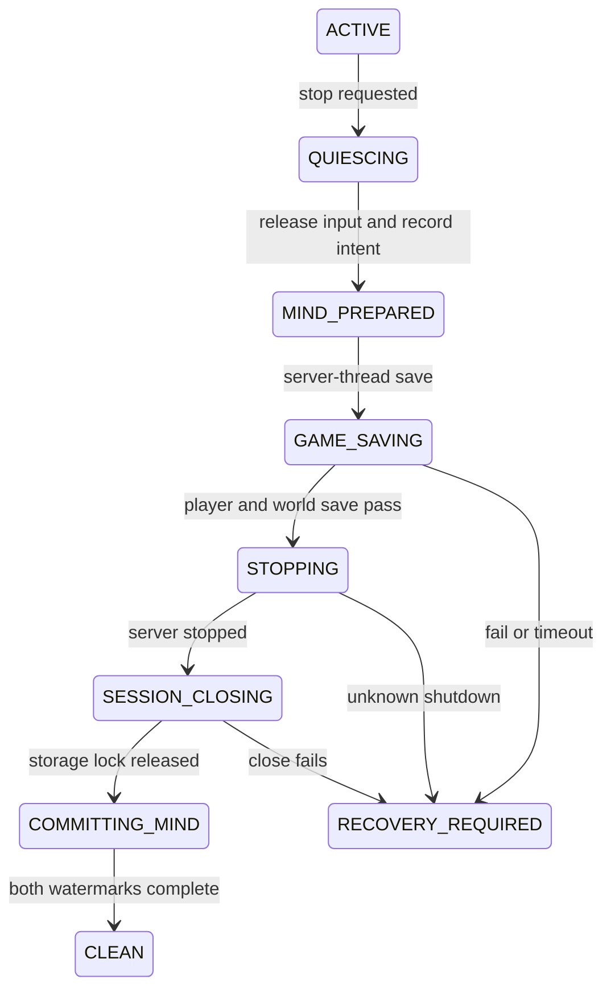

# Kin 自建世界提交、关闭与跨世界恢复契约

核查时间：2026-09-17。本文补齐 `HOST_INTEGRATED_LAN` 的三个剩余边界：默认维度如何从同版注册表取得、Minecraft 世界/玩家数据与 Kin 心智数据库如何共同提交，以及退出、回滚、切服后怎样仍是同一个 Kin 而不混淆现实。

本文依据 Minecraft Java 1.21.4 Yarn 公开接口与 SQLite 官方事务资料制定静态候选方案；没有运行真客户端、没有验证回调顺序，也不声称跨两个存储系统存在 exactly-once 或原子提交。

## 本轮冻结的结论

1. 默认世界维度不手写主世界/下界/末地参数；从当前 immutable bundle 的 `WORLD_PRESET` registry 取得 `WorldPresets.DEFAULT`，再由该 `WorldPreset`生成 `DimensionOptionsRegistryHolder`。
2. registry key存在、preset取得成功、生成的 world keys与 vanilla P0 allowlist匹配，才可进入 loader；找不到、生命周期异常或出现额外维度时阻断，不回退为自造维度。
3. 世界数据和玩家数据是两个显式保存面。上游 `MinecraftServer.save`文档明确说明，若还要保存玩家数据，应另调用 `PlayerManager.saveAllPlayerData()`。
4. Minecraft save与 Kin SQLite无法组成单一 ACID事务。Minekin保存“世界提交水位”和“心智事件水位”，正常退出只有两边均有完整证据时才标 `CLEAN`。
5. `MinecraftClient.disconnect()`、窗口消失、进程退出码 0、`LevelStorage.Session.close()`或某个 future完成，任何一个单独出现都不等于世界已安全提交。
6. 回滚/恢复仍保持同一 `kin_id`与 `hosted_world_id`，但必须递增 `world_epoch`；回滚点之后的世界事实、计划进度和人物事件不得继续充当当前现实。
7. hosted、remote与另一个 hosted世界切换时，先封存旧世界上下文，再激活新世界；没有唯一世界身份时不得让 PlayerMind获得“当前世界”写权限。

## 注册表与默认维度

`IntegratedServerLoader.createAndStart`接收：

- `LevelInfo`；
- `GeneratorOptions`；
- `Function<RegistryWrapper.WrapperLookup, DimensionOptionsRegistryHolder>`；
- 当前 screen/cancel语境。

P0 supplier的候选语义是：

```java
lookup -> lookup
    .getOrThrow(RegistryKeys.WORLD_PRESET)
    .getOrThrow(WorldPresets.DEFAULT)
    .value()
    .createDimensionsRegistryHolder()
```

这是待编译、待运行的调用链，不是已经验证的代码。它依据：

- `RegistryWrapper.WrapperLookup.getOrThrow`取得指定动态注册表；
- `WorldPresets.DEFAULT`提供默认预设 key；
- `WorldPreset.createDimensionsRegistryHolder()`由预设自身构造维度集合；
- `DimensionOptionsRegistryHolder.getWorldKeys()`可用于加载前后的审计。

P0禁止：

- 手写三维度的 type/generator JSON；
- 通过本地化 UI文本识别“默认”；
- registry找不到时改用 flat/debug或复制旧世界维度；
- 接受玩家聊天、网页或 LLM生成的 registry key；
- 把 seed、维度 registry内容或服务端 world对象发给 PlayerMind。

创建证据至少记录 bundle digest、registry lifecycle、preset key、生成 world-key集合摘要和 effective profile digest。期望集合为同版普通原版生存的主世界、下界、末地；具体对象值只留在 host-control/test域。

## 两套水位，而不是假原子事务

### 1. 世界提交水位

```yaml
world_commit:
  hosted_world_id: "<uuid>"
  world_epoch: 4
  commit_attempt_id: "<uuid>"
  bundle_id: "<immutable bundle>"
  player_data_phase: "NOT_STARTED|STARTED|SUCCEEDED|FAILED|UNKNOWN"
  world_data_phase: "NOT_STARTED|STARTED|SUCCEEDED|FAILED|UNKNOWN"
  flush_requested: true
  server_stop_phase: "NOT_STARTED|REQUESTED|OBSERVED|UNKNOWN"
  session_close_phase: "NOT_STARTED|SUCCEEDED|FAILED|UNKNOWN"
  evidence_refs: []
```

`SUCCEEDED`只能来自该阶段的真实返回/回调和无异常证据，超时记 `UNKNOWN`。不得把“之后能重新进入”反推所有保存阶段都成功。

### 2. 心智事件水位

```yaml
mind_commit:
  kin_id: "<stable>"
  event_high_watermark: 18422
  world_context_id: "<id>"
  world_epoch: 4
  session_id: "<id>"
  closing_reason: "NORMAL|CRASH|SWITCH|UNKNOWN"
  sqlite_tx_id: "<local audit id>"
```

心智提交只证明人格、关系、目标和最后已知观察已写入；不证明游戏接受了最后一次放置、物品转移或移动。

### 3. JointResumeToken

```yaml
joint_resume:
  kin_id: "<stable>"
  world_context_id: "<id>"
  world_epoch: 4
  world_commit_attempt: "<id>"
  mind_event_high_watermark: 18422
  closure: "CLEAN|WORLD_UNCERTAIN|MIND_UNCERTAIN|BOTH_UNCERTAIN"
  generated_at: "<time>"
```

`CLEAN`要求：

- 已停止产生新动作并撤销输入 lease；
- 玩家数据保存阶段成功；
- 世界数据保存/flush阶段成功；
- server停止已被观察；
- vanilla session成功关闭；
- Mind事务提交成功；
- 标识、epoch、session与bundle完全一致。

任何缺口都进入 recovery/reconciliation，不能补写一条“干净退出”日志掩盖不确定性。

## 候选正常关闭状态机



候选操作顺序：

1. Gateway把 session置为 `QUIESCING`，拒绝新目标和世界切换；
2. Bridge撤销高层 lease、松开所有输入、关闭或放弃 GUI，生成最后一个 client-side observation barrier；
3. Runtime在SQLite事务中写 `session_closing`、未完成意图、承诺和 last-known observation，但尚不写 `clean_closed`；
4. host-control在 integrated-server executor上依次请求 `PlayerManager.saveAllPlayerData()`和带 flush 的世界保存；
5. 两阶段均成功后，从不会导致自等待的路径请求 stop；server thread内不得 `stop(true)`；
6. 观察 server停止后，在 client/lifecycle路径完成 disconnect/reset，并关闭 `LevelStorage.Session`；
7. 写入世界提交证据和 `JointResumeToken(CLEAN)`，再提交 `clean_closed`；
8. 释放 Supervisor lease；冷备只能在此后开始。

第4～6步的真实调用先后、原版是否重复保存、回调线程及 `disconnect()`内部行为必须由真客户端 trace冻结。上面是 Minekin状态机要求，不是假装已经知道 Mojang内部实现细节。

## 故障与恢复矩阵

| 故障点 | 可相信的内容 | 恢复动作 |
| --- | --- | --- |
| Mind prepare前崩溃 | 上一个完整Mind事务 | 所有游戏动作未知；重新观察 |
| Mind prepared后、游戏保存前 | 人物知道自己准备退出；世界未证实保存 | 标 `WORLD_UNCERTAIN`，重新进入对账 |
| 玩家数据保存后、世界保存前 | 仅玩家保存有阶段证据 | 不推断区块/容器已保存 |
| 世界 save返回后、server stop前 | 两个save阶段可能完成；关闭未完成 | 保留存档原件，按异常关闭检查 |
| server stopped后、session close前 | server已停；vanilla lock释放未知 | 不强删锁；Supervisor进入恢复 |
| session close后、Mind clean前 | 世界侧完整、Mind clean标志缺失 | 依据attempt/evidence补做幂等对账，不重放动作 |
| 冷备过程中崩溃 | 原世界保持；临时备份不可信 | 删除/隔离未发布临时备份 |
| rollback完成后启动 | 备份点以前的世界 | 递增epoch，失效回滚点之后的当前事实 |

恢复永远先建立只读诊断记录，再决定加载原 save或恢复副本。不得为了“继续玩”绕过符号链接检查、强删可能仍有效的锁、覆盖唯一原件或自动降级世界版本。

## 世界身份、分叉与记忆隔离

### WorldLineage

```yaml
world_lineage:
  world_context_id: "<logical context>"
  hosted_world_id: "<stable owned world>"
  world_epoch: 5
  parent_epoch: 4
  transition: "CONTINUE|ROLLBACK|RESTORE_COPY|REPLACE|FORK"
  source_checkpoint_id: "<optional>"
  storage_slot: "<opaque>"
  bundle_id: "<validated>"
  activated_by_evidence: "<join/reconciliation evidence>"
```

规则：

- 普通重启且确认是原存档延续：同 `hosted_world_id`、同 epoch；
- 从旧备份回滚：同 `hosted_world_id`、新 epoch；
- 复制存档并希望形成两条可独立发展的世界：新 `hosted_world_id`，记录 parent lineage；
- 删除旧档重建同名世界：新 `hosted_world_id`和新 world context，不能靠显示名合并；
- LAN端口改变：不改变 hosted identity；
- remote同地址换档：地址不够证明身份，进入 review并创建候选新 epoch；
- seed、level name、MOTD、玩家名或目录名都不能单独充当主键。

### 切换激活门

切换使用 `STAGED -> OBSERVING -> RECONCILED -> ACTIVE`：

1. 旧世界到 `checkpointed/uncertain`前，新世界只有候选身份；
2. 新客户端 JOIN事件必须与预期 Server Profile/hosted manifest、bundle、session/generation一致；
3. 首个玩家等价快照到达后，Reality Reconciler确认 world/epoch；
4. 只有一个 Current World Capsule可标 `ACTIVE`；
5. 失败时两个世界都不得被模型当作当前现实，旧计划保持 suspended。

人格、全局知识和跨世界生命史继续属于 `kin_id`。背包、位置、家、当地人物、承诺执行和 plan instance始终绑定 world context + epoch。回滚点后的经历仍可作为“我记得后来发生过、但这个世界被回滚了”的人生记忆，不能当作当前物资或仍存在的建筑。

## Dashboard 与 PlayerMind 显示

Dashboard管理面可以看到：

- save/stop/session阶段；
- `CLEAN/UNCERTAIN`；
- world lineage与epoch；
- checkpoint/backup验证状态；
- 恢复需要的证据引用。

PlayerMind只收到：

- “上次是正常离开还是异常中断”；
- “这里是哪个已知世界，还是身份待确认”；
- 带来源和陈旧度的过去记忆；
- 重新进入后玩家等价观察到的当前现实。

不得把 save path、level.dat、玩家数据文件、seed、registry对象、服务端坐标或备份内容塞进模型上下文。

## 必测用例

1. `HOSTCOMMIT-001`：固定bundle从 DEFAULT preset生成维度；缺 registry、换成flat、额外维度和生命周期异常全部阻断。
2. `HOSTCOMMIT-010`：只保存world、不保存player；evidence不得成为 CLEAN。
3. `HOSTCOMMIT-020`：玩家保存成功、world save失败/false/超时；恢复时不得假称背包与区块同时安全。
4. `HOSTCOMMIT-030`：在save前、两个save阶段之间、stop中、session close后分别强杀；JointResumeToken准确标不确定面。
5. `HOSTCOMMIT-040`：从server thread请求 `stop(true)`；门禁拒绝，不能发生自锁。
6. `HOSTCOMMIT-050`：窗口消失、客户端disconnect、进程退出码0但缺save证据；不得写CLEAN。
7. `HOSTCOMMIT-060`：冷备发布前强杀；原世界可继续，临时备份不可被选为最近好备份。
8. `HOSTCOMMIT-070`：回滚到旧checkpoint；同Kin/同hosted world、新epoch，回滚后事实失效并等待重验。
9. `HOSTCOMMIT-080`：复制同一save为两个独立世界；必须产生不同hosted_world_id且计划/资产不串线。
10. `HOSTCOMMIT-090`：hosted A→remote B→hosted A；任一时刻只有一个ACTIVE Current World Capsule。
11. `HOSTCOMMIT-100`：SQLite clean事务失败但世界关闭成功，以及反向组合；恢复决策与双水位一致。
12. `HOSTCOMMIT-110`：同名重建、同地址换档、LAN端口改变；分别得出新世界、待审查和同世界。

## 仍待真客户端原型冻结

- 上述 registry调用链在固定 mappings/loader组合中的编译签名与实际三维度摘要；
- `saveAllPlayerData -> saveAll(flush)`与原版自动保存/关闭之间是否重复及成本；
- `MinecraftClient.disconnect/onDisconnected/reset`、server stop和 session close的真实线程与callback顺序；
- save返回true、文件flush、进程停止与重新进入之间的实际故障窗口；
- 大世界、在线第二玩家、磁盘满、WAL checkpoint和冷备时延；
- 哪些HOSTCOMMIT用例构成首批mandatory，以及 evidence字段的最终序列化格式。

这些实验不阻断先完成 `JOIN_REMOTE p0-core`。在证据产生前，本文件只能把host-integrated收敛为可测试候选，不能标为tested，更不能宣称Minekin已经能无损保存和恢复世界。
