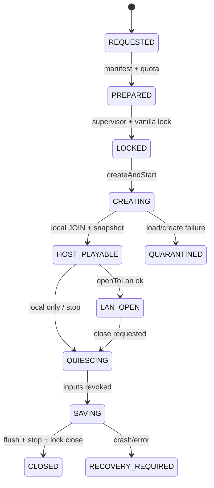

# Kin 自建世界的创建、存储、保存与恢复契约

核查时间：2026-09-17。本文把 `HOST_INTEGRATED_LAN`从产品模式收敛为 Minecraft Java 1.21.4 的实现边界：如何创建/加载 Kin-owned save、取得单写锁、启动 integrated server、开放 LAN、安全保存、备份和崩溃恢复。

所有结论目前来自同版公开接口与工程约束，不表示 Minekin 已创建存档、生成区块、开放端口、保存成功或完成恢复。

创建参数的三层合成、client/server线程交接及同 JVM 服务端真值门禁已拆到[自建世界控制边界契约](hosted-world-control-boundary-contract.md)；玩家/世界数据双保存、Mind双水位、回滚分叉与跨世界恢复见[提交与恢复契约](hosted-world-commit-recovery-contract.md)。本文仍负责存储与恢复状态机。

## P0-host 决定

1. 使用 1.21.4 原生 `IntegratedServerLoader`与 `LevelStorage`管线，不以鼠标宏点击“创建世界”作为权威实现。
2. Hosted World Store 完全位于 Minekin data root，宿主 `.minecraft/saves`永不读取、导入或覆盖。
3. 每个 hosted world 同时持有 Minekin Supervisor lease 与 vanilla `LevelStorage.Session`/session lock；任一锁不成立都不得启动。
4. P0-host 只允许同版本、同 `p0-core` bundle 重新进入；自动升级、降级、导入旧世界和第三方 datapack 后置。
5. 默认 `cheatsAllowed=false`；LAN 开放失败不等于本地世界启动失败，必须分别报告。
6. P0 备份只在 integrated server 已完成 flush 并关闭后制作；不宣称支持一致的在线热备。
7. save path、seed、区块/实体真值、连接玩家后台清单属于管理/测试数据，不自动进入 Kin 的 PlayerMind。
8. `host-integrated`独立晋级，不能借 `JOIN_REMOTE p0-core`的证据标记 tested。

## 已核对的 1.21.4 接口

| 同版接口 | 可支持的实现判断 | 不能据此声称 |
| --- | --- | --- |
| `IntegratedServerLoader.createAndStart(...)` | 有正式的新世界创建并启动入口，参数包含 level name、LevelInfo、GeneratorOptions 和维度供应器 | Minekin 已经正确生成所有创建参数或跳过了原版警告 |
| `IntegratedServerLoader.start(name, onCancel)` | 有按存档名加载现有世界的入口 | 任意旧版/损坏/带模组世界必然可加载 |
| loader 的 backup prompt、pack failure、safe-mode相关分支 | 原版加载会处理兼容/备份/资源包失败，不能只等一个“已进入”布尔值 | 无 UI 场景下所有提示都已自动安全处理 |
| `LevelStorage.createSession(name)` | 创建 session并可能抛 IOException 或 SymlinkValidationException | 路径规范化、配额和 Minekin 外层权限已自动解决 |
| `createSessionWithoutSymlinkCheck` | 上游确实存在绕过符号链接检查的入口 | Minekin 可以为了方便使用；P0 明确禁止 |
| `SessionLock.create/isLocked/isValid/close` | vanilla 层有文件锁与有效性判断 | 只凭遗留的 `session.lock`文件就能判断进程仍活着 |
| `IntegratedServer.saveAll(suppressLogs, flush, force)` | integrated server 提供显式全量保存/flush候选 | 任意参数组合和并发时点都已验证安全 |
| `LevelStorage.Session.createBackup()`、`close()`、`tryRestoreBackup()` | session 提供备份、关闭和备份恢复候选 | 在线热备、自动修复或恢复后游戏语义无损 |
| `IntegratedServer.openToLan(gameMode, cheatsAllowed, port)` | 本地 integrated server可按端口开放 LAN并返回成功/失败 | 端口已安全绑定、可公网访问或玩家身份已可信 |

## HostedWorldManifest

管理层为每个 Kin-owned save保存独立 manifest；它不写进 LLM prompt：

```yaml
schema: minekin.hosted-world.v1
hosted_world_id: "<uuid>"
kin_id: "<owner kin>"
display_name: "<dashboard label>"
storage_slot: "<opaque safe directory name>"
created_at: "<time>"
created_by:
  kind: "kin_decision|operator_config"
  evidence_ref: "<event/config revision>"
bundle:
  minecraft: "1.21.4"
  bundle_id: "<immutable p0-core>"
  bridge_digest: "<sha256>"
world:
  epoch: 1
  level_name: "<validated vanilla name>"
  creation_profile_digest: "<difficulty/gamemode/generator/options>"
  detected_data_version: "<observed after first save>"
  seed_policy: "random|explicit"
  seed_secret_ref: "<optional management-only ref>"
storage:
  save_root: "<canonical path under data root>"
  quota_bytes: "<configured>"
  last_clean_checkpoint: "<ref>"
  last_backup: "<ref>"
status:
  state: "CREATED|ACTIVE|CLOSED|RECOVERY_REQUIRED|QUARANTINED"
  last_close_reason: "<code>"
```

`storage_slot`由系统生成，不直接使用聊天给出的名称或显示名。seed 即使由 Kin 选择，也不能默认变成实时导航/找结构工具输入；PlayerMind 只获得按感知政策允许的知识。

## 目录与挂载

概念布局：

```text
minekin-data/
  artifacts/                  # 内容寻址，只读
  bundles/                    # 不可变 p0-core
  kin/<kin_id>/
    mind/                     # Minecraft JVM 不可见
    client-profiles/
    hosted-worlds/
      <hosted_world_id>/
        manifest.yaml
        save/                 # 唯一权威存档
        checkpoints/
        backups/
    sessions/
      <session_id>/           # 日志、crash、IPC与临时文件
```

Minecraft 期望通过 `LevelStorage`访问 saves root。P0 必须选一种可验证布局：

- 为当前 hosted world 创建专用 managed run directory，使其 `saves/<storage_slot>`就是持久 save；或
- 在隔离容器中把 Hosted World Store 以受控 bind mount挂到 run directory 的 saves slot。

不使用 filesystem symlink拼接世界目录，不调用 `createSessionWithoutSymlinkCheck`。Windows/Linux 的最终挂载策略在原型比较后冻结；无论哪种都需验证 canonical path仍位于该 `kin_id/hosted_world_id`根内。

Remote join session 不挂载 hosted-worlds。Minecraft 进程不能看到其他 Kin、其他 hosted world或 Mind/Memory目录。

## 创建状态机



创建前：

1. 校验 world profile、磁盘配额、bundle 和 Minekin data-root 路径；
2. 建 staging manifest，不先声称 world存在；
3. 获取 Supervisor lease，拒绝第二个 client/session；
4. 通过带 symlink validation 的 `LevelStorage.createSession`获取 vanilla session；
5. 在 client thread调用受控 adapter；异步 loader结果带当前 generation。

只有本地 host player已实际 JOIN、首份 authoritative snapshot成功且 save 可识别后，manifest才从 PREPARED变 CREATED/ACTIVE。创建取消、资源包/datapack加载失败、警告未决或回调过期都不能伪造成功。

## 加载已有世界

加载使用 manifest中的 `storage_slot`和固定 bundle，不凭 UI显示名搜索文件夹：

1. manifest/schema/kin/world id与 canonical path匹配；
2. 无 active Supervisor lease，vanilla session lock可获得；
3. `level.dat`存在性、最近干净 checkpoint、存储配额和上次 close reason可读；
4. bundle与创建/最后成功运行版本兼容；P0 不自动改用“最新版本”打开；
5. loader 的 backup/experimental/customized/datapack失败分支转成明确管理状态；
6. 本地 JOIN后重验玩家位置、背包、维度、生命、时间与 capability，再恢复 world-bound目标。

若 manifest存在但 save缺失，状态为 `MISSING_SAVE`；save存在但 manifest缺失，不自动认领为 Kin世界。导入须走未来的隔离导入流程。

## 双重单写

Supervisor lease解决“Minekin是否已经启动另一个会话”，vanilla session lock解决“存档是否被另一个 Minecraft/进程打开”。两者都必须持有：

- lease键：`kin_id + hosted_world_id`；
- lease记录 session/generation、pid/start identity、bundle和过期/回收状态；
- vanilla lock 的 `isValid`成为运行健康证据之一；
- 不因看见旧 `session.lock`文件就直接删除；
- 进程强杀后先确认旧进程身份不存在、文件锁已释放，再进入 recovery；
- 双实例竞争必须只有一个进入 CREATING/LOADING，另一个明确 `WORLD_IN_USE`。

任何“为了恢复”而调用绕过 symlink check、强删活锁或同时复制正在写入的 save 都是阻断缺陷。

## LAN 开放

LAN 是本地世界之上的第二状态，不与世界启动混成一个成功位：

1. 先达到 `HOST_PLAYABLE`；
2. 从 Hosted World Profile读取 game mode、`cheatsAllowed`和端口策略；
3. P0 强制 `cheatsAllowed=false`；
4. 在正确线程调用 `openToLan`，记录返回值、请求端口和服务器实际端口；
5. 只有监听与第二客户端真实连接均成功才标 `LAN_OPEN_VERIFIED`；
6. 端口占用/防火墙/绑定失败时保持本地可玩，但显示 `LAN_OPEN_FAILED`，不假报朋友可加入。

P0 测试网络保持 loopback/隔离 LAN。以后真实家庭 LAN的绑定地址、发现广播、允许玩家和 offline名称冒用另做威胁测试；默认不做公网端口映射、NAT穿透或自动路由器配置。

## 正常保存与关闭

关闭是协议，不是直接 kill：

1. Session Manager阻止新连接/新高层目标；
2. Bridge撤销高层 lease、停止 GUI/移动/攻击并松键；
3. 若有其他玩家，按管理策略发送世界关闭提示并等待有界宽限；
4. 在 server线程分别记录玩家数据保存与世界数据保存/flush；`saveAll`不能单独证明玩家数据已持久化；
5. 在不会死锁的线程边界停止 integrated server；上游 `stop(waitForShutdown)`明确提示不能在 server thread中等待自身；
6. client确认退出世界，关闭 `LevelStorage.Session`；
7. 写入 clean checkpoint、world manifest和事件高水位，再释放 Supervisor lease；
8. session overlay归档/清理，Hosted World Store保持。

各布尔参数、callback顺序和超时只能由真客户端故障注入冻结。没有收到完整保存/关闭证据时，close reason为 uncertain，下一次必须 recovery；不得把进程退出码 0单独当作存档安全。

## 备份、恢复与版本变化

P0 采用冷备：

- 正常关闭并释放 vanilla session后创建备份；
- 记录 hosted world/epoch、bundle、checkpoint、文件清单摘要、大小、创建原因和验证结果；
- 备份写临时目标，完成摘要后原子发布；
- 定期做实际恢复演练，不能只测试“压缩成功”；
- 保留轮换/配额，删除备份与删除世界分权。

`Session.createBackup()`是可利用的 vanilla候选，但必须实测它的输出位置、锁要求、失败清理和大世界成本。P0 不在 ACTIVE 时调用并宣称一致热备。

崩溃恢复：

1. 标记 `RECOVERY_REQUIRED`，不自动无限重启；
2. 核旧进程、Supervisor lease与 vanilla lock；
3. 保存 crash/log/session evidence；
4. 从原 save只读检查 level data/修改时间与最后 checkpoint；
5. 能正常加载则进入 observation/reconciliation，不重放旧动作；
6. 加载失败时保留原件，尝试恢复必须产生新副本/恢复记录；
7. rollback使 `world_epoch`递增，回滚点之后的地点/资产/承诺事实标为可能失效。

世界版本固定到 tested bundle。升级前冷备，在副本或新 revision上验证；禁止自动降级。升级成功可维持同一 hosted_world_id，但记录 format revision；回滚、分叉或换档递增 epoch。

## 感知与管理真值隔离

Kin是世界主人不等于全知管理员：

- PlayerMind只看到正常客户端和已声明例外；
- save path、文件、seed secret、区块NBT、玩家数据、integrated-server实体列表不进入 belief/model；
- Dashboard可显示保存、容量、端口与连接健康，但不能把后台坐标喂给导航；
- Bridge若能同时引用 client world与 integrated server，Observation Filter只允许 client侧玩家等价来源；
- 测试 oracle对 server truth的访问沿用[P0 隔离验证契约](p0-validation-evidence-contract.md)，仅离线断言。

如未来 Kin基于人格选择使用公开 seed map/作弊工具，应走明确外部工具/感知例外，而不是因为世界存档在本机就暗中读取。

## 必测用例

1. `HOST-001`：全新 data root创建固定 profile世界；本地 JOIN、首保存、重启重进。
2. `HOST-010`：同一 world双启动竞争；Supervisor/vanilla锁只允许一方。
3. `HOST-020`：save path symlink、`..`、其他 Kin路径和越界 bind；全部拒绝。
4. `HOST-030`：端口正常/占用/被防火墙阻断；本地世界与 LAN结果分开。
5. `HOST-040`：第二个真实客户端加入、游玩、离开、host提示后关闭。
6. `HOST-050`：保存前、保存中、保存后分别强杀 client/JVM/机器；恢复不重放动作。
7. `HOST-060`：磁盘接近配额、真正写满、备份目标满、日志目录满；不覆盖已有好备份。
8. `HOST-070`：冷备→新目录恢复→实际进入并核对抽样状态；原世界不被修改。
9. `HOST-080`：hosted→remote→hosted；身份连续，两个 world context无背包/人物/计划串线。
10. `HOST-090`：在 integrated server放置客户端不可见真值；Runtime/Memory/模型输入中必须不存在。
11. `HOST-100`：检查加载的所有 mixin/entrypoint触达；Bridge不注册服务端内容或旁路感知，nav变体独立。

`host-integrated: tested`至少要求 HOST-001…100 的 mandatory子集和不可变 evidence bundle通过。哪些用例首批 mandatory在实现前冻结；当前全部是待验证计划。

## 仍待原型决定

- 专用 persistent run directory与容器 bind mount哪种跨平台实现更可靠；
- 非默认难度/极限/预设/seed/GameRules/datapack 组合的逐项开放与实验性设置/数据包警告；
- `saveAllPlayerData -> saveAll(flush)`、client disconnect、server stop与 session close 的真实 callback/线程顺序及重复保存成本（双水位与故障矩阵已在提交恢复契约冻结）；
- 大世界冷备耗时、增量备份候选、配额与保留默认值；
- LAN发现广播、绑定接口与允许玩家策略；
- 存档导入的 archive traversal、symlink/hardlink、压缩炸弹、版本/datapack扫描；
- 世界升级副本、验证和回滚的成本。

这些不阻断先完成 JOIN_REMOTE；它们是 host-integrated从 candidate晋级的明确实验项。当前项目仍未进入正式开发。
