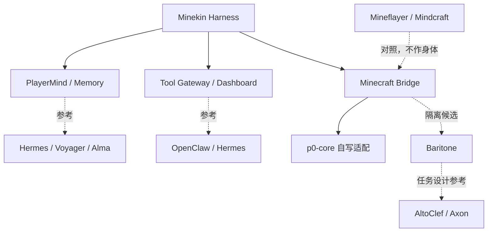

# 可借鉴项目与源码仓库地图

本文集中记录 Minekin 可以研究、对照或在许可证允许下复用的外部项目。它不是“把若干项目拼起来”的依赖清单，也不代表这些项目已经通过 Minekin 的版本、感知、输入、服务器规则与安全验收。

核对日期：2026-09-17。上游仓库会变化；进入实现前必须重新锁 commit、核许可证、生成 SBOM，并以本仓库的版本矩阵和原型证据为准。

## 使用标签

| 标签 | 含义 |
| --- | --- |
| 核心候选 | 可能进入隔离实验 bundle；仍须固定版本、审计与真客户端实测 |
| 架构借鉴 | 学习模块边界、数据流或交互设计，默认不直接嵌入 |
| 算法/技能借鉴 | 研究任务分解、技能库或控制实现；不能绕过玩家等价边界 |
| 对照实现 | 用来识别可行思路与失败边界，不作为 Kin 最终身体 |
| 暂不集成 | 许可证、维护状态、作弊语义或产品边界不适合默认依赖 |

## Minecraft 身体与技能层

| 项目 | 地址与许可 | 可借鉴部分 | 不能直接照搬 |
| --- | --- | --- | --- |
| Baritone | [cabaletta/baritone](https://github.com/cabaletta/baritone)；[LICENSE](https://github.com/cabaletta/baritone/blob/master/LICENSE)为 LGPL-3.0，并含项目特定例外 | 路径搜索、目标/过程抽象、导航/采矿接口、取消和状态回报；当前仍是 `p0-nav-exp`核心候选 | 读取客户端世界数据不天然等于玩家等价；版本组合、输入仲裁、隐藏真值与许可证边界必须逐项审计 |
| Axon | [jeremy46231/axon](https://github.com/jeremy46231/axon)；[GPL-3.0](https://github.com/jeremy46231/axon/blob/main/LICENSE) | Fabric 1.21.4 + Baritone + Meteor + LLM工具循环的组合方式，高层命令到确定性工具的反馈链 | README自标 `tests-none`，偏自然语言命令式 bot；Loader/依赖组合不同。GPL代码不能未经评估混入可能采用不同许可的 Minekin |
| llm-playing-minecraft | [drmcbride12/llm-playing-minecraft](https://github.com/drmcbride12/llm-playing-minecraft)；[Apache-2.0](https://github.com/drmcbride12/llm-playing-minecraft/blob/main/LICENSE) | Fabric Bridge + 外置 controller、小型可审计 action schema、本地模型与 Baritone、明确 early-stage/烟测边界 | 其 README中的单机烟测不等于 Kin 的持续人格、感知过滤、实时反射或完整生存链；不能把项目自述当成我们的兼容实测 |
| AltoClef | [gaucho-matrero/altoclef](https://github.com/gaucho-matrero/altoclef)；[MIT](https://github.com/gaucho-matrero/altoclef/blob/main/LICENSE)；仓库已归档 | 把“通关/采集”等复杂目标拆成可组合 task、资源前提和失败恢复；可作为任务图源码研究 | 旧版本、维护停止，并提示 Baritone配置可能互相干扰；不能作为 1.21.4 直接依赖或能力承诺 |
| Meteor Client | [MeteorDevelopment/meteor-client](https://github.com/MeteorDevelopment/meteor-client)；[GPL-3.0](https://github.com/MeteorDevelopment/meteor-client/blob/master/LICENSE) | 可研究食物、装备、物品与防御模块如何接入 Fabric事件和输入 | 官方定位是 anarchy utility mod，包含大量超人/作弊能力；不作为默认底座。若读源码或复用代码，GPL与服务器规则都是硬门禁 |
| Mineflayer | [PrismarineJS/mineflayer](https://github.com/PrismarineJS/mineflayer)；[MIT](https://github.com/PrismarineJS/mineflayer/blob/master/LICENSE) | 协议状态、行为插件生态和自动化测试 fixture 的对照；也可帮助理解 LLM Minecraft项目常见接口 | 它是协议级 headless bot框架，不符合 Minekin“真实 Java客户端身体”的最终路线；不得因实现方便替换核心客户端 |
| Mindcraft | [mindcraft-bots/mindcraft](https://github.com/mindcraft-bots/mindcraft)；[MIT](https://github.com/mindcraft-bots/mindcraft/blob/main/LICENSE) | LLM角色配置、Minecraft对话/行动回路、多 Agent实验和提示组织的对照 | 基于 Mineflayer；角色提示不等于持久人格，不能证明真实客户端操作、反射、关系记忆或玩家等价感知 |

### 当前采用判断

- P0只把 **Baritone** 放入与 core隔离的 `p0-nav-exp`；失败时保留自写导航/技能路线。
- Axon、llm-playing-minecraft和AltoClef先做源码审计与接口对照，不直接整体 fork进产品。
- Meteor默认不集成；任何来自它的思路都要先经过“玩家是否能做、服务器是否允许、许可证是否兼容”三道门。
- Mineflayer/Mindcraft可以用作研究对照或隔离测试参与者，但不能成为 Kin 的身体。

## 学习、记忆与自主技能

| 项目 | 地址与许可 | 可借鉴部分 | Minekin差异 |
| --- | --- | --- | --- |
| Voyager | [MineDojo/Voyager](https://github.com/MineDojo/Voyager)、[论文](https://arxiv.org/abs/2305.16291)、[MIT](https://github.com/MineDojo/Voyager/blob/main/LICENSE) | 自动课程、持续扩张的可执行技能库、环境反馈/执行错误/自验证驱动的迭代改进 | 原实现使用 Mineflayer环境和代码生成技能。Minekin技能必须经过 schema、权限、版本、回放和晋级门禁，不能让模型直接写任意控制代码 |
| Hermes Agent | [NousResearch/hermes-agent](https://github.com/NousResearch/hermes-agent)、[官方文档](https://hermes-agent.nousresearch.com/)、[MIT](https://github.com/NousResearch/hermes-agent/blob/main/LICENSE) | README描述的闭环学习、经验生成技能、技能使用中改进、跨会话搜索、FTS5摘要、Observer/工具循环、隔离后端与定时任务 | 借鉴 Harness层，不拿它代替 PlayerMind、世界上下文、tick控制或 Minecraft Bridge；“自我改进”仍须用真实成功证据晋级，不能自动覆盖稳定技能 |
| Alma | [alma.now](https://alma.now/)、[Memory文档](https://alma.now/docs/features/memory.html)、[Tools文档](https://alma.now/docs/features/tools) | 记忆提取/检索/管理的产品体验、工具模型分工、长期熟悉感 | 截至核对日，本项目未确认可审计的官方源码仓库与可复用许可；仅作为产品/UX参考，不能写成已经复用其实现 |

### 自主学习的借鉴边界

Minekin采用“经验候选 → 沙箱回放 → 多场景验证 → 人类可审计 manifest → 分阶段晋级”的技能生命周期。Voyager/Hermes说明技能沉淀路线有现实先例，但不证明自动生成代码在 PvP、GUI、建造、资源包或陌生服务器上安全可靠。

人格、社会记忆和世界事实不打包成可执行 skill；技能只能表达“如何尝试”，不能暗改“我是谁”“谁可信”或服务器规则。

## Agent Harness、外部工具与 Dashboard

| 项目 | 地址与许可 | 可借鉴部分 | Minekin差异 |
| --- | --- | --- | --- |
| OpenClaw | [openclaw/openclaw](https://github.com/openclaw/openclaw)、[官方文档](https://docs.openclaw.ai/)、[MIT](https://github.com/openclaw/openclaw/blob/main/LICENSE) | Gateway作为会话/工具/事件控制面、Control UI、可换模型/插件、技能与 channel、把入站消息视为不可信输入、显式 sandbox建议 | Minekin不需要复制聊天平台大全；Dashboard只有观察与管理权，不能直连游戏输入。OpenClaw README也明确主会话工具默认可在 host运行，说明“装上即安全”是不成立的 |
| Hermes Agent | 同上 | 单一 gateway、多入口连续会话、工具RPC、定时任务、trajectory与可切换执行后端 | 只借进程/工具/观察者模式；Minecraft实时控制保留独立 Bridge与 lease，不能经过通用终端工具 |
| Alma | 同上 | Dashboard/记忆可见性、用户可检查或修订长期信息的产品思路 | 管理者可修订存储错误，但不能在世界内直接改 Kin关系/情绪来获得服从 |
| agentskills.io | [开放规范](https://agentskills.io/) | 技能目录、描述和按需加载的互操作思路；Hermes声明兼容 | Minekin还需要版本、感知、输入、世界作用域、成功证据和撤销语义，不能只靠文本说明 |

## 项目关系图

核心原则是：**借鉴它们已经解决的问题，不继承它们与 Minekin目标不一致的假设。**

## 代码与许可门禁

任何上游代码进入仓库前都要记录：

1. 仓库 URL、精确 commit/tag、文件路径与取得日期；
2. SPDX许可证、NOTICE/例外条款、传染性与分发义务；
3. 是否复制、修改、动态/静态链接或仅阅读后独立实现；
4. 对应 Minecraft/Fabric/Java版本与依赖树；
5. capability、数据读取、网络、文件和命令执行权限；
6. 上游测试状态、Minekin原型 case和回退方案；
7. SBOM、工件摘要与升级/撤销记录。

“公开在 GitHub”不等于可以任意复制；“MIT/Apache”也不免除保留版权声明等义务。GPL/LGPL及项目特定例外必须在确定 Minekin自身分发方式后再由许可证审查冻结。

## 后续研究队列

- 固定 Axon、llm-playing-minecraft、Hermes和OpenClaw的审计 commit，画出实际进程/权限/存储边界；
- 对 Baritone与AltoClef只抽取最小 task/action接口，验证取消、失败恢复和玩家等价感知；
- 比较 Voyager/Hermes技能晋级与 Minekin已有 SkillSpec，补齐回滚、污染检测和跨版本失效；
- 对 OpenClaw的 Gateway/sandbox、安全模型做源码级 threat-model对照，避免通用工具拿到游戏输入 lease；
- 若未来考虑直接复用任何组件，先生成依赖/许可证矩阵，再进入隔离原型；未完成前保持“借鉴”状态。

本文不会把项目 README中的宣传语当作独立实测，也不因找到相似项目就声称 Minekin核心能力已经存在。
