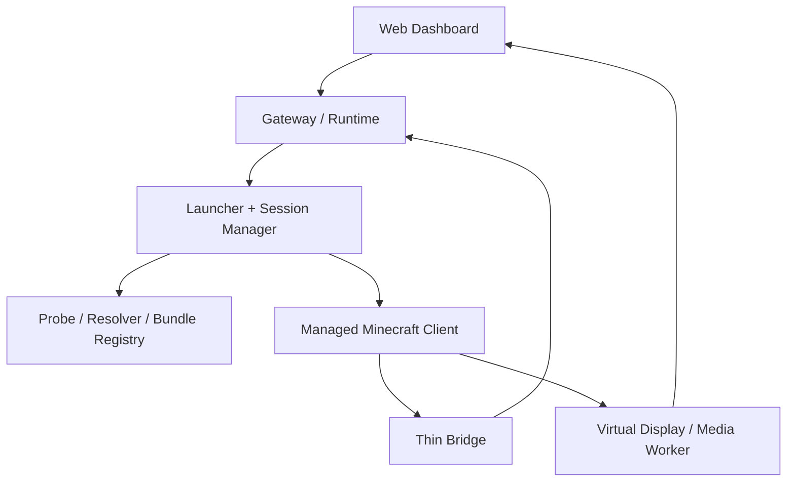
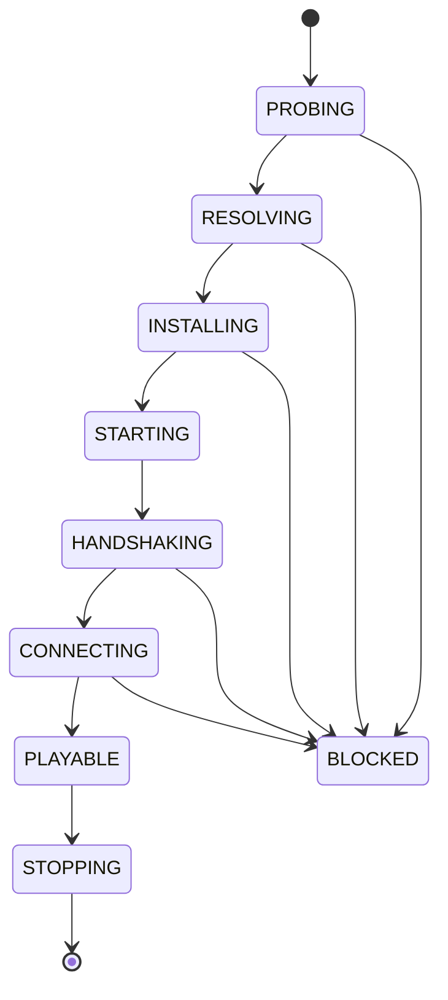

# 自带启动器后端、受管理客户端与自动版本切换契约

研究时间：2026-09-16。本文件定义 Minekin 如何在不依赖用户已有 Minecraft 启动器、不弹出普通游戏前端窗口的前提下，启动一个真实 Minecraft Java Client，并由 Web Dashboard 管理服务器、账号、版本、运行状态和第一人称观战。

这里的“无界面”是**没有用户需要操作的桌面启动器和可见游戏窗口**，不是把 Minecraft Java Client 偷换成纯协议机器人。真实客户端仍有 render thread、GLFW/OpenGL 上下文、网络栈和完整客户端状态；Linux 服务器可把它运行在隔离容器与虚拟显示中。

## 固定产品结论

1. Minekin 自带 `Managed Client Runtime`，不发现、不接管，也不依赖用户电脑上已有的官方启动器、第三方启动器或正在运行的游戏进程。
2. Dashboard 是唯一普通管理入口；账号授权、Server Profile、安装进度、版本选择、启停、日志、备份和 Live View 都在 Web 中完成。
3. Minecraft 客户端由 Minekin 后端按需安装、校验、启动、停止和回收；用户不手动下载对应游戏版本或 Fabric。
4. Kin 的 Soul、Memory、PlayerMind、工具与长期状态不在客户端实例内。换服务器版本、重启客户端或重建容器不得换掉 Kin。
5. 自动版本切换是“探测服务器 → 解析协议 → 选择已验证运行包 → 启动/重启客户端”，不是一个运行中的 Minecraft 进程热切版本。
6. 未识别或未验证版本必须阻断并显示原因；不得静默猜测、无限试连或回退到纯协议 Bot。

## 组件边界

| 组件 | 职责 | 不负责 |
| --- | --- | --- |
| Launcher Service | 解析版本元数据、下载/校验工件、组装 classpath/JVM 参数、管理 Java 与 natives | Soul、游戏决策、保存明文密码 |
| Account Broker | 从 Web 发起交互式授权、续期、账户与游戏档案核验、隔离令牌 | 把 token 交给 LLM、聊天、网页工具或日志 |
| Server Probe | DNS/SRV、地址解析、状态探测、协议号与版本名采集 | 保证服务端诚实、绕过白名单/封禁/正版验证 |
| Version Resolver | 把探测结果映射到已支持的运行包，处理歧义、固定版本和缓存 | 对未知版本“碰运气”登录 |
| Bundle Registry | 记录受支持的 Minecraft/Fabric/Bridge/Java/OS/arch 组合与哈希 | 声称所有 Java 版本天然兼容同一 Bridge |
| Artifact Store | 内容寻址缓存、临时下载、哈希/大小校验、原子安装、垃圾回收 | 在镜像内非法再分发完整游戏客户端 |
| Client Supervisor | 独立工作目录、虚拟显示、进程健康、资源限制、优雅退出、强杀回收 | 替 PlayerMind 决定游戏目标 |
| Thin Client Bridge | 本地结构化观察、反射、输入仲裁、动作回执、帧采集挂点 | 人格、长期记忆、LLM、服务器版本下载 |
| Media Worker | 捕获受管理客户端实际渲染帧并送到 Live View | 默认把视频送给 VLM 或写进角色记忆 |

## 运行拓扑

桌面机器和 Linux 服务器使用相同的控制面；只有执行驱动不同：

- Linux 首选 OCI 容器或受限 systemd 进程、独立数据卷、虚拟显示和可选 GPU 透传；无 GPU 时可测试软件渲染，但必须测 CPU 占用与 tick/帧稳定性。
- Windows/macOS 使用后台服务启动隔离客户端，并创建隐藏窗口/离屏目标；不得弹出可交互启动器。
- Live View 捕获的是这个受管理客户端的真实输出。它不参与 Kin 的实时控制，也不改变默认“本地结构化感知、外部 VLM 关闭”的成本策略。

GLFW 官方文档支持隐藏 windowed window，并列出 Native、EGL 与 OSMesa 等 context creation API；这只能证明底层候选能力，不证明 Minecraft 在各 OS/驱动下无需改造即可稳定离屏运行。因此首个原型优先验证 **Linux 虚拟显示 + 正常 Minecraft 渲染**，再评估更彻底的 EGL/OSMesa 路线。

## 自带启动器后端

Launcher Service 自己完成普通启动器的后端职责，但不制作桌面启动器 UI：

1. 拉取受信任的 Minecraft 版本清单和指定版本元数据；
2. 解析 client jar、libraries、assets、logging、Java 需求、native classifiers、JVM/game arguments；
3. 从 Fabric Meta 查询目标游戏版本可用的 Loader/Intermediary 和 launcher profile；
4. 选择与 OS/arch 匹配的 Java runtime、libraries 与 natives；
5. 下载到临时目录，逐项核对来源、大小与清单哈希；
6. 生成不可变 `Client Bundle Manifest`，原子发布到内容寻址缓存；
7. 为每次世界会话创建可写 overlay：options、服务器资源包、日志、崩溃报告和会话临时文件；
8. 只把会话 token 以最小生命周期传给客户端进程，不落入命令展示、一般日志或模型上下文；
9. 启动后等待 Bridge 以 nonce、bundle hash、协议版本和 capability manifest 握手；
10. 握手、服务器连接和角色生成均成功后，才把会话标记为 `PLAYABLE`。

Minecraft 客户端、libraries 与 assets 不预装进 Minekin 发布镜像；运行者授权账号后按官方来源下载，并遵守 Minecraft EULA。Minekin 自身只分发 Harness、Launcher、Bridge 与必要的开源依赖。

### Client Bundle Manifest

每个可启动组合至少冻结：

- `minecraft_version` 与 `protocol_id`；
- 上游版本元数据 URL、获取时间和内容 hash；
- Java major、具体 runtime build、OS 与 CPU 架构；
- Fabric Loader、Intermediary、Fabric API 与 Thin Bridge 版本；
- 可选 Baritone/自写技能适配器版本和许可清单；
- client/libraries/assets/natives 的来源、大小与校验值；
- 启动参数模板、允许环境变量、最低内存与渲染后端；
- 世界书、配方/动作 schema 和 Player-Equivalent Filter 版本；
- 构建状态：`candidate`、`tested`、`quarantined`、`unsupported`。

“可以从元数据下载”不等于“Minekin 支持”。只有完成构建、启动、账号入服、Bridge 握手、输入、GUI、反射、退出和恢复测试的组合才进入 `tested`。

## 账号授权

无桌面 GUI 不代表无用户授权。推荐流程：

1. 用户在 Dashboard 点击添加账号；
2. Account Broker 创建一次性设备码或授权链接；
3. 用户在自己的浏览器完成 Microsoft 登录与同意；
4. 后端完成 Minecraft entitlement/profile 核验并保存账户引用；
5. refresh token 进入系统密钥环或加密 secrets store；Dashboard 只显示昵称、UUID、授权状态和到期/重授权提示；
6. 模型、网页查询、游戏聊天、回放导出和客户端 Bridge 均拿不到 refresh token。

Microsoft 官方 device authorization flow 适合无浏览器/输入受限设备，但它只证明 Microsoft 身份登录候选；Xbox/Minecraft 服务链、应用注册、权限、token 续期和发行合规仍须单独原型与条款核验。不得复制官方启动器 token、要求用户粘贴密码或提供离线盗版模式作为正常路径。

## 服务器版本自动识别

### 探测流程

1. 规范化 host/port；若用户未显式给端口，解析 Minecraft Java 的 SRV 记录并保存最终目标与来源。
2. 在不建立游戏会话前执行 Server List Ping，记录服务端公开返回的版本文本、协议号、MOTD、资源包相关提示和 RTT。
3. 以**协议号为主要键**、版本文本为辅助证据，查本地 `Protocol Catalog`。
4. 从 Bundle Registry 选择最新的 `tested` bundle；缓存不存在时自动安装。
5. 运行静态 preflight：账号授权、系统资源、Java、Bridge、服规 profile、资源包策略、版本/能力兼容。
6. 启动受管理客户端并尝试一次受控连接；服务端实际拒绝信息可修正候选，但不自动扩大能力或循环试遍所有版本。
7. 将最终解析结果、置信度、证据、bundle hash 和连接结果写入 Server Profile 审计记录。

同版 Yarn 的 `ServerInfo` 暴露 `protocolVersion` 与展示版本字段，可作为真实客户端侧状态依据；Fabric Meta 官方 API能列游戏版本、兼容 Loader/Intermediary 和 launcher profile，适合版本包解析。

### 必须处理的歧义

- 多个 Minecraft patch 可能共享或兼容同一协议，不能仅凭显示名称唯一映射；
- ViaVersion/Velocity/Bungee 等代理可能接受多个客户端版本或返回定制版本文本；
- 状态探测可被关闭、限流、代理或伪造；
- 服务端 resource pack、认证代理、白名单、反作弊和客户端 Mod 政策无法仅从 ping 得知；
- Snapshot、定制核心和魔改协议不自动进入支持范围；
- Minecraft 版本可识别，不代表对应 Bridge、Baritone、世界书和动作 schema 已验证。

因此 Server Profile 使用：

- `version_policy: auto | pinned | auto_then_pin`；
- `detected_protocol`、`reported_version`、`resolved_version`、`confidence`；
- `bundle_id` 与 `last_verified_at`；
- `manual_pin_reason`，仅管理面可写；
- `reprobe_policy`，服务器声明变化时暂停而不是直接替换运行中的客户端。

推荐默认 `auto_then_pin`：首次可信探测后选择并记录版本；后续若协议变化，停止自动重连，生成待确认/重新验收事件。对于已知多版本代理，可显式指定运行者偏好版本。

## Web Dashboard 动态管理

Dashboard 增加以下管理页：

- **Servers**：host、port、SRV 结果、协议探测、版本策略、服规/资源包/重连配置；
- **Accounts**：设备码授权、账号档案、授权状态、重新授权和撤销；不展示 token；
- **Client Bundles**：已缓存版本、兼容矩阵、哈希、磁盘占用、验证状态、失败原因和清理；
- **Sessions**：安装→启动→Bridge 握手→登录→PLAYABLE 状态机、资源和日志；
- **Live View**：第一人称视频、媒体延迟、帧率与断流；不作为默认 AI 输入；
- **Diagnostics**：Java/GL/虚拟显示/GPU、网络、DNS、账号、版本和服务器拒绝原因。

配置写入版本化管理存储，由 Gateway 校验后下发。浏览器不能直接拼 JVM 参数、路径、下载 URL 或游戏输入；聊天和网页内容也没有 Server Profile、Bundle Registry 或账号写权限。

## 生命周期状态机

每次状态变化必须有结构化原因。`BLOCKED` 不是自动退回旧版本继续玩；修复配置、重新授权、安装受支持 bundle 或管理员确认后才重新开始。客户端崩溃不损坏 Soul/Memory，但世界状态标陈旧、旧 action lease 作废，重连后先重验血量、位置、背包、维度、GUI 和当前服务器身份。

## 部署形态

### Linux Server（首要部署目标）

- `minekin-gateway`、`minekin-runtime`、`launcher-service`、`managed-client`、`media-worker` 分进程/容器；
- 数据卷分为 durable identity/memory、secrets、content-addressed bundles、session overlays 和有期限日志；
- 虚拟显示或经过验证的离屏上下文承载真实客户端，默认无宿主桌面窗口；
- 按客户端实例限制 CPU、RAM、磁盘、网络、GPU 和进程数；
- Dashboard 默认只监听本机或受认证反代，Live View 与管理 API 分权限；
- 更新 Harness 不覆盖 Kin 数据；更新 bundle 不修改旧 bundle，新会话显式切换。

### 本地桌面

同样运行后端服务与受管理客户端，只是虚拟显示/媒体驱动可换为本机隐藏窗口实现。不得把“本地部署”退化为调用用户现有启动器路径。

## 细化实施契约

本文件保留总体边界，两个独立契约负责实现级收敛：

- [启动器供应链、版本包与账号会话契约](launcher-supply-chain-contract.md)：受信任元数据、不可变 bundle、内容寻址缓存、下载/回收事务、OAuth/Minecraft 会话、Linux argv 暴露面和跨版本 Bridge target。
- [Linux 无窗口真实客户端、渲染与 Live View 契约](headless-client-media-contract.md)：虚拟显示、llvmpipe/GPU 执行档、进程隔离、FFmpeg/WebRTC 候选、资源预算和媒体失败降级。

这里的 `headless` 始终指没有前台桌面交互，不指删掉真实客户端渲染。首版以虚拟显示中的正常渲染为基线；外部 VLM 仍默认零调用。
## 开发前必须验证

1. 全新 Linux 主机只安装 Minekin 后，通过 Web 授权账号、添加服务器并自动准备指定版本；不人工安装 Minecraft/Fabric。
2. 真实 1.21.4 客户端在虚拟显示中启动、Bridge 握手、加入私人测试服，宿主无可见游戏窗口。
3. Live View 展示同一客户端实际画面；关闭媒体进程不影响本地反射、网络会话和 PlayerMind。
4. 正确版本、错误版本、多版本代理、关闭 ping、伪造版本文本、SRV、白名单、资源包拒绝分别得到可解释结果。
5. 两个已验证版本之间自动重启切换，Soul/Memory/关系不变，旧 session lease 和瞬时观察全部失效。
6. 下载中断、hash 错误、磁盘满、元数据源不可用时不发布半成 bundle；恢复后能复用已验证缓存。
7. Bridge 与 bundle 版本不匹配时握手失败并停机，不尝试无 Bridge 运行。
8. refresh token 不出现在进程列表、普通日志、Dashboard API 响应、回放、模型上下文或网页工具请求中。
9. CPU 软件渲染与 GPU 透传分别量启动时间、内存、CPU/GPU、帧率、tick/反射延迟和 Live View 延迟。
10. A/B 模式由 Session Manager 决定是否启动/保持客户端；切模式不重建 Kin，也不给锚定玩家控制权。

## 尚待原型决定而非重大产品待确认

- Linux 首版用 Xvfb/X11 虚拟显示，还是经验证后采用 EGL/OSMesa；
- Minecraft/Java runtime 的缓存布局、可复现下载清单和镜像层边界；
- Account Broker 的具体库、应用注册及加密 secrets backend；
- Protocol Catalog 的维护源、协议共享版本的优先规则与 ViaVersion 探测策略；
- 首批正式支持几个版本，以及每个版本是否复用一套 Bridge 源码多目标构建；
- Live View 用窗口捕获、帧缓冲钩子还是编码侧共享纹理；
- 软件渲染能否满足 20 TPS 反射与可观看画面，最低服务器硬件如何分档。

这些属于可原型比较的实现选择，不改变“自带后端、无人工下载、Web 管理、真实客户端、自动选择已验证版本包”的产品方向。
