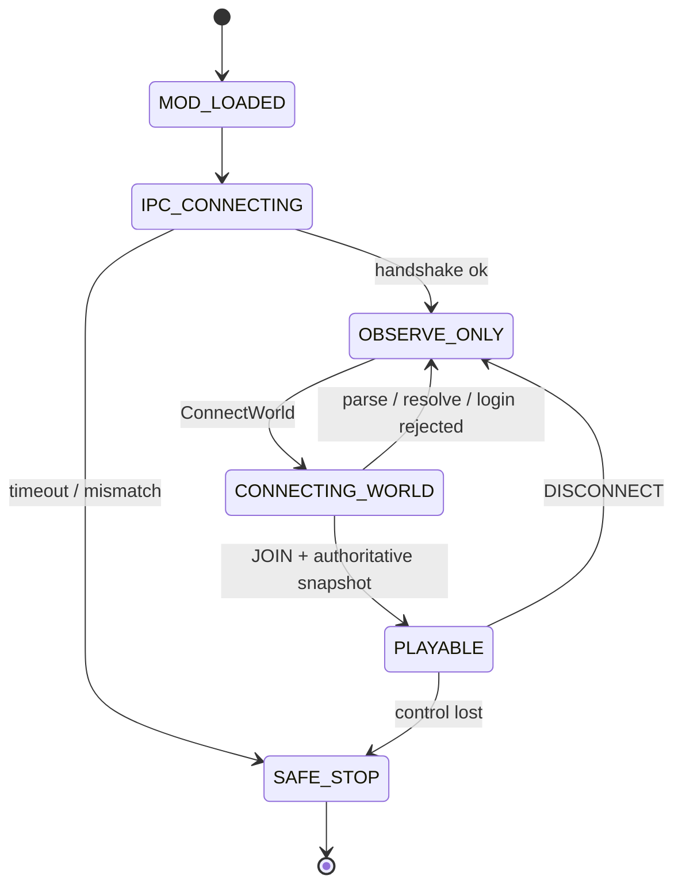

# P0 Thin Bridge 启动、线程与模组装配契约

核查时间：2026-09-17。本文定义独立 Minekin Runtime 如何通过最小 Fabric Client 构件接入受管理的 Minecraft Java 1.21.4 客户端。Bridge 在实现形式上是 client mod，但产品仍是独立 Agent Runtime/Harness：人格、记忆、目标、网页工具、Dashboard 和长期存储都不进入 Minecraft JVM。

以下是静态源码/接口核查与待实现契约，不表示 Bridge JAR 已构建、Fabric 已加载或 IPC 已握手。

## P0 决定

1. 首个基础 bundle 为 `p0-core`：Minecraft 1.21.4 + Java 21 + Fabric Loader 0.16.9 + Fabric API 0.119.4+1.21.4 + Minekin Bridge。
2. Baritone 不作为 `p0-core` 的启动前提。另建 `p0-nav-exp` 变体，在 core 通过后添加固定研究构件；失败时保留自写受限导航路线。
3. Kin 自建 integrated world另建 `p0-host-exp` 变体，只在 core通过后加入窄 `host-control`适配器；JOIN_REMOTE 的 core不能因此获得服务端对象能力。
4. Bridge 先在主菜单完成 bundle/session/协议握手，再接受一次 `ConnectWorld`；不靠 quick-play 绕过握手。
5. Bridge 启动后默认 `OBSERVE_ONLY`。没有正确 generation、capability、control 心跳和输入 lease 时，任何移动、攻击或 GUI 指令都不能执行。
6. IPC、DNS、序列化、压缩和磁盘日志不得阻塞客户端初始化、tick 或 render thread。
7. Bridge 不写 Soul/Memory 数据库，不自行决定目标，也不能被游戏聊天修改配置。

## 上游证据与边界

| 证据 | 已证实 | 未证实 |
| --- | --- | --- |
| Loader 0.16.9 [`FabricLoaderImpl`](https://github.com/FabricMC/fabric-loader/blob/083a4dc339655bddec498ffd75f13580d9b9722d/src/main/java/net/fabricmc/loader/impl/FabricLoaderImpl.java) | 固定 tag commit `083a4dc`；从 game dir 的 `mods`或显式 mods folder发现候选并做依赖解析 | Bridge/API/Baritone 组合能成功解析 |
| 同版 [client hooks](https://github.com/FabricMC/fabric-loader/blob/083a4dc339655bddec498ffd75f13580d9b9722d/minecraft/src/main/java/net/fabricmc/loader/impl/game/minecraft/Hooks.java) 和 [ClientModInitializer](https://github.com/FabricMC/fabric-loader/blob/083a4dc339655bddec498ffd75f13580d9b9722d/src/main/java/net/fabricmc/api/ClientModInitializer.java) | Loader 同步调用 main 后再调用 client entrypoint | initializer 内阻塞 IPC 不会拖死启动；因此必须快速返回 |
| Fabric 1.21.4 [项目结构](https://github.com/FabricMC/fabric-docs/blob/53dd9650e7ecb3566b03bfe260556407b5ff4267/versions/1.21.4/develop/getting-started/project-structure.md) | `fabric.mod.json`声明 environment、entrypoints、depends、mixins | 示例不替代 Bridge 构建 |
| 同版 [tick events](https://github.com/FabricMC/fabric-api/blob/7347d6186858dcfcf7fccf747e8029067caaece5/fabric-lifecycle-events-v1/src/client/java/net/fabricmc/fabric/api/client/event/lifecycle/v1/ClientTickEvents.java) | START/END client/world tick 存在；END_WORLD_TICK 可启动下一 tick 的异步计算 | 回调预算和反射延迟 |
| 同版 [connection events](https://github.com/FabricMC/fabric-api/blob/7347d6186858dcfcf7fccf747e8029067caaece5/fabric-networking-api-v1/src/client/java/net/fabricmc/fabric/api/client/networking/v1/ClientPlayConnectionEvents.java) | INIT、JOIN、DISCONNECT 可区分；DISCONNECT 后不应发包 | 真实事件顺序与恢复 |
| Yarn [MinecraftClient](https://maven.fabricmc.net/docs/yarn-1.21.4%2Bbuild.8/net/minecraft/client/MinecraftClient.html) / [ThreadExecutor](https://maven.fabricmc.net/docs/yarn-1.21.4%2Bbuild.8/net/minecraft/util/thread/ThreadExecutor.html) | 客户端管理渲染、输入、连接，并提供 execute/submit/isOnThread | 后台线程可安全持有 world/player/GUI；设计必须回 client thread |
| Yarn [ConnectScreen](https://maven.fabricmc.net/docs/yarn-1.21.4%2Bbuild.8/net/minecraft/client/gui/screen/multiplayer/ConnectScreen.html) | 用于 LAN/远端服务器并有静态 connect 候选 | 正确调用时机、取消和错误映射 |
| Yarn [`MinecraftClient.getServer`](https://maven.fabricmc.net/docs/yarn-1.21.4%2Bbuild.8/net/minecraft/client/MinecraftClient.html) / [`MinecraftServer`](https://maven.fabricmc.net/docs/yarn-1.21.4%2Bbuild.8/net/minecraft/server/MinecraftServer.html) | integrated world中 client代码可直达 server，再访问 ServerWorld/PlayerManager等真值；client-only不等于信息隔离 | 尚未发生泄漏不等于安全；须拆 host-control、扫描字节码并跑 canary |
| Baritone [fabric.mod.json](https://github.com/cabaletta/baritone/blob/78d3613e8c2e4c2f4bb56a6d84fe2844bd6d22e8/fabric/src/main/resources/fabric.mod.json) | 声明 MC 1.21.4、Loader >=0.14.22、LGPL-3.0，使用 mixins，entrypoints 为空 | 与 Bridge mixins/输入写者兼容 |

Fabric API 候选 aggregate JAR 的官方 Maven checksum 已核为 SHA-1 `1c7871b6af04edc8b8f0dbad12606d67f6118a11`、SHA-256 `d183bacb845167f09264c2f90322b7ecffe8826debda6f60e597889264bef4af`；仍须由实际下载器重新核验。

## 模组装配

这里不是假设 Kin 会使用用户现成的 `.minecraft`。Minecraft 客户端无论只进服务器还是自己开世界都需要 run directory；Minekin 为它指定完全独立的 managed run directory。只读 bundle 的 `mods`来自确定清单，只扫描该 bundle/实例获准的目录，宿主用户的 `.minecraft`从不挂载或读取：

| 变体 | 必需 JAR | 用途 | 状态 |
| --- | --- | --- | --- |
| `p0-core` | Fabric API aggregate + Minekin Bridge | 生命周期、最小观察、IPC、输入仲裁 | 首个 candidate |
| `p0-nav-exp` | `p0-core` + 固定 Baritone 构件 | 已知合法目标导航实验 | core 后独立 candidate |
| `p0-host-exp` | `p0-core` + Minekin host-control | 创建/加载/保存/LAN/关闭生命周期；无人物观察能力 | core 后独立 candidate |
| 未来 target | 每版本独立 Bridge/API/技能构件 | 多版本 | 不进入 P0 |

启动前逐个打开 JAR 并核对：

- 内容摘要、大小、来源和许可；
- `fabric.mod.json`存在、schema 可读、mod id 唯一；
- environment、depends、breaks/conflicts 对固定集合可满足；
- entrypoint、mixin resource 和 nested JAR 清单真实存在；
- nested JAR 摘要进入 bundle 物料表；
- session overlay、聊天、网页或用户既有 mods 目录不能注入 JAR。

Bridge manifest 目标为 client-only，并声明 1.21.4、Java 21、Loader 0.16.9 与固定 Fabric API。最终依赖范围语法必须由真实 Loader 解析测试冻结；Bundle Registry 仍执行精确版本和摘要约束。

## Bridge 最小模块

| 模块 | 允许职责 | 禁止职责 |
| --- | --- | --- |
| Bootstrap | 注册事件、读一次性 session descriptor、启动 IPC worker | 等网络、查数据库、连接服务器 |
| IPC worker | UDS/loopback、Protobuf、握手/心跳、有界队列 | 触碰 world/player/GUI |
| Client-thread adapter | tick/execute 中读取允许状态、连接/断开、施加授权输入 | HTTP、模型调用、阻塞 |
| Reflex/input arbiter | 本地安全反射、单一输入写者、lease/generation、松键 | 人格和跨世界计划 |
| Observation filter | 玩家等价 DTO 与明确动作例外 | 输出全世界真值 |
| Host-control（仅 `p0-host-exp`） | 创建/加载/保存/LAN/停止的管理事件 | 读取或输出 ServerWorld、实体、玩家背包/坐标、存档内容 |
| Metrics | tick预算、队列、丢弃、握手、结果 | token、秘密、无界日志 |

## 线程与数据所有权

`onInitializeClient()`只做纯本地注册和启动 worker，必须快速返回。同步 DNS、socket 重试、大文件读取、大快照编码或等待 Runtime 都违规。

1. client thread 检查 session/generation/GUI/world，采集最小不可变 DTO；验证 lease 后施加输入或状态变更。
2. IPC worker 编码 DTO、合并或丢弃低级事件并写 socket；收到 intent 只解析为不可变命令放入有界 inbox。
3. 下一 client tick 消费 inbox；过期 deadline、旧 generation、未知 capability 或前提不符直接拒绝。
4. 后台结果只能经 tick inbox 或 `MinecraftClient.execute`回写；不能跨 tick 持有 world/entity/screen 引用。
5. DISCONNECT、死亡、GUI generation变化、control失联或切服时，client-thread adapter先撤 lease并松开全部输入，再发事件。

不承诺零分配或固定微秒开销。原型记录 callback wall time、分配/GC、队列长度、事件合并和首次输入延迟的 P50/P95/P99。

## 启动与连接状态机

1. Loader 解析固定 mods 集并调用 Bridge client entrypoint。
2. Bridge 注册 tick/connection/stop hooks，读取权限受限的一次性 descriptor，启动 control/event worker后立即返回。
3. worker 证明 nonce、session/generation、bundle/Bridge/protocol/capabilities；失败保持无输入并请求回收。
4. 握手成功仅到 `OBSERVE_ONLY`。Runtime 发送带 Server Profile 引用、deadline 和 generation 的 `ConnectWorld`。
5. Bridge 在 client thread确认无现存世界/连接任务并匹配版本，再调用 1.21.4 连接适配器。
6. INIT、TCP连接或 screen状态都不是成功。只有同 generation 的 PLAY JOIN、本地 world/player/network handler成立，并由 Bridge 发出首个 authoritative snapshot；Runtime 校验 profile revision和 world binding后才发高层输入 lease并标 `PLAYABLE`。详细 admission子状态、身份分层和失败码见[P0 远程入服协议](p0-remote-admission-contract.md)。
7. 取消、失败或断线都撤销实体/GUI/action generation和按键；重连由 Session Manager 决定，Bridge 不无限重试。

LAN 世界仍按 host/port 远端连接处理；Bridge 不扫描整个局域网。Server Profile 提供地址，status ping 不能推断 `auth_mode`。

## Capability 最小化

- bootstrap：`session.handshake.v1`、`connection.remote.v1`；
- observation：先仅开放本人 HUD/背包摘要、聊天、当前 screen、连接生命周期和受过滤近场观察；
- control：按实测技能逐项开放 move/look/use/attack/gui，未通过的不出现在 manifest；
- reflex：与高层 control 分开，列明读数和动作；
- media：旁路 IPC，默认不进入模型。

Runtime 只能使用协商交集。bundle/Bridge 更新、切服或 reconnect 都重新协商；新增 capability 不能复用旧 lease。

## 故障语义

| 故障 | 行为 |
| --- | --- |
| mod dependency/mixin 失败 | 启动失败；candidate/quarantine，不退回无 Bridge 入服 |
| entrypoint 抛错或 hello 超时 | 无输入、回收，`BRIDGE_BOOTSTRAP_FAILED` |
| nonce/hash 不符 | `BRIDGE_HANDSHAKE_FAILED`，不连接 |
| Runtime 未启动/队列满 | 保命反射与松键；低级事件合并/丢弃 |
| tick inbox 超预算 | 本 tick停止消费并记录，不追无界积压 |
| connect 重入/取消竞态 | 单连接 generation；旧回调只作诊断 |
| JOIN 后首快照失败 | 不授高层 lease |
| Baritone mixin/输入冲突 | 只 quarantine `p0-nav-exp` |
| control 失联 | client thread撤 lease、松键并按策略退出 |

## 原型验收

1. 核实际 JAR metadata、entrypoint、mixin/nested JAR和摘要；未知 mod 必须拒绝。
2. 缺依赖、只装 Bridge、Bridge+Fabric API 分别启动，验证主菜单、hello 和清晰失败。
3. 正确/错误 nonce、bundle、protocol、capability、generation；握手前 ConnectWorld/输入必须拒绝。
4. IPC关闭、超时和 Runtime晚启动不能卡初始化/tick/render；记录 P50/P95/P99。
5. LAN 与 offline-mode 私服各测连接、JOIN、首快照、DISCONNECT、重连和服务端观察身份。
6. GUI、死亡、切服和 control断开时验证松键及旧对象失效。
7. 压测 inbox/event 洪水、超长 frame、慢消费者和序列化异常。
8. core 通过后再测 `p0-nav-exp` 的 mixin、输入所有权、取消尾部和感知越界。
9. `p0-host-exp`按[自建世界控制边界](hosted-world-control-boundary-contract.md)扫描源码/class/mixin/access widener，并跑 server真值 canary；不得用 host结果污染 core评级。
10. 只有 core 的启动、握手、连接、最小观察/输入、退出恢复通过，Bridge 才可标 tested；导航与 host变体独立评级。
11. 所有通过结论必须满足[P0 隔离验证与证据门禁](p0-validation-evidence-contract.md)：原版服务端真值与 Runtime/Bridge 日志离线交叉核对，oracle 不回流，缺 evidence bundle 时不得 PASS。

## 不作出的承诺

本文不证明 Loader 已发现 Bridge、不证明 checksum 已由实际下载器验证、不证明 ConnectScreen 是最终实现、不证明线程预算达标、不证明 Baritone 可组合，也不证明观察过滤或输入已玩家等价。它只把下一阶段原型边界变成可审查契约。
