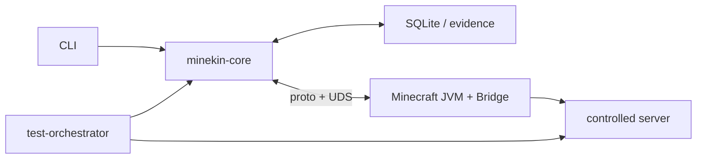
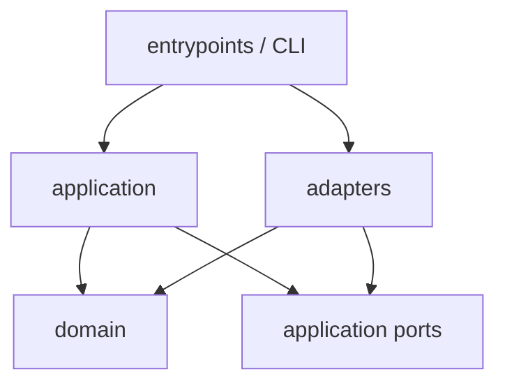

# P0 minekin-core 内部架构契约

核查时间：2026-09-18。本文把“两进程 P0”继续拆到可以开始 W00 的代码边界，但仍然是设计和验证计划，不是实现。目标是避免两种失败：把所有代码塞进一个脚本，或为了未来产品形态提前造一组微服务。

## 1. P0 系统边界

P0 产品侧只有：

1. 一个 Python 3.12 `minekin-core` 进程；
2. 一个 Minekin 管理的 Minecraft Java 21 JVM，其中加载 Thin Fabric Bridge。

受控原版服务器和 test-orchestrator 属于测试域。CLI 是 P0 唯一管理入口；没有 Web API、Dashboard、模型、PlayerMind、媒体服务或外部工具。



测试域可以读取 server oracle；Core 和 Bridge 的产品构建不能导入或读取 oracle 包、目录或字段。

## 2. 模块及依赖方向

`minekin-core` 是模块化单体。依赖只允许向内：



- `domain`：纯 Python 值对象、状态机、命令/事件语义和错误；不得 import SQLite、socket、subprocess、Fabric 或 CLI。
- `application`：用例编排、session supervisor、lease、恢复和事件分类；只依赖 domain 与 ports。
- `ports`：`Protocol` 接口，描述时钟、ID、事件库、Launcher、Bridge transport、evidence sink。
- `adapters`：SQLite、UDS/loopback、subprocess、manifest、文件系统、真实时钟的实现。
- `entrypoints`：CLI 和进程 bootstrap；只做解析、依赖装配、信号处理和退出码映射。
- `generated`：Protobuf 生成物；不得手改，不承载领域默认值。

禁止 application 直接调用 `sqlite3`、`socket`、`subprocess`；禁止 adapter 反向决定 Session 状态或生成高层结论。

## 3. 建议目录

```text
pyproject.toml
uv.lock
src/minekin_core/
  __main__.py
  bootstrap.py
  config.py
  domain/
    ids.py
    commands.py
    events.py
    session_state.py
    leases.py
    errors.py
  application/
    supervisor.py
    command_service.py
    session_service.py
    recovery_service.py
    event_router.py
    lease_watchdog.py
    snapshot_projector.py
    ports/
      clock.py
      event_store.py
      launcher.py
      bridge.py
      evidence.py
  adapters/
    sqlite/
      connection.py
      writer.py
      schema.sql
      migrations/
    launcher/
      metadata.py
      artifacts.py
      launch_plan.py
      process.py
    bridge/
      server.py
      framing.py
      channels.py
    evidence/
      bundle.py
      redaction.py
      digest.py
    system/
      clock.py
      signals.py
  generated/
    minekin/v1/
  cli/
    app.py
    output.py
proto/
  minekin/v1/
    envelope.proto
    session.proto
    observation.proto
    control.proto
    fault.proto
bridge/
  build.gradle.kts
  src/main/java/...
tests/
  unit/
  contract/
  integration/
  fixtures/
  replay/
test-orchestrator/
  ...
```

P0 可以只有一个 Python package 和一个 lockfile；这里的目录是依赖边界，不代表发布多个 wheel 或启动多个服务。

## 4. 核心领域标识

任何跨异步边界的数据不得只靠“当前全局状态”解释，至少携带：

| 字段 | 含义 |
| --- | --- |
| `kin_id` | 持久身份根；重启不变 |
| `run_id` | 一次 Core 进程生命周期 |
| `client_instance_id` | 一次 JVM 进程实例 |
| `session_id` | 一次目标世界会话 |
| `generation` | 每次连接/重连尝试单调增加 |
| `world_context_id` | 已确认世界身份；未确认时为空 |
| `sequence` | 每发送方/通道单调序号 |
| `correlation_id` | 命令、事件和证据链关联 |
| `monotonic_ns` | 同机排序与时延 |
| `observed_at_utc` | 人类审计时间，不参与超时计算 |
| `schema_version` | 协议兼容门禁 |

`kin_id` 不能从玩家昵称临时推导；`world_context_id` 不能只用 host:port；`generation` 改变后，所有旧 lease、旧 callback 和旧观察自动失效。

## 5. Command、Event、Snapshot 分离

### Command

Command 表示“请求尝试”，不是事实。例：

- `PrepareBundle`
- `StartClient`
- `ConnectWorld`
- `IssueInputLease`
- `ReleaseAllInputs`
- `StopSession`

每个 Command 带 command ID、预期状态、generation、deadline 和 idempotency key。重复 command 只能返回原结果或明确冲突，不能重复启动 JVM/重复按键。

### Domain Event

Event 表示已经发生的事实，只追加不原地改写。例：

- `BundleVerified`
- `ClientProcessStarted`
- `BridgeHelloAccepted`
- `JoinObserved`
- `PlayableEstablished`
- `InputLeaseGranted`
- `InputReleased`
- `InputRefused`
- `SessionInterrupted`
- `ClientProcessExited`

模型输出、聊天文字和未来网页内容都不能伪装成 Domain Event；它们只能成为有来源的 observation/proposal。

### Snapshot / Projection

Snapshot 是从事件与最新 Bridge 状态生成的可重建视图，用于 CLI 和恢复加速。它不是独立真值，删除后应能由事件和重新观察恢复。高频遥测不逐条写入权威事件账本。

## 6. 事件信封

P0 内部和持久事件采用同一语义信封，序列化格式可以不同：

```text
EventEnvelope
  event_id
  event_type
  schema_version
  kin_id
  run_id
  client_instance_id?
  session_id?
  generation?
  world_context_id?
  sequence
  correlation_id
  causation_id?
  monotonic_ns
  observed_at_utc
  source
  trust_class
  payload
  payload_hash
```

`source` 至少区分 CORE、BRIDGE、LAUNCHER、SERVER_ORACLE_TEST_ONLY、OPERATOR_CLI。`trust_class` 不允许由输入正文自行声明。测试 oracle 事件只能写入隔离 evidence，不得进入产品 event store 或 projection。

## 7. 会话状态机

P0 Session 状态固定为：

| 状态 | 含义 | 允许的主要出口 |
| --- | --- | --- |
| `STOPPED` | 没有受管 JVM | PREPARING |
| `PREPARING` | 校验配置、bundle、锁和目录 | STARTING_CLIENT / FAILED |
| `STARTING_CLIENT` | JVM 已创建，等待进程确认 | WAITING_BRIDGE / FAILED |
| `WAITING_BRIDGE` | 监听 IPC，尚未接受 hello | HANDSHAKING / STOPPING / FAILED |
| `HANDSHAKING` | 校验 nonce、版本、能力和实例 | READY_MENU / STOPPING / FAILED |
| `READY_MENU` | Bridge 可用但未进入目标世界 | CONNECTING / STOPPING |
| `CONNECTING` | 当前 generation 正在连接 | JOINED_UNVERIFIED / READY_MENU / FAILED |
| `JOINED_UNVERIFIED` | 收到 JOIN，尚未满足首快照门禁 | PLAYABLE / READY_MENU / FAILED |
| `PLAYABLE` | JOIN、客户端对象和受限首快照一致 | STOPPING / READY_MENU / FAILED |
| `STOPPING` | 禁发新 lease，释放输入并回收 | STOPPED / FAILED |
| `FAILED` | 有分类错误，默认不自动恢复 | STOPPING / PREPARING |

任何未列出的跳转都是 bug。状态转换由 application service 决定并持久记录；Launcher/Bridge adapter 只能报告事实。

`PLAYABLE` 不等于“Kin 智能可用”，只表示 Core 可以在该 generation 下发受约束 P0 输入。

## 8. 写入与副作用顺序

对可重复或有外部副作用的命令，采用本地 transactional outbox 语义：

1. 校验当前 projection、generation、deadline 和幂等键；
2. 在一个 SQLite 事务中写入 command acceptance/domain event 与 outbox item；
3. 提交成功后，worker 才执行启动进程、连接或发送 Bridge command；
4. adapter 返回结果后追加成功/失败事件；
5. projection 更新；outbox 标记完成；
6. 崩溃恢复时重读未决 outbox，按动作类型选择安全重试、查询现状或失败收敛。

不是所有副作用都能重试：

- bundle 下载/校验：按 hash 幂等，可重试；
- JVM 启动：先用 client_instance lock/process identity 查现状，不能盲目再启动；
- ConnectWorld：旧 generation 不重试；创建新 generation；
- 输入 lease：重启后一律失效，先 `release_all`，绝不重放；
- stop/release：设计为幂等，可重复发送。

## 9. SQLite 并发模型

P0 使用标准库 `sqlite3`，但不得在 asyncio event loop 上直接执行可能 fsync 的事务：

- 一个专用 writer thread 独占写连接和 migration/checkpoint；
- asyncio 侧通过有界写队列提交 transaction request；
- writer 用 `loop.call_soon_threadsafe` 完成对应 Future；
- 关键写入有 deadline；队列饱和时 session 降级并拒绝新输入，不静默丢事件；
- 读取优先来自内存 projection；需要 DB 查询时使用短事务、只读连接并放到线程执行；
- WAL、foreign_keys、busy_timeout、synchronous 取值写入启动 evidence；
- 启动检查实际 SQLite 版本，未满足已冻结 WAL 修复版本则 fail closed 或退回经验证的单连接 journal 策略。

Dashboard 以后也只能经 Core API 读取，不能直接打开同一个数据库。

## 10. asyncio 任务树

Core 顶层只创建一个 `TaskGroup`/supervisor，建议子任务：

- `command_loop`：串行化会改变 Session 状态的命令；
- `bridge_control_reader`：关键握手/回执/故障；
- `bridge_event_reader`：观察流，执行容量和合并策略；
- `process_watchdog`：监控 JVM PID/退出码；
- `lease_watchdog`：按 monotonic deadline 释放输入；
- `outbox_worker`：执行已提交副作用；
- `signal_handler`：将 SIGINT/SIGTERM 转为 StopSession；
- `evidence_flush`：输出已脱敏摘要和 digest。

一个关键任务异常必须通知 supervisor；不能用裸 `create_task` 让异常漂失。shutdown 顺序固定为：拒绝新命令 → generation 失效 → release_all → 等待回执的有界窗口 → 关闭连接/JVM → flush 事件/证据 → 释放单实例锁。

## 11. IPC 队列与事件等级

| 等级 | 例子 | 策略 |
| --- | --- | --- |
| Critical | hello、disconnect、death、lease ack、action result、fault | 不合并；队列满即进入故障/停机 |
| State | self state、inventory revision、GUI state | 按 key 合并为最新值，同时周期落快照 |
| Telemetry | FPS、队列深度、debug trace | 可采样/丢弃，但记录丢弃计数 |
| Media | 画面帧 | P0 不走 Core IPC |

Control 和 Event 通道保持分离。Bridge 接收 control 的延迟不能被大量观察淹没。所有长度、消息大小、解码失败和未知 enum 都有上限与错误分类。

## 12. Lease 与输入所有权

P0 只有一个输入 owner：Runtime control arbiter。每个动作命令包含：

- lease ID、generation、client instance；
- 动作类型与有限参数；
- issued/deadline monotonic time；
- 可抢占级别；
- 前置状态；
- 完成/取消回执要求。

Bridge 本地 watchdog 才是最终松键保障。Core watchdog 是第二层。断 IPC、generation 改变、死亡、GUI 冲突、超时、Bridge fault 或 Session 离开 PLAYABLE 时，Bridge 必须释放 Core 拥有的全部输入。

P0 不保存“按键当前为按下”用于重启恢复；这是必须失效的瞬时状态。

## 13. 启动与崩溃恢复

Core 启动顺序：

1. 读取配置并取得 `kin_id` 目录单实例锁；
2. 校验目录权限、schema、SQLite 版本、bundle manifest 和上次 evidence；
3. 若 identity root 缺失，仅显式 init 可创建；普通 start 禁止创建“新 Kin”；
4. 将未正常结束的 run/session/outbox 标记为待对账；
5. 使所有历史 lease 和 generation 失效；
6. 检查残留 JVM/UDS/lock，按 PID identity 和 run metadata 判断接管、终止或人工阻断；
7. 追加 `CoreRecovered`/失败事件；
8. 从 STOPPED 开始显式启动新客户端；不恢复旧移动、攻击、连接 callback 或瞬时观察。

同一个 Kin 的 persona/关系/目标在 P1 加入后沿用同一 identity/event store；P0 先证明 identity root、run/session 和恢复水位不会被重启重置。

## 14. 错误模型与退出码

错误至少由 `component + operation + category + retryability + evidence_ref` 组成。category 冻结为：

- CONFIG
- SUPPLY_CHAIN
- STORAGE
- PROCESS
- IPC_PROTOCOL
- IPC_BACKPRESSURE
- SESSION
- ADMISSION
- PERCEPTION_BOUNDARY
- CONTROL_SAFETY
- TIMEOUT
- INTERNAL_INVARIANT

CLI 只打印脱敏摘要和 evidence 路径。未知错误归 INTERNAL_INVARIANT 并停止，不自动换身份、换版本或扩大能力。

## 15. CLI 最小表面

P0 仅需要：

```text
minekin init --kin-id ...
minekin doctor
minekin bundle verify --profile ...
minekin launch-plan --profile ... --dry-run
minekin session start --profile ... [--server-profile ...] [--identity-candidate ...]
minekin session status
minekin session stop
minekin evidence verify <run-id>
minekin replay <evidence-dir>
```

`--server-profile` 是可选的第二个输入文档：不给就与加它之前逐字相同（客户端启动、证明自己、停在主菜单），给了就在握手之后由 Core 发出 `ConnectWorld`，把客户端接到那份已评审的、不可变的 Server Profile 上。它没有做成独立动词（`session connect`），因为会话只在本进程托管期间可达，而客户端只有一个 Bridge 对。

`--identity-candidate` 选的是**已经冻结**的那个离线候选矩阵里的哪一个：不给就是第一个
（`prism-parity`，也就是加这个选项之前每一次运行实际用的那个，逐字节相同），给了就按点名
的那个启动。**候选只有两个且都在 `adapters/launcher/offline_session.py` 里声明**，选项的可选值
从那份声明的清单读出而不是在这里重抄一遍。它的用处是让**第二个**候选真的跑得起来：在这之前
产品里唯一的选点是硬编码的 `[0]`，于是 OFF-B 有实现、契约里有、却永远不可达，而没有任何东西
会说——一个点名了 OFF-B 却静默跑了 OFF-A 的运行会为一件没发生的事封出证据。点名一个不存在的
候选由 parser 在创建任何东西之前拒绝。

`doctor` 只诊断，不修复或下载；`dry-run` 不启动 Java；`status` 读取 projection；`stop` 可重复；任何 destructive cleanup 都不属于隐式启动流程。

## 16. W00 必须冻结的交付物

W00 不是搭空目录就完成，至少提交：

1. Python/Java/Node-free P0 依赖清单和锁文件策略；
2. 上述 package 依赖检查规则；
3. Session 状态/转换表及状态机单元测试；
4. proto v1 envelope、hello、fault、observation、lease、release_all；
5. ID、generation、sequence、deadline 与时钟规范；
6. SQLite schema v1、migration v1、writer-thread contract；
7. 错误 enum、退出码和脱敏规则；
8. CLI 命令 schema，只实现 dry-run/doctor 也可以；
9. fake Clock/Launcher/Bridge/EventStore/Evidence ports；
10. golden protobuf、framing、event replay 与 crash fixtures；
11. 依赖方向和“产品构建不得含 oracle”自动检查；
12. ADR：为何 P0 不用 Web、ORM、Agent 框架和多进程 Python 服务。

## 17. P0 验收映射

| 架构机制 | 对应验收 |
| --- | --- |
| 状态机 + generation | 晚到 callback、重连和旧消息不能改变新会话 |
| transactional outbox | 强杀后副作用可对账，不重复 JVM/输入 |
| writer thread | SQLite fsync 不阻塞 control loop |
| 双 IPC 通道 | observation 洪峰不阻塞 release_all |
| 双 watchdog | Core/Bridge 任一失联后无残留按键 |
| identity root | 重启后仍是同一 Kin，不隐式新建 |
| oracle 隔离 | 服务端真值不进入产品快照/记忆 |
| evidence digest | 运行结果可复核但不泄露敏感正文 |

这些机制的存在只能由测试证明；文档不能把“已设计”标成 PASS。
