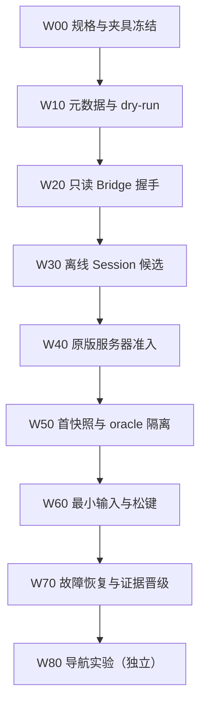

# P0 核心原型执行计划

核查时间：2026-09-17。本文把已有的启动、Bridge、离线 Session、远程入服与证据契约排成一个可实施的首轮垂直切片。它是**开发前执行计划**，不是实现提交，也不表示 Minecraft、Bridge 或服务器已经被启动验证。

## 原型只回答什么

P0 核心原型只回答一个问题：

> Minekin 能否用自己管理的 Minecraft Java 1.21.4 真客户端，在没有 Microsoft/Xbox 认证的默认路径上，完成受控离线身份启动、Bridge 握手、加入运行者控制的原版 `online-mode=false` 服务器、产生玩家等价首快照、执行一次最小合法输入并可恢复地退出？

首个可演示闭环固定为：

1. 解析并校验固定版本包；
2. 启动 Java 21 客户端进程；
3. Bridge 在主菜单完成带 nonce 的握手；
4. 选择一个显式 Offline Session candidate；
5. 加入受控原版服务器；
6. JOIN 与首个玩家等价快照共同形成 `PLAYABLE`；
7. 执行受 lease 约束的转向/移动，再释放全部输入；
8. 主动断开、关闭客户端并生成证据包。

“到达主菜单”“进服一次”或“画面里动了”都不是完成。

## P0 运行形态与依赖上限

P0 产品侧只有两个主要进程：

1. `minekin-core`：一个 Python 3.12 进程，内部模块包含 launcher、session runtime、标准库 SQLite event ledger、CLI 和 evidence hooks；
2. Minecraft Java 21 JVM：加载 Thin Fabric Bridge。

原版 dedicated server 与 test-orchestrator 是测试夹具，不计入产品常驻进程。P0 不运行独立 Gateway、Web Dashboard、媒体服务、模型服务、Redis/Postgres 或多个 Python microservice。Core 内部模块必须可测试、可替换，但不得为了“未来可能拆分”提前增加网络 hop。

P0 最小依赖固定为 Python/uv、Java 21/Gradle/Fabric、proto3/Buf、本机 UDS 或 loopback、SQLite、pytest/JUnit。标准库 `sqlite3` 足够支撑 core 证据账本；ORM、Web API 与前端均后置。

## 明确排除

以下内容不进入首个 P0 core 切片：

- PlayerMind、人格、情绪、长期记忆、LLM 或外部网页工具；
- Baritone、AltoClef、自动通关、战斗、建造与技能学习；
- HOST 自建世界、LAN 开放、多 Kin、模组服；
- Dashboard 实时视频、外部 VLM、纯视觉控制；
- 多 Minecraft 版本、Microsoft/Xbox 在线认证与第三方公网服务器；
- 自动重试未知身份参数、动态下载未冻结 mod、读取宿主 `.minecraft`。

这些能力不是被否定，而是只有 core 的进程、会话、观察、输入、隔离和证据边界先成立，后续结论才可归因。

内部模块、依赖方向、事件/命令分离、Session 状态机、SQLite 写线程、transactional outbox、TaskGroup 与 CLI 冻结项见[P0 minekin-core 内部架构契约](p0-core-internal-architecture.md)。该契约是 W00 的实现入口；若与较早的宽泛目录建议冲突，以它为准。

## 依赖顺序

任何阶段失败都停在本阶段。后续阶段不得用 mock 的成功覆盖前置失败。

## 工作包与门禁

| ID | 工作包 | 交付物 | 通过门禁 | 停止条件 |
| --- | --- | --- | --- | --- |
| W00 | 规格与测试夹具冻结 | Protobuf/schema、错误枚举、case manifest、1.21.4 bundle manifest、受控 server profile | schema 可版本化；fixture 摘要固定；oracle 输出与 Runtime 输入目录分离 | 字段语义冲突、测试真值可回流产品进程 |
| W10 | 元数据解析与 dry-run | Mojang/Fabric 元数据解析、classpath/natives/argv 计划、内容摘要；不启动游戏 | 所有下载 URL、SHA-1/size、Java、main class、独立 argv 元素可复核；无未替换占位符 | 摘要不符、未知 artifact、shell 字符串拼接、访问宿主 `.minecraft` |
| W20 | 只读 Bridge | 最小 Fabric client entrypoint、IPC hello、nonce/generation/capability、主菜单阶段状态 | 客户端主线程不被 IPC 阻塞；错误 nonce/protocol 被拒；尚无连接和输入能力 | tick/render 卡顿、握手前获得控制、未知 mod |
| W30 | Offline Session | OFF-A/OFF-B 有界候选、Bridge 脱敏 Session 回报、候选选择记录 | 启动至握手；name/UUID/type 可解释；正文不进入日志 | argv 错位、Session 材料不一致、候选自动漂移 |
| W40 | 远程准入 | 原版 1.21.4 `online-mode=false` dedicated server、连接 generation、JOIN/失败分类 | 只经普通客户端连接；JOIN 事件与服务端身份可离线核对；online-mode 负向明确失败 | 使用 op/RCON 影响 Kin、认证失败触发账号切换、旧 callback 改写新连接 |
| W50 | 玩家等价首快照 | self/inventory/visible-world 最小 snapshot、感知过滤、三时间线关联 | JOIN、world/player/network handler 与首快照同 generation；oracle canary 不出现于产品输出 | 墙后/容器/服务端坐标等真值泄漏、快照失败仍授予 lease |
| W60 | 最小合法输入 | `look`、短时 `move`、`release_all`；lease/优先级/超时 | 服务端观察到预期位移；断线、死亡、GUI、超时均松键；没有瞬移或状态写入 | 残留按键、绕过客户端动作、输入 owner 不唯一 |
| W70 | 恢复与晋级 | 断 IPC、杀进程、取消连接、重启、evidence bundle 与结果分类 | 强杀后无孤儿控制；证据可重放核对；强制 case 全部 PASS 才可标 `P0_CORE_TESTED` | 失败无法归类、证据不完整、实测与摘要不一致 |
| W80 | 导航实验 | 独立 `p0-nav-exp` bundle 与评级 | 只能在 W70 后开始；失败不污染 core | mixin/输入冲突、越过玩家等价感知、许可证/SBOM 不清 |

## 建议的代码边界

这不是目录脚手架承诺，而是首轮实现时必须保持的依赖方向：

| 边界 | 责任 | 禁止 |
| --- | --- | --- |
| `launcher` | artifact 解析、run directory、JVM/argv、进程生命周期 | PlayerMind、世界真值、shell 拼接 |
| `bridge` | Fabric 客户端生命周期、脱敏观察、合法输入适配 | 网络 I/O 阻塞 client thread、服务端真值 |
| `protocol` | Protobuf 消息、版本与能力协商 | 业务决策与隐式默认 |
| `runtime/session-manager` | generation、lease、状态机、故障编排 | 直接读取 Minecraft 内部对象 |
| `test-orchestrator` | server 进程、oracle、case 驱动、证据打包 | 向 Runtime/Bridge/模型回灌 oracle |
| `schemas` | manifest、profile、snapshot、evidence schema | 无版本的自由 JSON |
| `evidence` | 不可变摘要、三时间线、断言结果 | token/xuid/clientId 正文 |

初始产品进程边界固定为“一个 Python `minekin-core` + 一个 Minecraft JVM/Thin Bridge”。Test Orchestrator 独立运行但仅属于测试域。两大产品进程之间继续采用版本化 Protobuf 和本机 UDS/受限 loopback；Core 内 launcher/session/evidence 以函数与领域接口组合，不额外网络化。

## Session 候选执行顺序

Prism 固定源码链已经静态收敛一项：未填入的 `${clientid}` 与 `${auth_xuid}` 会在 token 替换阶段变成**显式空字符串 argv 值**，并作为 `param ` 经 Prism Launcher 子进程协议和 StandardLauncher 传给 Minecraft main class。它们不是被省略的 flag，也不是字面占位符。

因此顺序固定为：

1. OFF-A：`userType=offline`、offline UUID Id128、token `"0"`、clientId/xuid 均为空 argv 值；
2. OFF-B：只把 `userType` 改为 `legacy`；
3. 仅在 A/B 的证据指出 UUID 编码问题时运行 OFF-C；
4. 仅在空 clientId/xuid 导致可归因失败时，用 OFFLINE-050 比较预先登记的非空 sentinel；
5. OFF-D/OFF-N 只作默认/错误诊断，永不成为静默 fallback。

静态源码追踪不能证明 Minecraft 1.21.4 接受空值；该结论仍必须由 W30 的真实启动与 Bridge Session 观察验证。

## 每个工作包的提交纪律

- 一个 PR/commit 批次只增加一个可逆能力；不得把 Launcher、Bridge、PlayerMind 和 Dashboard 混在同一批。
- 每批先提交 schema/fixture/预期，再提交实现，最后提交实际 evidence digest；设计文档不能预填 PASS。
- case 失败时保留原始结果并增加修复后的新 run，不覆盖历史。
- 任何“临时调试”读取服务端真值的代码只能存在于 `test-orchestrator`，且产品构建应在编译/依赖检查时拒绝它。
- 未达到前置门禁时，后续能力可做静态研究，但不能用运行结果晋级。

## P0 core 必跑集合

实施时至少串行跑完：

- Launch/Bridge：现有 bootstrap 契约中的 artifact、依赖、hello、nonce、protocol、backpressure 与主线程预算用例；
- Offline：`OFFLINE-001`、010、020、030、040（条件触发）、050（条件触发）、060、080、090、100；
- Admission：地址阻断、offline-mode 正向、online-mode/白名单/资源包负向、取消晚 callback、重连；
- Perception：首快照、视锥/遮挡最小 canary、oracle 目录/字段泄漏检查；
- Control：短时 look/move、lease 过期、断线/死亡/GUI/进程故障松键；
- Recovery：Runtime 先死、Bridge 先死、server 先死、重复启动与同 identity 重启；
- Evidence：manifest、三时间线、server oracle、脱敏日志、结果摘要和所有工件 digest。

具体 case 定义仍以各专项契约为准；本文只定义顺序与晋级依赖，不复制测试真值。

## 晋级与项目状态

W70 全部通过后，只能宣布：

> 固定 Minecraft Java 1.21.4 bundle 的 P0 core 已在受控离线服务器上通过测试。

这不等于“Kin 已完成”，也不证明自主生存、战斗、建造、长期记忆、跨服、HOST、多版本或 Dashboard。只有 core 被证明后，才依次开放导航实验、基础生存技能、PlayerMind/持久记忆与上层体验开发。

当前状态仍是：**计划已可执行，运行证据为零，尚不能标记 P0_CORE_TESTED，也不能据此宣布可以进入全面正式开发。**
