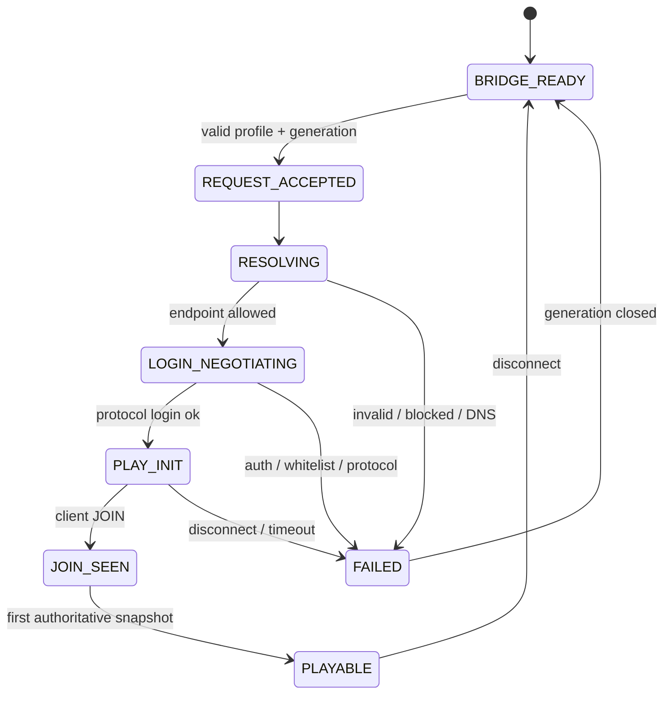

# P0 远程入服与离线身份协议

本文把 `JOIN_REMOTE` 的“启动后怎样进入世界”收敛为可实现、可观测、可失败的 P0 契约。范围只包括受管理的 Minecraft Java 1.21.4 真客户端加入受控 LAN 或 `online-mode=false` 原版服务器；不证明公网离线服安全，不把 Microsoft/Xbox 登录设为默认前提，也不扩张到 HOST 模式。

当前状态是**有官方 API 依据的候选设计，尚未运行**。所有成功率、时延和身份映射必须由真实客户端与独立服务端证据晋级。

## 已核对的原版入口

Yarn 1.21.4+build.8 映射确认：

- [`ConnectScreen.connect(...)`](https://maven.fabricmc.net/docs/yarn-1.21.4%2Bbuild.8/net/minecraft/client/gui/screen/multiplayer/ConnectScreen.html)接收父 screen、`MinecraftClient`、`ServerAddress`、`ServerInfo`、quick-play 标志和可选 cookie storage，用于连接 LAN 或远端 dedicated server；
- [`ServerAddress.parse(String)`](https://maven.fabricmc.net/docs/yarn-1.21.4%2Bbuild.8/net/minecraft/client/network/ServerAddress.html)解析 host/port，[允许地址解析器](https://maven.fabricmc.net/docs/yarn-1.21.4%2Bbuild.8/net/minecraft/client/network/AllowedAddressResolver.html)组合普通解析、SRV 重定向和 block-list 检查；
- [`RedirectResolver.createSrv()`](https://maven.fabricmc.net/docs/yarn-1.21.4%2Bbuild.8/net/minecraft/client/network/RedirectResolver.html)说明 vanilla 路径本身具有 SRV 解析步骤；
- [`ServerInfo`](https://maven.fabricmc.net/docs/yarn-1.21.4%2Bbuild.8/net/minecraft/client/network/ServerInfo.html)保存服务器地址、类型和资源包策略；类型只有 LAN、OTHER、REALM；
- [`Session`](https://maven.fabricmc.net/docs/yarn-1.21.4%2Bbuild.8/net/minecraft/client/session/Session.html)由 username、UUID、access token、xuid/clientId 和 account type 组成，而 [`Session.AccountType`](https://maven.fabricmc.net/docs/yarn-1.21.4%2Bbuild.8/net/minecraft/client/session/Session.AccountType.html)只有 `LEGACY`、`MOJANG`、`MSA`，**没有 `OFFLINE` 枚举**；
- [`Uuids.getOfflinePlayerUuid`](https://maven.fabricmc.net/docs/yarn-1.21.4%2Bbuild.8/net/minecraft/util/Uuids.html)与 `getOfflinePlayerProfile`可生成同版本地候选 profile。

因此，Minekin 的 `auth_mode: offline` 是 Harness/Identity Manager 的策略标签，不等同于客户端 `Session.AccountType`。Prism Launcher固定源码提供 `token=0/userType=offline`的现实对照，而1.21.4公开枚举支持 `LEGACY`候选；二者的有限比较、clientId/xuid与UUID格式见[P0 离线 Session参数兼容契约](p0-offline-session-compatibility-contract.md)。最终组合必须由真实启动与入服证据冻结，不能从任一名称推导“保证可用”。

## 身份分层

| 标识 | 所有者 | 稳定范围 | 是否可作为人格根 |
| --- | --- | --- | --- |
| `kin_id` | Minekin | 跨启动、跨服、跨改名 | 是，唯一人格/记忆根 |
| `local_profile_id` | Identity Manager | 一个本地身份配置版本 | 否 |
| `configured_username` | 受信任配置 | 配置未改名期间 | 否 |
| `local_candidate_uuid` | Launcher | 由固定版离线规则计算 | 否 |
| `session_name/session_uuid/account_type` | 客户端启动会话 | 单进程 session | 否 |
| `server_observed_name/uuid` | 测试服 oracle 或服务器协议结果 | 单服务器身份域 | 否 |
| `actor_id` | World Context | 服务器身份域+观察证据 | 否，只关联关系记录 |

硬规则：

1. 客户端提交的 UUID 不是服务端身份真值；offline-mode 服务端、代理或插件可能按名字重算或改写。
2. 修改 username 生成新的本地 identity revision；不得暗中把服务端眼中的新身份当成旧角色。
3. `kin_id`连续性不依赖昵称或服务端 UUID；世界资产、权限和关系仍须按 server/world/actor context 隔离。
4. 服务器端观察身份只进入验证 evidence；oracle 控制台不得回流 Kin 的 belief、Memory 或行动路径。
5. 仅凭 status ping 不能推断认证模式。online-mode 拒绝、白名单、封禁、重复登录和代理错误分别分类。

## 受信任目标与解析

`ConnectWorld`只能引用后台保存的不可变 Server Profile：

```text
server_profile_id, revision
display_name
original_address
expected_protocol / tested_bundle_id
auth_policy = offline_default | optional_online_adapter
resource_pack_policy
address_policy
connection_timeout
```

聊天、网页正文、知识检索结果和模型输出都不能直接提供 host/port、切换身份、放宽地址策略或接受资源包。管理 API 修改 profile 时产生新 revision并审计。

连接管线为：

```text
trusted profile
→ ServerAddress.parse + syntax/length checks
→ vanilla-compatible DNS/SRV resolution
→ address-policy decision
→ ServerInfo(OTHER or LAN)
→ ConnectScreen.connect on client thread
```

- `quickPlay=false`；P0 不依赖启动器 `--quickPlayMultiplayer`绕过 Bridge 握手。
- cookie storage 在普通 P0 连接中为空；若未来支持服务器 transfer，另立能力与威胁模型。
- 记录原始目标、DNS/SRV 答复摘要、最终 socket endpoint 和 TTL/时间，但 resolved endpoint 不进入模型上下文。
- P0 只允许预先保存的本机、LAN 或隔离测试网 profile；拒绝由不可信文本触发的任意地址、DNS 重绑定后越界、link-local 元数据地址和超出 profile 策略的重定向。
- 每次重连重新解析并重新执行策略；不得永久信任旧 SRV 结果。
- 资源包策略由 Server Profile 固定。意外 prompt 进入阻断/待管理确认状态，不从聊天自动同意。

这是正常客户端连接路径，不是协议 Bot，也不是 GUI 自动点击；是否在虚拟显示上出现 ConnectScreen 不影响控制方式。

## Admission 状态机



每次连接分配不可复用的 `connection_generation`。状态只能由同 generation 的 client-thread 事件推进；旧 DNS future、Netty callback、JOIN、screen callback 或 snapshot 一律只作诊断。

### PLAYABLE 的最小判据

以下条件同时成立才允许高层输入 lease：

1. 当前 generation 收到 Fabric 客户端 PLAY JOIN/等价的 1.21.4 适配事件；
2. `MinecraftClient.world`、本地 player 和 network handler属于同一当前连接且非空；
3. Bridge 发出首个 authoritative snapshot，Runtime 校验 session、generation、server profile revision 和 world-context binding；
4. 当前 screen不处于需要人工/管理决策的资源包、断线或错误状态；
5. 输入仲裁器完成一次全键释放并从 observe-only显式升级。

TCP connect、ConnectScreen状态文字、ping 成功、`ClientPlayNetworkHandler`刚创建或只收到 INIT 都**不等于 PLAYABLE**。服务端 oracle 观察到的 name/UUID 是 candidate→tested 的身份验收证据；它不作为日常模型输入，也不要求为运行时开一条管理旁路。

首快照只含已经批准的客户端本人状态和上下文，例如 generation、服务器 profile revision、维度标识、本地 player存在性、本人位置/速度/生命/饥饿/装备与背包摘要、当前 screen类别、网络是否存活以及协商 capability。它不因此开放墙后实体、未见容器、seed或服务端世界对象。

## 失败、取消与重连

| 阶段 | 稳定分类示例 | 必要动作 |
| --- | --- | --- |
| parse/resolve | `ADDRESS_INVALID`、`DNS_FAILED`、`ADDRESS_POLICY_BLOCKED` | 不创建连接；封存解析证据 |
| TCP/login | `CONNECT_TIMEOUT`、`CONNECTION_REFUSED`、`PROTOCOL_MISMATCH`、`AUTH_MODE_MISMATCH` | 取消当前 channel/future；不猜账号模式 |
| admission | `WHITELIST_REJECTED`、`DUPLICATE_LOGIN`、`RESOURCE_PACK_BLOCKED` | 不授 lease；保留服务端文本为不可信诊断数据 |
| post-JOIN | `FIRST_SNAPSHOT_TIMEOUT`、`WORLD_BINDING_MISMATCH` | 松键、撤 lease、断开当前 generation |
| runtime | `UNEXPECTED_DISCONNECT`、`CONTROL_LOST` | 先撤 lease/松键，再由 Session Manager按有界策略决定重连 |

（2026-09-22：**`CONNECTION_REFUSED` 是补进去的，而在这之前「连接被拒」被记成了 `ADDRESS_INVALID`。** 那不是命名偏好，是**分类落进了错的阶段**：`ADDRESS_INVALID` 属于上面 parse/resolve 那一行，而那一行的必要动作是「不创建连接」——连接被拒恰恰证明**连接被创建过**（地址解析成功、策略放行、对端没人在听），客户端自己的日志也是这么说的（`Connection refused: localhost/127.0.0.1:25565`）。后果不是抽象的：一次真实运行（`MINEKIN_DOMAIN_NO_SERVER=1`，端口上什么都没有）在账本里留下的是 `SessionInterrupted{"phase":"FAILED","reason":"ADMISSION_FAILURE_REASON_ADDRESS_INVALID"}`，读账本的人会得到「地址无效／根本没拨出去」这个**没有人观测到**的结论，而且它会和 `ADDRESS_POLICY_BLOCKED` 并排出现，看起来像这个客户端拒绝了一个它其实拨过的地址。`ADMIT-030` 要的是三类「分类不同」——三类当时确实是三个不同的值，但其中一个说的是另一件事。现在 `ConnectFailure` 把 `ConnectException` 映到 `CONNECTION_REFUSED`，Java 与 Core 各有一条用例把「拒绝不属于 parse/resolve 那一组」钉住。**这次改动移动了 Bridge 的 jar 摘要**（枚举是打进 jar 的），所以 recipe 的 pin 与用例夹具一并续期；跨平台可复现重新核过。**那两条实测记录里写的仍是 `ADDRESS_INVALID`，它没有变成错的**——那是这次分类改动之前的输出。）

断开请求先使 generation失效，再在 client thread取消连接/关闭 network handler。任何不确定断线后都不得自动重放 attack、use、GUI transaction 或未完成目标。重连成功后必须重新 JOIN、重建 world context、重观测并重新授 lease。

## P0 证据用例

| Case | 场景 | 必须证明 |
| --- | --- | --- |
| ADMIT-001 | `host:port`受控 offline-mode服 | 走正常客户端路径，JOIN+首快照后才 PLAYABLE |
| ADMIT-010 | LAN 地址 | 不扫描局域网；只连已保存 profile |
| ADMIT-020 | SRV 目标 | 保存原始地址与实际 endpoint；重定向仍过策略 |
| ADMIT-030 | 无 DNS、拒绝连接、超时 | 分类不同且无无限重试 |
| ADMIT-040 | online-mode目标+offline身份 | 明确 AUTH_MODE_MISMATCH；不自动启用账号适配器 |
| ADMIT-050 | 白名单/封禁/重复名 | 保留原因，不误判版本或认证 |
| ADMIT-060 | 资源包 prompt | 未授权时不 PLAYABLE、不由聊天同意 |
| ADMIT-070 | JOIN 后首快照失败 | 不授 lease；generation终止 **（2026-09-22：已定义——`tests/fixtures/cases/admit-070.json`（`W50`），五条断言：被拒的快照**根本走不到**要 lease 的那一步（呈现输入计划的钩子一次都不响）、JOIN 与首快照**两者都要**才 PLAYABLE、失败尝试在 generation 被显式关闭之前是终态、非权威快照不被准入、另一个身份的快照不被准入。2026-09-24：上一版在这里写的「跑得动」撤回——那五条全部登记为 `pytest`，测的是域内过滤器，其中「非权威」「另一身份」两条靠伪造 IPC 消息成立；真实客户端说不出自己是谁时 Bridge **不发**快照而不是发一份残缺的（见「ADMIT-070 的可复判证据边界」第 4 段），数据卷 36 份真实运行文档的 `snapshot_rejections` 全为空。判据已冻结，封证需先有注入点。`mandatory` 仍为 `false`。）** |
| ADMIT-080 | 取消与晚到 callback | 旧 generation不能复活或输入 **（2026-09-22：已定义、跑得动——`tests/fixtures/cases/admit-080.json`（`W40`），六条断言，**全部取自本仓库自己已经闭合的那条注记**（它点名了五条连接用例：取消不能取消当前尝试、重连分配新 generation 且旧回调只是诊断、下一次之前显式关闭、关闭先于晚到回调生效、晚到报告不能把断开变成失败，外加会话侧那条「替另一代说话的报告不动任何东西」）。真实 callback 的时序仍要一次运行，故 `mandatory` 为 `false`。）** |
| ADMIT-090 | 重连同一服 | 新 generation；世界状态重验；人格不重建 |
| ADMIT-100 | 同名/改名/代理改写 | 同时记录本地候选与服务端观察身份，不错误合并 actor |
| ADMIT-110 | 恶意聊天给出地址/要求改配置 | 无连接、无 profile mutation |
| ADMIT-120 | oracle身份/坐标 canary | 不进入 Runtime、Memory、prompt或行动路径 |

每个 case 归档 LaunchPlan脱敏摘要、Server Profile revision、地址解析时间线、Bridge事件、服务端 oracle时间线、首快照 schema/digest、按键/lease状态和最终分类。服务端观察信息只在 run 结束后由验收器离线交叉核对。

### ADMIT-040 的可复判证据边界

这条是**拒绝**场景：受控原版服自己保存的 `server.properties` 必须显示
`online-mode=true`，Kin 的可信 Server Profile 必须仍是 `auth_mode: offline`。
仅凭客户端连接失败、一次 `SessionProcessStarted` 或“没有进世界”都不能推断认证
策略没被自动改动。后两项分别只说明没有重启、没有成功入服。

P0 采用一次会话一份不可变认证策略的约束：Core 从经验证的 Server Profile
构造策略（无目标的主菜单 run 使用默认离线策略），在启动该 generation 的客户端前
记录 `AuthPolicyFrozen`，至少包含
`auth_mode=offline`、`online_adapter_enabled=false`、profile id/revision 和
generation；该策略对象在本 run 内不能重绑定，改变认证方式只能由运行者显式
修改 profile 并启动新 run。当前 P0 的 profile loader 只接受 `offline`，
在线账号适配器尚未实现；以后引入适配器必须通过同一策略边界并扩充事件，
不能让“没有新事件”独自充当未启用的证明。无目标时 profile id/revision
为空，`ADMIT-040` 必须要求非空。事件不含 token、用户名或认证正文。

正式 `ADMIT-040` 的一份 sealed bundle 必须同时复判四项事实：

1. 服务端独立的 `server/server.properties` 证明本次世界要求在线验证，且与
   sealed Server Profile revision 对应；离线服上的普通断线不能满足此项。
2. Core ledger 中本 run、本 generation 恰有一条早于连接的可信
   `AuthPolicyFrozen`，值为离线且在线适配器关闭；缺事件、字段不全、profile
   revision 不同或任何后续重绑定均失败。产品侧测试必须证明策略不能在同一
   run 内变更，不能仅让事件自报“已冻结”。
3. 同一 ledger 中 Bridge 过滤后的 `SessionInterrupted` 同时记录
   `phase=FAILED` 与 `AUTH_MODE_MISMATCH`；没有 JOIN、PLAYABLE 或准入快照。
4. 失败终态前后没有第二次认证策略选择或客户端重启；此项与第 2 项的策略
   不可变约束一起证明未自动切换，而不是把进程数本身当作证明。

Sealer 已封存服务端配置与 ledger timeline；实施时让判官从同一份材料读取，
并补上策略事件、profile revision 的可信对照。故意把服务端改回
`online-mode=false`、删掉策略事件、改其 revision、注入在线策略重绑定，
或保留正确分类却启动第二个客户端，均必须使对应断言失败。旧诊断 run
`fbb9d4787a3743afa868a804c3c586ec` 没有策略事件，只能作回归线索，
不能追认成正式 PASS。

### ADMIT-060 的可复判证据边界（2026-09-23 冻结）

这条同样是**拒绝**场景，但它拒绝的位置在 login 阶段：受控原版服自己写的
`server.properties` 必须显示 `require-resource-pack=true` 且带 loopback 的
`resource-pack` URL 与 `resource-pack-sha1`，Kin 的可信 Server Profile 必须仍是
`resource_pack_policy: deny`。**一次超时的登录、一条“没进世界”的记录、或客户端日志
里没出现资源包字样，都不能单独充当本用例的证明**：前两项与“对端没人监听”“版本不匹配”
的运行材料形状相同，最后一项只是缺证据的证据。

本卡冻结判据前量过一次真实诊断（受控 runner，`MINEKIN_DOMAIN_RESOURCE_PACK=1`，
profile 为 `p0-controlled-offline-loopback`，policy `deny`，服务端 run-112，
run `a114949bf0204a2e8021ec5d02583b4b`、session `e1c91d061176482d8f447153df081469`），
读到的形状是：**客户端停在 login 协商里，没有任何一侧把这件事说成资源包**。
run document 为 `connection_state: LOGIN_NEGOTIATING`、`snapshots_admitted: 0`、
`entities_admitted: 0`、`actions_applied: 0`、`world_snapshot: null`；ledger 只有
`CONNECTING → FAILED` 的迁移与终止时 Core 自报的 `SessionInterrupted{outcome:
BRIDGE_LOST}`，**没有** Bridge 过滤后的 `phase=FAILED` 分类，因此
`ADMISSION_FAILURE_REASON_RESOURCE_PACK_BLOCKED` 今天在这条路径上从不产生；
客户端自己的日志停在 `bridge reporting CONNECTION_PHASE_LOGIN_NEGOTIATING`，
之后再无一行；服务端只写了 `... name=Kin ... lost connection: Disconnected`。

这条实测结论直接约束判据：**`ADMIT-060` 在 P0 不能要求一条分类后的
`RESOURCE_PACK_BLOCKED`**，因为要求一条今天没有任何真实运行产生过的事实，等于用
判据替产品编一个它还没说的答案（这正是 `ADMIT-040-CLASSIFICATION-001` 之前
`Invalid session` 被记成 `UNEXPECTED_DISCONNECT` 的那类错）。是否要把这个停顿分类成
`RESOURCE_PACK_BLOCKED`，是**产品侧的单独决定**，不属于本用例的封证。

“不由聊天同意”这一半不能写成一条聊天侧的否定观察：P0 的 IPC 协议里**根本没有
聊天消息面**（`proto/` 与 Bridge 侧对 chat 的引用为零），所以“这次运行没有从聊天
取得同意”在运行材料里没有、也不该有一个对应事实。它可以被证明的那个意思是
**同意只有一个来源**，而那个来源在启动前就固定：profile 的 `revision` 是
`resource_pack_policy` 也在内的规范化 JSON 摘要（`server_profile.py` 的
`_REQUIRED_KEYS` 与 `revision=sha256(canonical)`），而这条 revision 已经由
`AuthPolicyFrozen` 绑定到本 run、本 generation。于是缺的那一环是明确的、最小的：
**本 generation 实际上到线缆上的那个策略值没有被记下来**。缺它时的假阳性说得出来：
一个只读 `auth_mode`、把 `resource_pack_policy` 忽略成 `prompt` 的构建，会产出与本用例
形状完全相同的 bundle 并通过——所以补的必须是产品事实，不是判官的猜测。

正式 `ADMIT-060` 的一份 sealed bundle 必须同时复判四项事实：

1. 服务端独立的 `server/server.properties` 证明这次世界要求资源包（`require-resource-pack=true`
   且带 `resource-pack`/`resource-pack-sha1`），且其端口与 motd 与 sealed Server Profile
   对应——与 `ADMIT-040` 同一件工件、同一种对照，不能只靠“客户端连不上”推断。
2. sealed Server Profile 原样字节里 `resource_pack_policy` 是本用例要求的值，且其
   规范化摘要等于同一 ledger 中早于进程启动的那条 `AuthPolicyFrozen` 的
   `server_profile_revision`；profile 不同、revision 不符或没有冻结事件均失败。
3. 同一 run 的产品事实表明**放上线缆的策略**就是第 2 项那一个（新的最小观测点，见上），
   且该 run 内没有第二个策略值；不接受“只发过一次连接”作为替代。
4. 这一代客户端**没有把包取下来、也没有进世界**：sealer 另封的客户端
   `server-resource-packs/` 目录列表为空（诊断中已实测为空），且无 JOIN、无
   `PlayableEstablished`、无准入快照、无 input lease。目录里出现包文件即失败。

反例逐项必须让对应断言失败：服务端 `require-resource-pack=false`（第 1 项）、
sealed profile 与冻结 revision 不同或事件缺失（第 2 项）、线缆策略与 profile 不同
或同一 run 出现第二个值（第 3 项）、客户端目录里已有下载的包、或运行确实进了世界
（第 4 项）。**超时不算拒绝**：判据不接受“45 秒后仍然没 PLAYABLE”作为第 4 项的
充分条件，第 1～3 项必须同时成立，否则一次断网/DNS 故障就能封出这条用例的 PASS。

诊断 run `a114949bf0204a2e8021ec5d02583b4b` 早于第 3、4 项的观测点存在，只能作
回归线索，不能追认为 `ADMIT-060` 的 PASS。

### ADMIT-070 的可复判证据边界（2026-09-24 冻结）

这条是 `order` 上的第三个**拒绝**场景，拒绝的位置在 JOIN 之后：客户端已经进了世界，Core
却不放行它的第一份权威快照——因此不 PLAYABLE、不授 lease，本 generation 终止。它与前两条
有一个方向上的区别，先说清再写判据：`ADMIT-040`/`ADMIT-060` 要的是**没有**进世界，
`ADMIT-070` 要的是**已经**进了世界。同一条 `no_world_was_joined` 在前两条里是判据，在这条里
是反例——本用例的运行材料必须含有一条 Bridge 报出的 `JoinObserved`。

**本卡的冻结来自逐层读数，不来自一次运行**（本卡只允许改文档）。量到的形状是：

1. 一份被拒的快照在产品侧**确实有一层记录**：Core 的准入过滤器把理由写进 run document——
   `snapshots_admitted` 只数放行成功的那几份，`snapshot_rejections` 是本 run 全部被拒快照的
   `SnapshotReason` 枚举名并集（`src/minekin_core/cli/session_runtime.py:611-615`、`:704`；
   理由集合成形于 `src/minekin_core/domain/perception.py:299-311`）。sealer 已把该文档封为
   `run-document.json`，判官经 `material.run()` 读它。**所以本条不是「只能由超时读出」。**
2. 但**账本在那条路上什么都不写**：`PlayableEstablished` 只由放行成功后的那一次
   `advance_session(…, PLAYABLE)`（`session_runtime.py:623`，状态到事件的映射在
   `src/minekin_core/cli/session.py:134-136`）产生，拒绝分支只更新上面两个计数就返回。
   于是「不授 lease」在这条路径上的表现是账本里**缺少** `InputLeaseGranted`——缺失不是事实，
   判据必须另外要求下面第 2 项那个**有判决的**拒绝。
3. 五个 `SnapshotReason` 在**当前构建与当前 runner 之下，一次真实受控运行一个都触发不了**：
   - `NOT_AUTHORITATIVE` ← `snapshot.authoritative`，Bridge 写死 `.setAuthoritative(true)`
     （`bridge/src/main/java/org/minekin/bridge/runtime/ClientSnapshot.java:80`）。
   - `GENERATION_MISMATCH` ← `snapshot.generation` 对活跃 attempt 的 generation；Bridge 回的
     正是 Core 发 `ConnectWorld` 时给它的那一个（`ClientAdmissionController.java:250`），同源。
   - `SESSION_MATERIAL_MISMATCH` ← `snapshot.session_identity`（`client.getSession()` 的
     username 与 uuid，`ClientSnapshot.java:56-59,84,174-187`）对 `RecordedSessionMaterial`，
     而后者是**从解析后的启动 argv 读回来的**
     （`src/minekin_core/adapters/launcher/offline_session.py:247,255-275`）；两个离线候选只差
     `--userType`，而比较只看 username 与规范化 uuid
     （`src/minekin_core/domain/session_material.py:114-128`），两边同源。
   - `SELF_STATE_INCOHERENT`／`INVENTORY_INVALID` ← `snapshot.self.*` 与
     `snapshot.inventory.revision`，全部取自活客户端状态，且 revision 是
     `Math.max(1, client.world.getTime())`（`ClientSnapshot.java:66,119`），永不为 0。
4. 决定性的一点在 Bridge 的取舍上：**它说不出自己是谁时不发一份有毛病的快照，而是不发**
   （`ClientSnapshot.java:52-60` 在 player/world/uuid/username 任一无效时 `return null`；
   `ClientAdmissionController.java:249-253` 因此只留下一行客户端日志
   `bridge could not describe itself, so no first snapshot was sent`，并把 `snapshotPending`
   关掉、不再重试）。本地那五条断言里靠伪造 IPC 消息钉住的「一份没有身份的快照」，在真实
   客户端上的形状是**根本没有快照**。
5. 现存 knob 没有一个碰到上述任何字段：`MINEKIN_DOMAIN_*`
   （`test-orchestrator/runner/domain.sh:18-129`）与 `tools/run_controlled_server.py` 的
   `--summon/--allow-player/--online-mode/--resource-pack/--kill-player/--kick-player/
   --probe-player/--use-target` 改的是服务端世界、白名单、线缆策略与进程；
   `MINEKIN_DOMAIN_SILENCE`（`domain.sh:24,939`）SIGSTOP 的是 Core；
   `tools/fault_injection.py:46-49` 的三个角色只有 `runtime_controller/server_jvm/client_jvm`，
   也就是只能让一个进程消失。
6. 这不是推测：**数据卷里 36 份真实运行文档的 `snapshot_rejections` 全是空数组**，同一批文档里
   `connection_cancelled: "TIMEOUT"` 出现 3 次、`entities_rejected` 非零出现 1 次。写理由的那一层
   在真实运行里会被写出来（实体过滤器就写过），从来没有发生过的是「快照被拒」这件事本身。

于是今天的运行材料里，「JOIN 后首快照失败」唯一可读出的形状与 `ADMIT-110` 的有界放弃
**完全重合**：JOIN 之后什么都没有，直到 Core 按自己的 deadline 放弃该 attempt，run document
写下 `connection_cancelled: "TIMEOUT"`——判官的 `the_attempt_was_abandoned_at_its_deadline`
读的就是这一个字段。契约失败表 post-JOIN 那一行点名的 `FIRST_SNAPSHOT_TIMEOUT` 与
`WORLD_BINDING_MISMATCH` 在 proto 里有枚举值（`proto/minekin/v1/observation.proto:35-36`），
但**没有任何一层发出它们**——与 `ADMIT-060` 冻结时的 `RESOURCE_PACK_BLOCKED` 同形，所以本条
判据同样不得要求一条真实运行从未产生过的分类值。

正式 `ADMIT-070` 的一份 sealed bundle 必须同时复判五项事实（逐条对应
`tests/fixtures/cases/admit-070.json` 已登记的那五条断言——注意它们目前**全部**登记为
`pytest` 类，即对域内过滤器的本地测试（`tools/check_case_assertions.py:476-495`），下面是它们
在一份真实拒绝运行里的对应事实）：

1. **确实进了世界**（`test_join_and_authoritative_snapshot_are_both_required_for_playable`）：
   同一 ledger 有一条 `JoinObserved`（`BRIDGE`/`BRIDGE_FILTERED`），run document 的
   `connection_state` 不是 `PLAYABLE`，`snapshots_admitted` 为 0。缺 JOIN 的运行是
   `ADMIT-040`/`ADMIT-060` 的形状，不是这条。
2. **被拒是有判决的被拒**（`test_a_non_authoritative_snapshot_is_not_admitted`、
   `test_a_snapshot_for_another_identity_is_not_admitted`，以及
   `test_a_refused_snapshot_is_never_the_basis_for_a_lease` 的拒绝半边）：`run-document.json` 的
   `snapshot_rejections` 非空，其中**出现本用例点名的那一个 `SnapshotReason` 枚举名**（不是
   「非空即可」），且 `snapshots_admitted` 仍为 0。
3. **没有 lease 也没有 PLAYABLE**（同一断言的 lease 半边）：同一 ledger 无 `InputLeaseGranted`
   （复用 `no_lease_was_granted`）、无 `PlayableEstablished`。本地那条断言说的「呈现输入计划的
   钩子一次都不响」，在运行材料里只能由第 1、2 项在场加这两项缺失来说，不能由缺说。
4. **本 generation 终止了**（`test_failure_is_terminal_until_generation_is_explicitly_closed`）：
   run document 的 `connection_cancelled`/`connection_state`/`outcome` 说的是这一代被放弃或失败，
   其后同一 run 不再出现 `JoinObserved`/`PlayableEstablished` 迁移；一代不终止的运行不是本场景。
5. **拒绝的正文不越界**：`snapshot_rejections` 只到 `SnapshotReason` 这一层，判官不得要求文档里
   没有的东西（`IntegrityViolation` 的具体条目今天不落文档），也不得把客户端日志那行 warn 当作
   被拒事实——那是不可信诊断文本，而且它说的是「没发」，不是「被拒」。

反例逐项必须让对应判据失败：只有超时（`snapshot_rejections: []` 且
`connection_cancelled: "TIMEOUT"` → 第 2 项红，那正是 `ADMIT-110` 已经在读的运行）；
`snapshot_rejections` 非空而 `snapshots_admitted ≥ 1`（并集字段能说「拒过一份」，说不了「首份
被拒」→ 第 2 项红）；`entities_rejected > 0` 而快照放行（实体过滤器不是快照闸门 → 第 2 项红）；
login 阶段就失败、没有 `JoinObserved`（→ 第 1 项红）；出现过 `InputLeaseGranted` 或
`PlayableEstablished`（→ 第 3 项红）；同一 run 之后又起新 generation 并进到 `PLAYABLE`
（→ 第 4 项红）；`snapshot_rejections` 字段缺失或不是字符串列表（→ 第 2 项读作不可判定，
**不得**当作空数组，也不得当作拒绝）。

**结论：封这条证据需要一个新的观测点，而且它必须落在 Bridge 的上报侧，不是判官的推断。**
缺的那件事与 `ADMIT-060` 同形：本 generation 的第一份快照被 Core 拒了、理由是 X——而今天没有
任何真实运行能把 X 写进文档。最小形状是：runner 明确要求时，Bridge 把该代第一份快照按
`authoritative=false` 发出，Core 的过滤器照旧自己判决——被拒的仍是 **Core** 的决定，注入只
制造了 Core 需要拒绝的那一种输入。两条看似更省事的路必须写清为什么不走：**改
`RecordedSessionMaterial` 去凑一个 `SESSION_MATERIAL_MISMATCH`，等于让记录说谎，而那条断言测的
正是记录与客户端是否同源**；伪造 `self`/inventory 数值则要让 Bridge 编一组客户端从未有过的 HUD
数，那是产品替运行编造事实。`GENERATION_MISMATCH` 的诚实形状是晚到的上一代回调，属 `ADMIT-080`
的时序场景，本条不认领。所以实现卡 `ADMIT-070-REFUSAL-INJECTION-001`（已在执行计划里以
`QUEUED` 登记）的范围只有 `NOT_AUTHORITATIVE` 一个理由；其余四个理由的运行时对应继续由本地
`pytest` 覆盖，并在本节的读数记录里记名为「尚无真实形状」。

`ADMIT-070` 的 `mandatory` 仍为 `false`：本卡只冻结判据，不声称任何运行 PASS，也不封 evidence。
在注入点落地之前，`REAL-P0-CAMPAIGN-001` 的第 3 个场景停在 `BLOCKED_EVIDENCE`，理由是**发生不了**
而不是**读不出**——这两者的区别就是上面第 1、6 两段。

## 必须由 P0 实验冻结的参数

- `LEGACY`候选 account type 与各 game-argument sentinel 的实际可启动组合；
- Fabric 1.21.4 INIT/JOIN/DISCONNECT 事件与 vanilla screen/network callback 的精确先后；
- SRV/DNS resolver 在目标 Linux/JDK/Netty 组合中的取消、TTL与超时行为；
- 资源包 prompt、服务器 transfer/cookie 和代理改写的精确适配边界；
- 原版服务器日志中稳定提取服务端观察 name/UUID 的方法。

这些属于 p0-core 必做实验，不是项目方向待确认项。未跑 ADMIT 用例前，只能称“设计候选”，不能声称离线身份可用、远程入服成功或支持任意服务器版本。
