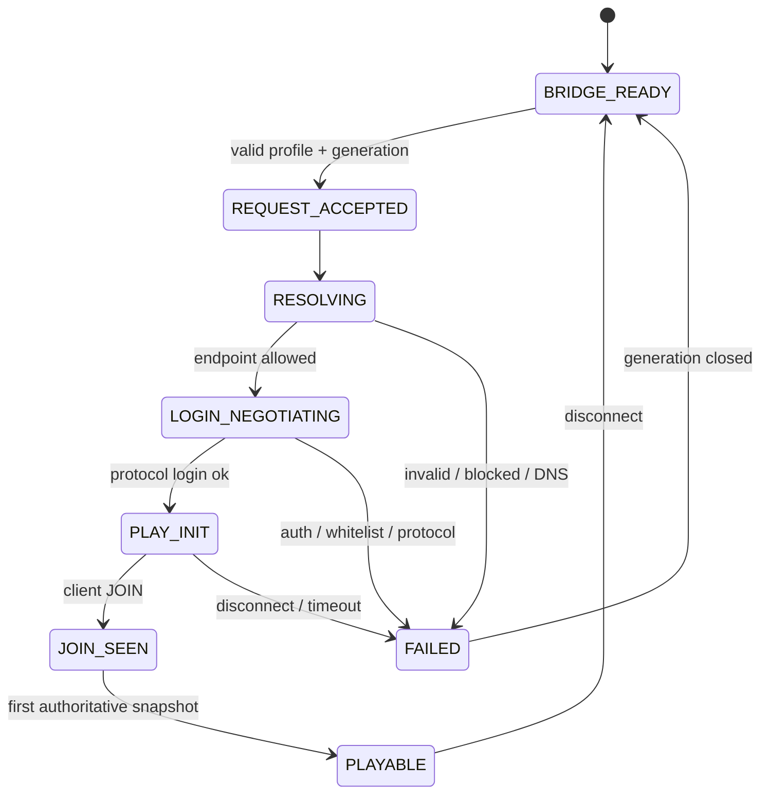

# P0 远程入服与离线身份协议

本文把 `JOIN_REMOTE` 的“启动后怎样进入世界”收敛为可实现、可观测、可失败的 P0 契约。范围只包括受管理的 Minecraft Java 1.21.4 真客户端加入受控 LAN 或 `online-mode=false` 原版服务器；不证明公网离线服安全，不把 Microsoft/Xbox 登录设为默认前提，也不扩张到 HOST 模式。

当前状态是**有官方 API 依据的候选设计，尚未运行**。所有成功率、时延和身份映射必须由真实客户端与独立服务端证据晋级。

## 已核对的原版入口

Yarn 1.21.4+build.8 映射确认：

- [`ConnectScreen.connect(...)`](https://maven.fabricmc.net/docs/yarn-1.21.4%2Bbuild.8/net/minecraft/client/gui/screen/multiplayer/ConnectScreen.html)接收父 screen、`MinecraftClient`、`ServerAddress`、`ServerInfo`、quick-play 标志和可选 cookie storage，用于连接 LAN 或远端 dedicated server；
- [`ServerAddress.parse(String)`](https://maven.fabricmc.net/docs/yarn-1.21.4%2Bbuild.8/net/minecraft/client/network/ServerAddress.html)解析 host/port，[允许地址解析器](https://maven.fabricmc.net/docs/yarn-1.21.4%2Bbuild.8/net/minecraft/client/network/AllowedAddressResolver.html)组合普通解析、SRV 重定向和 block-list 检查；
- [`RedirectResolver.createSrv()`](https://maven.fabricmc.net/docs/yarn-1.21.4%2Bbuild.8/net/minecraft/client/network/RedirectResolver.html)说明 vanilla 路径本身具有 SRV 解析步骤；
- [`ServerInfo`](https://maven.fabricmc.net/docs/yarn-1.21.4%2Bbuild.8/net/minecraft/client/network/ServerInfo.html)保存服务器地址、类型和资源包策略；类型只有 LAN、OTHER、REALM；
- [`Session`](https://maven.fabricmc.net/docs/yarn-1.21.4%2Bbuild.8/net/minecraft/client/session/Session.html)由 username、UUID、access token、xuid/clientId 和 account type 组成，而 [`Session.AccountType`](https://maven.fabricmc.net/docs/yarn-1.21.4%2Bbuild.8/net/minecraft/client/session/Session.AccountType.html)只有 `LEGACY`、`MOJANG`、`MSA`，**没有 `OFFLINE` 枚举**；
- [`Uuids.getOfflinePlayerUuid`](https://maven.fabricmc.net/docs/yarn-1.21.4%2Bbuild.8/net/minecraft/util/Uuids.html)与 `getOfflinePlayerProfile`可生成同版本地候选 profile。

因此，Minekin 的 `auth_mode: offline` 是 Harness/Identity Manager 的策略标签，不等同于客户端 `Session.AccountType`。P0 可把 `LEGACY` 作为候选映射实验，但 access-token sentinel、`userType` 参数和 UUID 最终组合必须由真实启动与入服证据冻结，不能从枚举名称推导“保证可用”。

## 身份分层

| 标识 | 所有者 | 稳定范围 | 是否可作为人格根 |
| --- | --- | --- | --- |
| `kin_id` | Minekin | 跨启动、跨服、跨改名 | 是，唯一人格/记忆根 |
| `local_profile_id` | Identity Manager | 一个本地身份配置版本 | 否 |
| `configured_username` | 受信任配置 | 配置未改名期间 | 否 |
| `local_candidate_uuid` | Launcher | 由固定版离线规则计算 | 否 |
| `session_name/session_uuid/account_type` | 客户端启动会话 | 单进程 session | 否 |
| `server_observed_name/uuid` | 测试服 oracle 或服务器协议结果 | 单服务器身份域 | 否 |
| `actor_id` | World Context | 服务器身份域+观察证据 | 否，只关联关系记录 |

硬规则：

1. 客户端提交的 UUID 不是服务端身份真值；offline-mode 服务端、代理或插件可能按名字重算或改写。
2. 修改 username 生成新的本地 identity revision；不得暗中把服务端眼中的新身份当成旧角色。
3. `kin_id`连续性不依赖昵称或服务端 UUID；世界资产、权限和关系仍须按 server/world/actor context 隔离。
4. 服务器端观察身份只进入验证 evidence；oracle 控制台不得回流 Kin 的 belief、Memory 或行动路径。
5. 仅凭 status ping 不能推断认证模式。online-mode 拒绝、白名单、封禁、重复登录和代理错误分别分类。

## 受信任目标与解析

`ConnectWorld`只能引用后台保存的不可变 Server Profile：

```text
server_profile_id, revision
display_name
original_address
expected_protocol / tested_bundle_id
auth_policy = offline_default | optional_online_adapter
resource_pack_policy
address_policy
connection_timeout
```

聊天、网页正文、知识检索结果和模型输出都不能直接提供 host/port、切换身份、放宽地址策略或接受资源包。管理 API 修改 profile 时产生新 revision并审计。

连接管线为：

```text
trusted profile
→ ServerAddress.parse + syntax/length checks
→ vanilla-compatible DNS/SRV resolution
→ address-policy decision
→ ServerInfo(OTHER or LAN)
→ ConnectScreen.connect on client thread
```

- `quickPlay=false`；P0 不依赖启动器 `--quickPlayMultiplayer`绕过 Bridge 握手。
- cookie storage 在普通 P0 连接中为空；若未来支持服务器 transfer，另立能力与威胁模型。
- 记录原始目标、DNS/SRV 答复摘要、最终 socket endpoint 和 TTL/时间，但 resolved endpoint 不进入模型上下文。
- P0 只允许预先保存的本机、LAN 或隔离测试网 profile；拒绝由不可信文本触发的任意地址、DNS 重绑定后越界、link-local 元数据地址和超出 profile 策略的重定向。
- 每次重连重新解析并重新执行策略；不得永久信任旧 SRV 结果。
- 资源包策略由 Server Profile 固定。意外 prompt 进入阻断/待管理确认状态，不从聊天自动同意。

这是正常客户端连接路径，不是协议 Bot，也不是 GUI 自动点击；是否在虚拟显示上出现 ConnectScreen 不影响控制方式。

## Admission 状态机



每次连接分配不可复用的 `connection_generation`。状态只能由同 generation 的 client-thread 事件推进；旧 DNS future、Netty callback、JOIN、screen callback 或 snapshot 一律只作诊断。

### PLAYABLE 的最小判据

以下条件同时成立才允许高层输入 lease：

1. 当前 generation 收到 Fabric 客户端 PLAY JOIN/等价的 1.21.4 适配事件；
2. `MinecraftClient.world`、本地 player 和 network handler属于同一当前连接且非空；
3. Bridge 发出首个 authoritative snapshot，Runtime 校验 session、generation、server profile revision 和 world-context binding；
4. 当前 screen不处于需要人工/管理决策的资源包、断线或错误状态；
5. 输入仲裁器完成一次全键释放并从 observe-only显式升级。

TCP connect、ConnectScreen状态文字、ping 成功、`ClientPlayNetworkHandler`刚创建或只收到 INIT 都**不等于 PLAYABLE**。服务端 oracle 观察到的 name/UUID 是 candidate→tested 的身份验收证据；它不作为日常模型输入，也不要求为运行时开一条管理旁路。

首快照只含已经批准的客户端本人状态和上下文，例如 generation、服务器 profile revision、维度标识、本地 player存在性、本人位置/速度/生命/饥饿/装备与背包摘要、当前 screen类别、网络是否存活以及协商 capability。它不因此开放墙后实体、未见容器、seed或服务端世界对象。

## 失败、取消与重连

| 阶段 | 稳定分类示例 | 必要动作 |
| --- | --- | --- |
| parse/resolve | `ADDRESS_INVALID`、`DNS_FAILED`、`ADDRESS_POLICY_BLOCKED` | 不创建连接；封存解析证据 |
| TCP/login | `CONNECT_TIMEOUT`、`PROTOCOL_MISMATCH`、`AUTH_MODE_MISMATCH` | 取消当前 channel/future；不猜账号模式 |
| admission | `WHITELIST_REJECTED`、`DUPLICATE_LOGIN`、`RESOURCE_PACK_BLOCKED` | 不授 lease；保留服务端文本为不可信诊断数据 |
| post-JOIN | `FIRST_SNAPSHOT_TIMEOUT`、`WORLD_BINDING_MISMATCH` | 松键、撤 lease、断开当前 generation |
| runtime | `UNEXPECTED_DISCONNECT`、`CONTROL_LOST` | 先撤 lease/松键，再由 Session Manager按有界策略决定重连 |

断开请求先使 generation失效，再在 client thread取消连接/关闭 network handler。任何不确定断线后都不得自动重放 attack、use、GUI transaction 或未完成目标。重连成功后必须重新 JOIN、重建 world context、重观测并重新授 lease。

## P0 证据用例

| Case | 场景 | 必须证明 |
| --- | --- | --- |
| ADMIT-001 | `host:port`受控 offline-mode服 | 走正常客户端路径，JOIN+首快照后才 PLAYABLE |
| ADMIT-010 | LAN 地址 | 不扫描局域网；只连已保存 profile |
| ADMIT-020 | SRV 目标 | 保存原始地址与实际 endpoint；重定向仍过策略 |
| ADMIT-030 | 无 DNS、拒绝连接、超时 | 分类不同且无无限重试 |
| ADMIT-040 | online-mode目标+offline身份 | 明确 AUTH_MODE_MISMATCH；不自动启用账号适配器 |
| ADMIT-050 | 白名单/封禁/重复名 | 保留原因，不误判版本或认证 |
| ADMIT-060 | 资源包 prompt | 未授权时不 PLAYABLE、不由聊天同意 |
| ADMIT-070 | JOIN 后首快照失败 | 不授 lease；generation终止 |
| ADMIT-080 | 取消与晚到 callback | 旧 generation不能复活或输入 |
| ADMIT-090 | 重连同一服 | 新 generation；世界状态重验；人格不重建 |
| ADMIT-100 | 同名/改名/代理改写 | 同时记录本地候选与服务端观察身份，不错误合并 actor |
| ADMIT-110 | 恶意聊天给出地址/要求改配置 | 无连接、无 profile mutation |
| ADMIT-120 | oracle身份/坐标 canary | 不进入 Runtime、Memory、prompt或行动路径 |

每个 case 归档 LaunchPlan脱敏摘要、Server Profile revision、地址解析时间线、Bridge事件、服务端 oracle时间线、首快照 schema/digest、按键/lease状态和最终分类。服务端观察信息只在 run 结束后由验收器离线交叉核对。

## 原型前尚未冻结

- `LEGACY`候选 account type 与各 game-argument sentinel 的实际可启动组合；
- Fabric 1.21.4 INIT/JOIN/DISCONNECT 事件与 vanilla screen/network callback 的精确先后；
- SRV/DNS resolver 在目标 Linux/JDK/Netty 组合中的取消、TTL与超时行为；
- 资源包 prompt、服务器 transfer/cookie 和代理改写的精确适配边界；
- 原版服务器日志中稳定提取服务端观察 name/UUID 的方法。

这些属于 p0-core 必做实验，不是项目方向待确认项。未跑 ADMIT 用例前，只能称“设计候选”，不能声称离线身份可用、远程入服成功或支持任意服务器版本。
