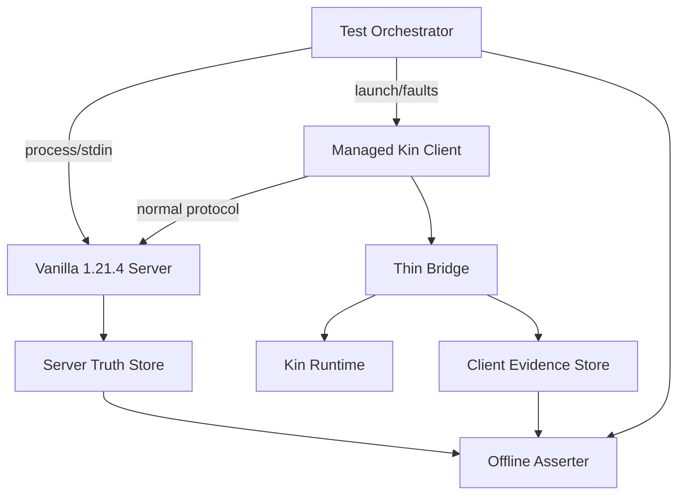
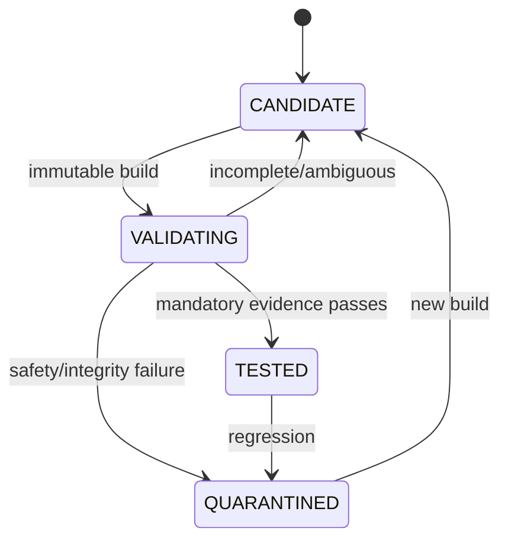

# P0 隔离验证环境、真值与证据包契约

核查时间：2026-09-17。本文定义怎样把 P0 从“有静态依据的 candidate”升级为“有可复核证据的 tested”。它只设计测试环境、测试用例、真值隔离和晋级门禁，不表示已经构建 Bridge、启动 Minecraft、加入服务器或跑过任何用例。

## 固定结论

1. P0 的权威基线是 Minecraft Java 1.21.4 的**官方原版 dedicated server**与真实受管理客户端；Paper、代理服或测试 mod 不能替代原版基线。
2. 另有一组 LAN integrated-world 用例，用来验证默认本地身份、动态端口与真实客户端间连接；LAN 通过不代替 dedicated server。
3. Kin 永远以普通 survival 玩家加入，不授予 op、控制台、RCON、服务端文件或服务器真值权限。
4. Test Orchestrator 可在隔离环境中持有服务器 stdin/stdout、进程控制和只读证据目录；这是**测试侧 oracle**，不得进入 Bridge observation、Runtime belief、Memory、Planner、Skill 或模型上下文。
5. P0 默认外部 VLM 调用为零。测试截图/视频只供人类复核与离线公平校准，不能被回灌为当次 Kin 感知。
6. 一次“看起来能动”的手工演示不是通过。缺 manifest、日志、时间线、预期/实测对照或工件摘要时，用例必须是 `INCOMPLETE`，不能标绿。
7. `p0-core` 与 `p0-nav-exp` 独立评级；Baritone 变体失败不降低已经证明的 core，也不能借 core 的证据声称导航已通过。
8. 实施顺序由[P0 核心原型执行计划](p0-prototype-execution-plan.md)的 W00→W70 门禁约束；前置工作包未通过时，后续结果不得用于晋级，W80导航实验只能在 core 之后运行。

## 为什么需要服务端真值

同版 Yarn 文档把 `MinecraftServer`描述为处理玩家动作、伤害、世界时间和命令的逻辑服务器，并区分 dedicated 与 integrated server；这支持把服务端观察作为测试判据，而不是相信客户端或模型自报。Dedicated server 还具有终端命令入口；P0 首选由 Orchestrator 独占子进程 stdin/stdout，不启用 RCON。

真值只回答“游戏实际上发生了什么”，不回答“Kin 当时应该知道什么”。例如服务端知道玩家坐标，不代表 PlayerMind 可以得到精确坐标；比较工作在测试报告中进行，而不是把 truth DTO 发给 Runtime。

## 测试拓扑与隔离



关键隔离：

- Server/Orchestrator 网络置于本机 loopback、network namespace 或等价私有测试网；`online-mode=false` 的测试服不得暴露公网。
- Dashboard、Runtime 与 Bridge 的服务账号没有 server world、logs、console pipe、oracle database 的读取权限。
- Asserter 在测试结束后读取两侧证据；它不位于实时控制链，也没有向 Runtime/Bridge 回写接口。
- truth 目录只允许 Orchestrator/Asserter 写读；Kin 的 durable memory volume 与 session overlay 均不挂载该目录。
- fixture player 使用另一个真实客户端或 LAN host；其动作在测试清单中标记，不能伪装为环境自然发生。
- 每次 case 使用新的 `test_run_id`、session generation 和干净/已知 world snapshot；不得复用旧 lease、客户端 GUI 或实体引用。

最小部署建议为三个 OS 身份/容器边界：`minekin-test-orchestrator`、`minekin-runtime/client`、`minekin-test-assert`。是否最终使用 systemd、OCI 或 network namespace 由实现原型决定；权限隔离本身是门禁。

## 原版 dedicated server 档案

P0 使用 Mojang 1.21.4 version metadata 指向的 server JAR，记录官方 URL、大小与 SHA-1 `4707d00eb834b446575d89a61a11b5d548d8c001`；运行前接受适用 EULA。JAR 不提交仓库、不默认打进 Minekin 镜像。

测试配置的意图如下，具体字段和值仍须由启动实验读取启动日志并核对：

| 配置 | P0 意图 |
| --- | --- |
| `online-mode=false` | 验证默认本地身份；只用于明确允许该模式的隔离私人测试服 |
| `server-ip` / firewall | 只绑定隔离地址；没有公网路由 |
| `white-list=true` | 仅 Kin 与声明的 fixture 身份可进 |
| `gamemode=survival`、`force-gamemode=true` | Kin 始终走正常生存规则 |
| `pvp=true`、固定 difficulty | 支持伤害/PvP用例并保持环境可重放 |
| 固定 `level-seed` 与 world snapshot | 同一 case 可从相同起点重跑 |
| `enable-rcon=false`、`enable-query=false` | P0 不为方便扩大远程管理面 |
| `enable-command-block=false` | 场景编排由受控 console完成 |
| `broadcast-console-to-ops=false` | 即使未来出现 op fixture，也不把 oracle 输出广播进游戏 |
| `spawn-protection=0` 或远离 spawn 的 fixture | 避免普通玩家被测试配置误阻挡 |

Test Orchestrator 可以在**场景准备或故障注入阶段**通过 server console 执行命令，但要记录原文、时间、预期影响和目标；由命令直接造成的移动、物品或伤害不能计为 Kin 能力。动作结果测试优先让 Kin 自己通过正常客户端完成，再从日志、控制台查询和世界快照交叉确认。

LAN 档案由另一个受管理的真实 1.21.4 host client 开启 integrated world；记录实际动态端口、host bundle、world seed/snapshot 与 host identity。不得把扫描整个局域网作为通过条件，地址来自测试 Server Profile。

## 三条时间线

每个用例至少产生三条只追加时间线：

| 时间线 | 必备字段 | 用途 |
| --- | --- | --- |
| Bridge/Runtime | `run_id`、`session_id`、generation、单调时间、client tick、状态/intent/action/result、lease/capability | 证明何时看见、决定和发出合法输入 |
| Server truth | server process id、world/seed、join/leave、服务端观察身份、命令与响应、位置/物品/伤害/死亡的必要断言 | 证明游戏实际结果 |
| Orchestrator | case/step、进程动作、网络/IPC故障、fixture动作、snapshot restore、wall-clock sync marker | 解释外部刺激与故障 |

跨进程不假定 wall clock 完全同步。Orchestrator 在启动、JOIN 后、故障前后注入带 `sync_marker_id` 的可观察标记，各进程同时记录 wall clock 与 monotonic clock；报告给出误差窗口。动作先后无法在误差窗口内判定时结论必须是 `AMBIGUOUS`，不能强行通过。

## Evidence Bundle

每次 run 产出内容寻址、只读封存的 evidence bundle：

```yaml
schema: minekin.p0.evidence.v1
test_run_id: "<uuid>"
case_id: "P0-CORE-..."
case_version: "<git/blob digest>"
result: "PASS|FAIL|INCOMPLETE|AMBIGUOUS"
bundle:
  launch_plan_digest: "<sha256>"
  minecraft: "1.21.4"
  server_jar_sha1: "4707d00eb834b446575d89a61a11b5d548d8c001"
  loader: "0.16.9"
  fabric_api: "0.119.4+1.21.4"
  bridge_digest: "<sha256>"
  protocol_schema_digest: "<sha256>"
environment:
  os_kernel: "<value>"
  java_runtime: "<vendor/build>"
  cpu_memory: "<summary>"
  renderer_display: "<llvmpipe-or-gpu/display>"
world:
  kind: "dedicated|lan|none"
  server_config_digest: "<sha256>"
  seed_or_snapshot_id: "<controlled ref>"
identity:
  configured_profile: "<redacted ref>"
  server_observed_name_uuid: "<evidence>"
artifacts:
  bridge_trace: "<path,digest>"
  server_truth_trace: "<path,digest>"
  orchestrator_trace: "<path,digest>"
  stdout_stderr: ["<path,digest>"]
  crash_reports: ["<path,digest>"]
  screenshots_video: ["<optional path,digest>"]
assertions:
  expected: ["<machine-readable predicates>"]
  observed: ["<machine-readable values>"]
  failures: ["<reason code>"]
```

日志先脱敏再封存：不含在线 token、秘密、完整聊天或无关玩家位置。原始敏感证据仅保存在受控测试域并有期限；公开报告只发布摘要、哈希和获授权片段。evidence bundle 的 digest 与测试代码/文档 commit 相互引用；修改任一文件都会产生新 run，不覆盖旧结论。

`case_version` 覆盖的是**判据本身**，不只是它的名字。（2026-09-22：此前它只覆盖用例 manifest 的摘要，而 manifest 只列断言**名字**——于是把 `leave_after_join_observed` 从"Core 报了干净退出"改成"只看服务端那一行"**不会**让任何版本动，同一个 `case_version` 可以对应两种判据，而在旧判据下封的 bundle 会以"证据就是这一版要的那个"的身份通过晋级。现在每份用例在 manifest 里记录**它点名的每条断言由哪段源码执行**（`assertion_digests`：断言名 → 该实现的 sha256，取函数源码而非整个文件，docstring 也算在内），于是"改了判据就必须换版本"由 manifest 自己的摘要保证，不需要多一条规则。记录按**用例各自**限定：改一条这份用例没点名的断言**不会**动它的版本——一个到处都会动的版本等于没有版本。执行的是 `tools/check_case_assertions.py`（CI 的 `python` job 里跑）：记录缺失、记录对不上、或记录了用例没点名的断言，都拒绝；`--record` 是唯一的更新路径，且是在改动**评审之后**才该跑的那一步。跨平台一致：摘要按 LF 归一化后再算，同一份函数在 Windows 与 Linux 上是同一个实现。）

**封存的判决可以被重判一次，而且重判必须与封存的一致**（`tools/rejudge_evidence.py`，2026-09-22）。上面那条规矩管的是"判据有没有变"，这条管的是**"写在这份字节上的判决，这份字节是否真的支持"**。此前做不到，因为 bundle 缺两样东西：判官**被交给的输入**（服务端看见的那个名字、这次运行属于哪个 Kin、以及它前面那一次是哪一次——一个被强杀 Core 的运行从来没写过会说这些的文档），以及"同一份材料"的第二个读法；现在封存端多封一件 `asserter-inputs.json`，并且材料里的每个工件名由**读取端**声明、封存端 import（封存端写了一个读取端不认识的名字不会失败，它会读成"这次运行没有这一项"，那是另一个更安静的答案）。于是三件事各查各的：字节还是那些字节（`verify_addressed_bundle`，`evidence verify` 跑的就是它）、bundle 点名的用例仍是**封存时那一版**的用例（版本不符即拒判——判据搬了家，旧判决回答的是现在没人问的问题，这与"判决被盗改"必须是两个不同的答案）、以及**这些字节现在给出的判决与当时记录的一致**（结果、expected、observed、failures 逐项比）。**这条是补上一个真实的洞**：一份被改写过的 manifest——把 `failures` 清空、`observed` 填成 `expected`、`result` 改成 `PASS`，并重新生成 `bundle.sha256`——**能通过 `evidence verify`**，因为摘要只证明"字节没被动过"，不证明"这些字节支持这个判决"。重判端拒绝它并报出 `RESULT:recorded=PASS,re-judged=FAIL`（有用例就是这么构造的）。**晋级也拒绝它**：晋级报告是唯一能跑重判的地方（判据是测试域代码，产品侧不能 import），因此它对每个"验得过"的 bundle 重判一次，重判不符的**不能**点亮它所属的包（`EVIDENCE_DISAGREES_WITH_ITS_BYTES`）；"重判不出来"（bundle 早于这条规矩、没有记录判官当时的输入）**只报不拦**——那是读法上的缺口而不是字节的问题，而且把输入删掉并不能走到那个状态：删掉 manifest 声明过的工件、或留下 manifest 没声明的文件，都已经是校验失败。这两者的区别写进了 `ReJudge` 的注释：一个是关于 bundle 的事实，另一个是关于读者的事实。

### `world.kind: "none"`：一次没有加入任何世界的运行

L1 的要证内容是"真客户端到主菜单、握手完成、仍是 `OBSERVE_ONLY`"——**这次运行根本没有世界**，而上面那一段把 `world` 当必填，于是这类运行要么写一句假话（`dedicated`），要么写一个真服务器的摘要（更糟）。2026-09-20 补上第三个取值，规则如下：

- `kind: "none"` 表示这次运行**没有加入任何世界**：没有服务端、没有存档、没有连接尝试。它不是"服务端未知"，也不是"暂时不知道"——那些都该失败而不是记成这个值。
- 此时 `server_config_digest` **必须是空文档的 sha256**，即 `e3b0c44298fc1c149afbf4c8996fb92427ae41e4649b934ca495991b7852b855`。这是"没有任何服务端配置"的唯一表示：字段仍然是一个合法摘要（否则它与"摘要缺失"这一失败长得一样），但它的值不可能是任何一份真配置的摘要。这条约束是双向的——校验端拒绝 `kind: "none"` 与非空文档摘要同时出现，也拒绝另外两种 kind 出现空文档摘要，否则这个取值会变成"绕开服务端配置要求"的逃逸口。
- `seed_or_snapshot_id` 写 `none`，`server_jar_sha1` 写空串：这次运行没有用到 jar，也没有种子，写任何值都是编造。
- `identity.server_observed_name_uuid` 为空：没有服务端观察过这个身份，而"服务端观察到什么"不能被客户端自报替代。`identity.configured_profile` 仍然填，因为客户端确实带着一份配置运行过。

这份取值只对**没有世界**的运行成立。L0 那类仓库自检用例（从不启动任何东西）**也走同一份形状**：它的 `inputs` 恰恰就是那份已评审的 bundle 与夹具，因此 `bundle` 段里那些"这次检查的是什么"的字段填的是真值而不是编造，而 `world` 段就是这里的 `none`。2026-09-20 已实测：`W00-CONTRACT-001` 的四条检查被封成一份 bundle、`evidence verify` 通过、晋级报告把它算作该用例的证据。仓库自检的 bundle 不放在任何 Kin 下面（`repo-evidence/<run-id>/`，见[数据根目录提案](run-directory-proposal.md)决定五）。


## 晋级阶梯

| 级别 | 必须证明 | 典型用例 |
| --- | --- | --- |
| L0 Artifact | 官方/Fabric/Bridge/配置摘要一致，固定 mods 无未知项 | 错 hash、缺库、未知 mod、错误 Java 必须 fail closed |
| L1 Bootstrap | 真客户端到主菜单，Bridge hello/握手完成且仍为 `OBSERVE_ONLY` | Runtime 晚启动、错误 nonce/schema/capability、无卡死 |
| L2 Dedicated Join | 默认本地身份加入隔离原版 offline-mode 私服 | JOIN、首 authoritative snapshot、服务端观察身份、正常离开 |
| L3 LAN Join | 加入真实 integrated-world LAN 会话 | 动态端口、host 退出、重连与 generation 更新 |
| L4 Minimal Body | 只有 JOIN+首快照后获得 lease；最小 move/look/use 的结果被服务端确认 | 输入→服务端结果链，不用控制台替 Kin 完成 |
| L5 Failure Safety | 断 IPC、杀 Runtime/client/server、慢消费者、旧 generation、重连均安全 | 松键、撤 lease、无旧对象/危险动作重放 |
| L6 Soak/Resource | 有界持续运行并报告资源与延迟分布 | P50/P95/P99、队列/GC/FPS/TPS/RSS；阈值先测后定 |

L6 的基线**已有第一轮证据**（2026-09-20，用例 `CORE-100`，见下方用例清单第 14 条）：受控域里 600 秒 / 间隔 10 秒，真客户端 + 真原版服务端、`llvmpipe` 软件渲染，两个 JVM 各 62 个 `/proc` 样本。**报告什么、由谁报告**：`tools/report_soak.py` 只读**已封存**的 bundle（先校验摘要），算出 per-process 的 min/first/last/**P50/P95/P99**/max RSS 与线程峰值，并写明百分位方法（nearest-rank）。**本轮数字**：client P50 1607 MB / P95 1611 / P99 1618 / max 1618，线程峰值 115；server P50 912 / P95 913 / P99 913 / max 913 MB，线程峰值 78。**没有测的**：FPS/TPS/GC/队列深度在本仓库没有来源（采样器只读 `/proc`），GPU 渲染档没有跑。**没有人设阈值**：契约说「阈值先测后定」，所以这一轮只报告。

上述 L3 只证明 Kin 客户端能加入**另一宿主**开放的 LAN 世界。Kin 自己创建/恢复存档并开放 LAN 是独立的 `host-integrated`晋级面，必须同时按[自建世界存储生命周期](hosted-world-storage-lifecycle-contract.md)的 HOST 用例与[自建世界控制边界](hosted-world-control-boundary-contract.md)的 HOSTCTL 用例另取证；其 Bridge 变体记为 `p0-host-exp`。它不属于 `p0-core`由 candidate 升为 tested 的前置条件，也不能反向借用 L3 结果声称 host tested。

**用例的 `work_package` 是一份**闭集**，而三份 host 相关的用例此前写着 `W90`——那不是任何东西。**（2026-09-22。路线图到 `W80` 为止（`p0-nav-exp`），而 host 面按上面这段是独立的 `host-integrated` 晋级面；于是 `W90` 只满足"形如 `W\d\d`"这条形状检查，读者读一份 bundle 时**说不出**它的证据属于哪个包，也**没有东西可以核对**这个说法。现在词汇表是 `W00`-`W80` 加上本文与[决策记录](decisions.md)已经命名的那三个独立晋级面：`p0-core`、`p0-nav-exp`、`host-integrated`。**为什么要两种名字**：`W00`-`W80` 是 core 切片内部的阶段，而 L3（LAN join）**不属于任何单一阶段**——它是 core 阶梯上的一级，建在 W70 之上但不属于它——所以它写自己为之作证的**面**（`p0-core`），而不是借一个不属于它的阶段号。`HOST-030`/`HOST-040` 写 `host-integrated`。域里的 `WORK_PACKAGES` 与 `schemas/case-manifest.schema.json` 的 `enum` 是同一份清单，并有一条用例钉住两者相等——两份清单就是两套词汇，而其中一份会漂移。

HOST世界保存/恢复另需 `HOSTCOMMIT-001…110` 证据；它验证默认维度、玩家/世界双保存、JointResumeToken、回滚/分叉和唯一Current World激活。缺少该组证据时，`p0-host-exp`不能标记host lifecycle tested。

`p0-core: tested`至少要求 L0–L5 全部 mandatory case 有 PASS evidence，并完成一轮有明确时长和环境的 L6 baseline（2026-09-20：这一轮已跑并封存，见 L6 行的说明与用例清单第 14 条；证据在 `kin/<kin_id>/run/evidence/<run-id>/` 里，含 `soak-samples.txt` 与 `soak-summary.json`）；性能数字没有人类基线前只报告、不凭空设“优秀”阈值，但下列安全不变量没有宽限。

## 硬失败不变量

- 固定 manifest 外出现未声明 mod：失败；
- JOIN 与首 authoritative snapshot 前授予高层输入 lease：失败；
- 接受旧 session/generation/capability 的动作：必须为 0；
- disconnect、safe-stop、死亡或 GUI generation 失效后留下持续按键：必须为 0；
- ambiguous disconnect 后自动重放 attack/use/GUI 等危险动作：必须为 0；
- test oracle 的坐标、背包、实体、世界或命令结果到达 Runtime belief/action/model 路径：必须为 0；
- 测试截图/Live View 自动进入 VLM 或人物记忆：必须为 0；
- 日志缺失、摘要不符、断言不可重放：不能 PASS；
- Orchestrator 命令造成的结果被记作 Kin 技能成功：失败。

“0”是可观测验收目标，不是零风险宣传；报告仍需说明监测覆盖和残余盲区。

## P0 mandatory case set

1. `CORE-001`：固定 artifact/bundle 清单复核；篡改任一摘要与插入未知 mod。
2. `CORE-010`：到主菜单、hello、握手、OBSERVE_ONLY；Runtime 缺失/晚到/错误协议。
3. `CORE-020`：原版 dedicated offline join；服务端 name/UUID、JOIN首快照与退出。
4. `CORE-030`：LAN join；端口变化、host 退出和重新进入。（2026-09-21 状态：**已有用例 `tests/fixtures/cases/core-030.json`，仍是 `mandatory: false`**。两条断言判的是**加入端这一次运行**的材料：`the_first_snapshot_of_the_world_it_dialled_was_admitted`（它自己日志里的 dial 目标 + 它自己 run document 里首快照被准入且 `PLAYABLE`）与 `the_world_this_run_joined_is_the_one_the_case_names`（**世界的身份由宿主那一轮的 run document 给出**：`settings_digest` 等于用例钉住的 `tests/fixtures/saves/kinworld/level.dat`、`digest` 与 `settings_digest` 结构完整、宿主确实 `LAN_OPENED` 且端口等于这个客户端实际 dial 的端口；宿主的 `kin_id`/`run_id` 必须完整，并且是另一个 Kin、另一次 run）。宿主文档随 bundle 一起封（`host-run-document.json`）、被 manifest 的摘要覆盖，并且**判决与工件是同一次读取**——sealer 不再把活动路径转发给验收器。**仍未覆盖**：端口变化、host 退出与重新进入；而且这一条**还没有一轮真实运行**（2026-09-21 这一轮只到本地锁定环境，没有真实 Minecraft、没有接受 EULA）。）
5. `CORE-040`：最小合法 move/look/use；Bridge trace 与 server truth 都能解释结果。（2026-09-20 状态：**三种动作都已覆盖，本用例已是 `mandatory: true`**。`use` 已接线（第四条能力 `control.use.v1`、第四条 wire 消息 `UseInput`），并且有一条把它变成服务端可观察的事实的场景：Kin 走向一个摆在三格外的音符盒、撞上去停住、按住 use，服务端每次都被问它是不是还是被摆下去时的状态。六条断言（move 四条 + 转向 + 方块状态改变）在一轮真实运行里全部通过、封存、可验。它是本仓库第一个同时覆盖 move/look/use 的用例。）
6. `CORE-050`：握手前、JOIN前、首快照前的输入全部被拒绝。（2026-09-20 状态：**已有用例 `tests/fixtures/cases/core-050.json`，且已是 `mandatory: true`**。四条断言：账本里有一条 `InputRefused{phase: JOIN_SEEN, refusals: [NOT_PLAYABLE]}`、这次运行**没有任何** `InputLeaseGranted`、客户端日志里**没有** Bridge 按过任何键的那两行、以及服务端自己的读数里 Kin 到达过、却始终在同一个地方。判据来自一次真实运行（`--hold-forward-seconds 30 --hold-at join`，世界照常变成 playable、快照照常被接收，而 Kin 从未被驱动），九件工件、封存、可验。**握手指令之前**那一段由传输层覆盖：尚未 authenticate 的 host 拒绝所有控制命令，有一条契约用例对输入类型与非输入类型各断言一次。）
7. `CORE-060`：逐个强杀 Runtime、Launcher、client、server；验证 lease、松键、回收和重验。（2026-09-20 状态：**按进程边界拆独立 case id**，因为一次运行只能注入一种故障，而 promotion 对一个 case id 采用 any-satisfying-bundle 语义；把互斥故障塞进同一断言集既不可能由一份 bundle 满足，也不能保证每种故障各有一份。原 `CORE-060` 记录 runtime-controller kill；新增 `CORE-060-SERVER-001` 记录 server JVM kill，两者仍为 `mandatory: false`。server 子用例要求同一份证据同时证明：move lease 存在；结构化故障记录精确归属 case/version/run/kin/session/generation，目标为 `server_jvm`，`SIGKILL` 已注入且该进程身份从 `/proc` 消失、没有伪造 wait status；服务端日志没有 `Stopping the server` 与 `All dimensions are saved`；账本从 `PlayableEstablished` 进入 `SessionInterrupted{phase: DISCONNECTED}`；Bridge 以 `LEFT_PLAYABLE (PLAY_ENDED)` 非零松键。每一项都有负向变异测试。**本仓库 Runtime 与 Launcher 是同一个进程**，所以不虚构 launcher 独立边界；client kill 与完整回收/重验子用例仍未完成，L5 仍不算 complete。故障 helper 仍由本 run 已持有的 root pid 推导唯一目标，记录 `/proc` 身份并在发信号前复核、SIGKILL 后等待该身份消失；它不是目标父进程，因此只能声明 `IDENTITY_DISAPPEARED`，不能声明 `WAIT_STATUS`。**server 子用例已有一轮真实运行**（2026-09-20，受控域里 Kin 走着时强杀 server JVM）：五条断言全部成立、bundle 封存且 `verified: true`，账本按同一 session 记下 `PlayableEstablished → InputLeaseGranted{control.move.v1} → SessionInterrupted{DISCONNECTED}`，客户端自己报 `released 1 input(s) after LEFT_PLAYABLE (PLAY_ENDED)`，服务端日志停在半句上。**client 子用例（`CORE-060-CLIENT-001`）也已有一轮真实运行**（2026-09-20，Kin 走着时强杀 client JVM）：四条断言成立、bundle 封存且 `verified: true` —— move lease 存在；`fault-injection.json` 归属同一 run/session/generation、目标 `client_jvm`、`SIGKILL` 已投递且身份消失、不伪称 wait status；账本在同一 session 上有 `SessionInterrupted`（实测是 `outcome=BRIDGE_LOST`：Bridge 就在被杀的那个进程里，所以客户端侧不可能留下松键日志，这也是本条与另外两条不同的地方）；服务端自己记录了先 joined 后 left。**仍未完成的边界**：L5 的另一项「回收/重验」现在有独立子用例（`CORE-090`，见下），但它在契约上还差「正常退出」那半，所以 L5 仍不算 complete；第四种进程边界（Launcher）在本仓库不存在，不虚构。`/proc` 的实际读取路径现在有两条真实运行覆盖（此前只有注入 procfs 的单测）。）
8. `CORE-070`：断线/半帧/慢消费者/事件洪水；有界背压且无危险重放。（2026-09-20 状态：**已有用例 `tests/fixtures/cases/core-070.json`，且已是 `mandatory: true`**，四条断言都由测试执行——它证的是**通道**的行为，而唯一能被按需驱动到那些状态的端是测试对端；`tests/contract/test_bridge_ipc_host.py` 三条：半个帧被拒（长度头说了 N 只来了 M，通道按故障读而不是按短读读）、超过协商上限的帧在**分配之前**被拒、事件洪水在**有界队列**上溢出时清空缓冲并只留下一个错误（慢消费者就是反方向的洪水，所以这是同一条规则）；`tests/unit/test_session_supervision.py` 一条：世界在 lease 还在 Core 手上时消失、且报告**没有**失败原因（本仓库自己的判据：带原因是服务端结束了会话，不带原因是会话自己结束了），Core 不能从中知道最后那条命令是否到达——安全的答案是**不再重复它**。这一条做过变异验证：把那条命令在断线时重发一次，用例立刻变红。**断线那一半由运行取证**（`ADMIT-110` 的黑洞与 `CORE-060` 的杀 Core 都是从另一侧结束一次会话），**Bridge 侧的同一个有界队列**（Java `BoundedChannel`）不在本用例里：仓库自检类用例能驱动的只有 python 侧。)
9. `CORE-080`：故意向 oracle 放置 Kin 未看见的事实；检查所有 Runtime/Memory/模型输入均不存在该事实。
10. `CORE-090`：正常退出与崩溃恢复；同一 `kin_id`，瞬时状态失效，世界状态重新观察。（2026-09-20 状态：**崩溃恢复这半已有用例 `tests/fixtures/cases/core-090.json`、已封存且可验，仍是 `mandatory: false`**——契约这一条还要求「正常退出」，而那半由 `CORE-020` 的 `leave_after_join_observed` 证，所以这一条不点亮门禁。判据是**重启这一次运行自己的材料**加上**同一条账本里排在它前面那次运行**：新的快照被准入（世界状态是重新观察的）、世界那边 Kin 到达过且一步没动、上一条运行停在 `InputLeaseGranted` 之后（没有松键、也没有中断，因为能写下它们的那次 Core 已被杀）、这一次的 session 坐标与那一次不同（§7 的瞬时状态不跨运行）、以及 run document 的 `recovery` 块说它 `reconciled` 且没有东西还在等世界。**材料的形状随之扩展**：`RunMaterial` 多出上一条运行的 run id 与它的事件行（按账本的 `position` 取，不用任何时钟），封存端在它非空时多封一件 `previous-run-trace.jsonl` —— 判决所依据的那份读法必须与 bundle 一起走，否则读 bundle 的人复现不出判决。实测：一轮「先杀 Core、紧接着重启」的两连跑里五条断言全部成立、bundle `verified: true`，封进去的上一条运行的行恰好停在租约之后。**仍未覆盖**：崩溃落在启动窗口（记下意图、还没 settle 效果）时留下的 pending outbox 分支，那一段只能由单测对着真账本覆盖。）
11. `ADMIT-001…110`：验证可信 profile、host/port与SRV、地址策略、正常客户端 login/JOIN/首快照、资源包门禁、取消/晚回调、重连和离线身份映射；TCP连接、INIT或 screen状态不得单独判成功。（2026-09-20 状态：`ADMIT-100` 被定义为**服务端拒绝**这一条——目标启动并接受登录握手，然后在白名单上说不——判据是两处记录都说同一件事：账本里 `phase: FAILED` 配 `…WHITELIST_REJECTED` 这个类别，客户端日志里 Bridge 自己那行分类；`ADMIT-110` 是**这一组里的另一条**——「目标接受连接却从不回应时，Core 在自己的 deadline 上放弃这次尝试，并且这件事到达了客户端」——用例文件 `tests/fixtures/cases/admit-110.json`，目前 `mandatory: false`，因为这一组其余部分还没有定义。）
12. `ADMIT-120`：服务端 oracle 放置身份/位置 canary；只允许在 run结束后由验收器交叉核对，不得进入 Runtime、Memory、prompt或行动路径。
13. `NAV-EXP-010`：只在 core tested 后运行，核 Baritone mixin、输入仲裁、取消尾部和隐藏真值越界；单独给 `candidate/tested/quarantine`。
14. `CORE-100`：**L6 的有界 soak baseline**——一轮有明确时长的持续运行，报告两个进程的资源分布，而不是通过某个性能阈值。（2026-09-20 状态：**已有用例 `tests/fixtures/cases/core-100.json` 与一轮真实运行的 bundle，`mandatory: false`**——它证的是「这轮测量本身成立」，不是「性能合格」，所以它不该像行为用例那样点亮门禁。三条断言都读被封存的证据：世界是被准入过的（`first_snapshot_admitted`）、这次 soak 真的覆盖了它被要求的时长（summary 没提前结束 **且** 样本的时刻实际跨到那里，容差一个采样间隔）、两个 JVM **各自**从头到尾都被采到（一个中途不再出现的进程就是中途不在了）。harness 写 `soak-samples.txt`（`label rss_kb threads elapsed_seconds`）与 `soak-summary.json`（要求了什么、有没有提前结束），sealer 与验收器读**同一份快照**并封存它；`tools/report_soak.py` 从封存字节算出 P50/P95/P99 与线程峰值。**本轮**：600 秒 / 10 秒间隔、62 个样本/进程、跨度 594 秒、PASS、`verified: true`。**未做的**：FPS/TPS/GC/队列深度没有来源，GPU 档没跑，阈值仍然没有——按契约「先测后定」。）

### crash / outbox / restart 窗口的可封边界（2026-09-24 冻结，`CRASH-OUTBOX-EVIDENCE-DESIGN-001`）

上面第 7 与第 10 条合起来要求的是**几个互斥的故障窗口**，不是一条用例。逐窗口给出「由哪个 case id
承载、读哪些已封存工件、当前 harness 能不能真跑出来、当前 build 上有没有证据」四件事：

| 窗口 | 承载 case id | 判据读什么 | 当前 harness 可否真跑 | 当前 build 上的证据 |
| --- | --- | --- | --- | --- |
| Runtime（Core）强杀后松键 | `CORE-060` | 故障记录 `target: runtime_controller` + Bridge 松键 + 服务端读数 | 开关在（`MINEKIN_DOMAIN_KILL_CORE`，`domain.sh:26/1233`），**注入真做得到，封存通道当场是断的**（见下面那条 2026-09-24 修订） | **无**（只有旧 build 的 PASS/FAIL） |
| client JVM 强杀 | `CORE-060-CLIENT-001` | 同上，目标 `client_jvm`，账本记 session 结束 | 可（`MINEKIN_DOMAIN_KILL_CLIENT`，`domain.sh:36/1389`） | **无**（同上） |
| server JVM 强杀 | `CORE-060-SERVER-001` | 目标 `server_jvm`、`/proc` 身份消失、无 `Stopping the server` | 可（`MINEKIN_DOMAIN_KILL_SERVER`，`domain.sh:30/1316`） | **无**（同上） |
| 崩溃后重启重验（瞬时状态失效、世界重新观察） | `CORE-090` | 本次 run document + 同账本上一条 run 的事件行（`previous-run-trace.jsonl`）+ `recovery` 块 | 可（两连跑：先 `MINEKIN_DOMAIN_KILL_CORE=1`，紧接着 `MINEKIN_DOMAIN_CASE=CORE-090 MINEKIN_DOMAIN_STILL=1`） | **无**（同上） |
| 正常退出 | `CORE-020` 的 `leave_after_join_observed`（也出现在 `CORE-060-CLIENT-001` 的断言集里） | 客户端日志与服务端读数 | 可 | **无**（旧 build 的 PASS） |
| **intent 已写、效果未 settle**（崩溃落在启动窗口）留下的 pending outbox | 没有 case id，也不该有 | `session start` 在**尝试效果之前**写 `START_CLIENT`；这一半**只能**由真 SQLite + 故障注入单测构造 | **按构造打不中**（见下） | 本地证据：`tests/unit/test_recovery_service.py`（`:236` 真 `sqlite3.connect`、`:339` 真 `SessionEventLog(...).open_effect(...)`），按下面的口径标，不伪装成真实运行 |

- **runtime 那一格为什么从「可」改成「开关在、封存通道断」**（2026-09-24 开跑当场读数，
  `CRASH-OUTBOX-RESEAL-001` 因此修订了自己的范围）：冻结那句「可」读的是「有 case id、有断言、有开关」，
  第一次真跑把第四件事也问了一遍——**封存通道能不能把这次 run 收下来**。答案是否：注入成功
  （`INJECTED`、session 退出 137、服务端目录 `run-133`），sealer 却报
  `exit 2 / unsealed：/tmp/domain-session.json is not a readable run document`（run id
  `3e7ac6124d3549598ad85259d2b8b54f`，**卷上没有它的 bundle**，因此既无 FAIL 可留也无事可撤）。
  机制是 `domain.sh:1886-1889` 用「捕获文件有没有字节」回答「Core 打没打出自己的文档」，而 session 跑在
  `xvfb-run` 里、`/usr/bin/xvfb-run:184` 是 `"$@" 2>&1`：被杀的是 `xvfb-run` 的孩子，死讯 `Killed` 就落在
  文档那条流上。三次容器内只读探针把它钉死：只杀内层 python → 文档 7 字节 `Killed`、包装器自身 stderr
  0 字节；同一个孩子不过包装器直接杀 → 两路各 0 字节（死讯压根不进数据流）；按命令行把包装器与孩子一起
  杀（`a818a62` 之前那句全局 `pkill -f "minekin_core session start"` 的形状，那串参数同时出现在
  `xvfb-run` 自己的命令行里）→ 文档 0 字节，`07e68af` 设计的 `--run-id` 回落照原意生效。
  **所以这是 `a818a62` 的副作用**：那次把杀法从「按命令行猜」换成「按身份只杀孙进程」，归因对了，
  代价是从此没有一份被杀的 Core 封得上——而那条回落通道只有这个窗口用得上，所以那四天里没人碰到。
  修法不改判据也不改杀法（改回 `pkill` 会撞上 `tests/contract/test_runner_scripts.py:156`），只把守卫
  换成「文件里是不是一份可解析的 JSON 对象」，认不出就按账本里的 `run_id`（`domain.sh:1075`）命名这次
  run 并说出来。`CORE-090` 那一行的两连跑里被杀的是**不承载 case 的第一次**，第二次的 Core 活着、文档
  正常，故不受此影响。这一格要等 `CORE-060` 真封出 `PASS` 才改回「可」，不提前。
- **启动窗口为什么打不中**（冻结时逐行读过，不是引用的旧结论）：意图写在
  `src/minekin_core/cli/session.py:719-721`（`open_effect(effect_type=START_CLIENT, …)`，
  排在 `supervisor.start(...)`（同一文件 `:723`）**之前**），settle 在成功路径 `:750`、失败路径 `:734`。
  `test-orchestrator/runner/domain.sh` 的强杀块在 `:1233-1266`，它自己等到
  `:1250` 那个条件成立才动手——服务端探针的**不同横坐标数 ≥ 2**，也就是「已到 playable 且 Kin 真的走过」
  之后；`--hold-at join`（`domain.sh:365/378`）并不暂停任何进程，它只是让 Core 在 `JOIN_SEEN` 提前索要
  输入租约并被拒（那正是 `CORE-050` 要读的证据），`JOIN_SEEN` 同样远在 spawn+settle 之后。
  曾经加过的 `KILL_CORE=early` 在代码里**零残留**（全仓 `early` 只命中文档），与它被删掉的记录一致。
  **冻结结论**：这一半归本地证据。要让它成为真实运行的证据，需要的是把崩溃精确放进 `open_effect` 与
  `supervisor.start` 之间那几行——那段区间在**产品代码内部**，因此**不存在**「只在 `domain.sh` 里加一次
  等待」的干净改法：可行的两条候选，一条是在产品代码里插停顿/分支（**禁止**：为了封证改被测物），
  另一条是从外部把被生成的可执行文件本身拖慢（唯一由外部命名的句柄是 `MINEKIN_JAVA`，
  `src/minekin_core/config.py:21`，它在 `bootstrap.py:113` 被解析成运行期要 spawn 的那个文件——但它是否
  只影响客户端那一侧、慢 spawn 会不会同时改掉这轮所观察的东西，本卡**未实测**）。任何一种都要先另起卡
  并先实测，再谈封证；在本卡里它仍是本地证据。
- **旧 bundle 一律不追认**：数据卷上这五个 case 各有一份 `PASS`
  （`CORE-060` run `6b6dcdf7e1c4479b8b84a8a226d84aa0`、`CORE-060-SERVER-001` run
  `652043a63c024dd2909ef970114eb1b3`、`CORE-060-CLIENT-001` run `e00f28511e3c475799eed32c259fea9e`、
  `CORE-090` run `c993c80118bb4c45be59d7d0c80d05ef`、`CORE-020` run `79ac9a14e6b948e49348f928e3bd45ca`；
  另有一份保留的旧 `CORE-060` `FAIL` run `6d4bf5ebba0f4528841359d1d595a8c3`），但它们**没有一份在当前
  reviewed build 上**：`tools/report_promotion.py` 对它们一律给
  `from_repository_build: false`，`bridge_digest` 是 `580daa9332e9f9b9…` 或 `f02741f58b0b20d0…`，
  而本 build 是 `faeec4a9df83abb9ca0404863e04d20cfd87ac0f3afd5e74b6858e3e15372f55`。
  并且这五个 case 的 `case_version` 全部移动过（fixture 里钉的是判官源码的 digest，判官这些年长了
  新断言）：`CORE-060` `30ac59a0641b…`→`d1ea32d8b705…`、`CORE-060-SERVER-001`
  `d4850165e578…`→`50ca1ae2e22d…`、`CORE-060-CLIENT-001` `e8d03e1b4a26…`→`dc85eb043861…`、
  `CORE-090` `4b0ba8550622…`→`88fa467d8896…`、`CORE-020` `090c8253e6b8…`→`7c01d11ed1e9…`。
  所以旧 bundle 对着今天的 case version 读作 `UNJUDGED`（上面那份报告里这五案的
  `re_judge_reason` 逐字如此：「the criteria moved, so the recorded verdict answers a question this
  repository no longer asks」），**原样留着**：不重判为 PASS、不改写、不拿它充当本场景的闭合。
- **本场景因此缺的是「在当前 build 上重封」，不是「没有定义」**：case id、断言、runner 开关、
  封存通道都齐（`RUN-001`/`OFFLINE-010` 已把同一条通道走过四遍），缺的只是 attempt 序号。
  登记它的卡是 `CRASH-OUTBOX-RESEAL-001`。
- **不属于本场景的事**：`mandatory` 翻转（第 10 条那条「正常退出 + 崩溃恢复」的门禁点亮，
  按契约自己的读法属 promotion 场景）、将 Launcher 当作第四个独立进程、以及上面那句产品侧改动。

失败用例保留完整 evidence。修复后用新 build/case version 重跑，不把旧 FAIL 删除，也不手工改为 PASS。

## Candidate → Tested 状态机



只有 Registry 的 promotion job 能写 bundle 状态；Dashboard 只能发起 run、查看证据和执行 stop，不能手工把 candidate 点成 tested。promotion job验证 case 列表、版本、evidence digest、签名/权限和不变量；任何 case 的 bundle digest 不一致都不合并。

## 仍待原型冻结

- vanilla console 输出的稳定解析格式，以及必要断言应使用控制台查询还是停服后的世界只读快照；
- integrated-world host 的自动准备与干净 snapshot 恢复方法；（2026-09-21：**自动准备这半定了，并有测试**——`session start --world-save PATH --world-name LEVEL` 把操作者给的存档种进 overlay 的 `saves/<level>`，并让客户端用 `--quickPlaySingleplayer <level>` 进去，run document 以 `world_snapshot`（level 名 + 交出去的那些字节的摘要）命名这个世界的**身份**而不是描述它。**快照恢复那半仍未定**：恢复要回到的是「这次运行开始时的世界」还是「某个被指名的快照」，以及**谁来断言世界真的回去了**，都还没有答案——而后者才是契约真正要的。另：`world.kind` 目前只有 `dedicated`/`lan`/`none` 三个取值，一个**宿主**运行该记哪一个、它的 `server_config_digest` 与 `seed_or_snapshot_id` 从哪来，要等那一轮运行真跑出来再定。）
- Linux 软件渲染/GPU 两档的 L6 时长和资源基线；
- 真值防回流的 OS 权限、网络策略与自动 taint 测试实现；
- fixture player 是否首轮用人工操作的第二客户端，还是另一个严格脚本化受管理客户端；
- evidence bundle 的签名、保留期与公开脱敏格式。

这些是可在原型中比较的实现选择，不改变“原版真客户端、普通玩家权限、测试 oracle 隔离、无证据不晋级”的方向。当前没有任何 P0 run，项目仍不能标记 `tested` 或宣布进入正式开发。
