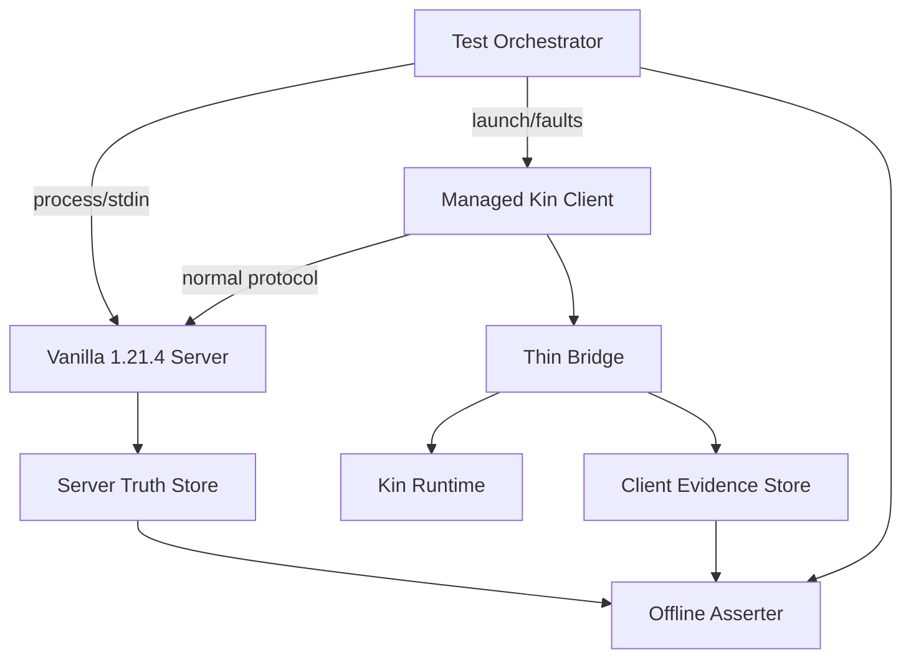
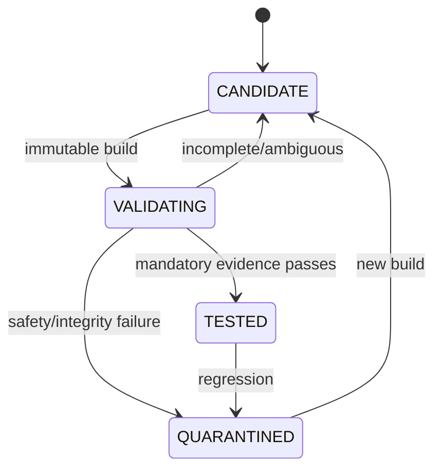

# P0 隔离验证环境、真值与证据包契约

核查时间：2026-09-17。本文定义怎样把 P0 从“有静态依据的 candidate”升级为“有可复核证据的 tested”。它只设计测试环境、测试用例、真值隔离和晋级门禁，不表示已经构建 Bridge、启动 Minecraft、加入服务器或跑过任何用例。

## 固定结论

1. P0 的权威基线是 Minecraft Java 1.21.4 的**官方原版 dedicated server**与真实受管理客户端；Paper、代理服或测试 mod 不能替代原版基线。
2. 另有一组 LAN integrated-world 用例，用来验证默认本地身份、动态端口与真实客户端间连接；LAN 通过不代替 dedicated server。
3. Kin 永远以普通 survival 玩家加入，不授予 op、控制台、RCON、服务端文件或服务器真值权限。
4. Test Orchestrator 可在隔离环境中持有服务器 stdin/stdout、进程控制和只读证据目录；这是**测试侧 oracle**，不得进入 Bridge observation、Runtime belief、Memory、Planner、Skill 或模型上下文。
5. P0 默认外部 VLM 调用为零。测试截图/视频只供人类复核与离线公平校准，不能被回灌为当次 Kin 感知。
6. 一次“看起来能动”的手工演示不是通过。缺 manifest、日志、时间线、预期/实测对照或工件摘要时，用例必须是 `INCOMPLETE`，不能标绿。
7. `p0-core` 与 `p0-nav-exp` 独立评级；Baritone 变体失败不降低已经证明的 core，也不能借 core 的证据声称导航已通过。
8. 实施顺序由[P0 核心原型执行计划](p0-prototype-execution-plan.md)的 W00→W70 门禁约束；前置工作包未通过时，后续结果不得用于晋级，W80导航实验只能在 core 之后运行。

## 为什么需要服务端真值

同版 Yarn 文档把 `MinecraftServer`描述为处理玩家动作、伤害、世界时间和命令的逻辑服务器，并区分 dedicated 与 integrated server；这支持把服务端观察作为测试判据，而不是相信客户端或模型自报。Dedicated server 还具有终端命令入口；P0 首选由 Orchestrator 独占子进程 stdin/stdout，不启用 RCON。

真值只回答“游戏实际上发生了什么”，不回答“Kin 当时应该知道什么”。例如服务端知道玩家坐标，不代表 PlayerMind 可以得到精确坐标；比较工作在测试报告中进行，而不是把 truth DTO 发给 Runtime。

## 测试拓扑与隔离



关键隔离：

- Server/Orchestrator 网络置于本机 loopback、network namespace 或等价私有测试网；`online-mode=false` 的测试服不得暴露公网。
- Dashboard、Runtime 与 Bridge 的服务账号没有 server world、logs、console pipe、oracle database 的读取权限。
- Asserter 在测试结束后读取两侧证据；它不位于实时控制链，也没有向 Runtime/Bridge 回写接口。
- truth 目录只允许 Orchestrator/Asserter 写读；Kin 的 durable memory volume 与 session overlay 均不挂载该目录。
- fixture player 使用另一个真实客户端或 LAN host；其动作在测试清单中标记，不能伪装为环境自然发生。
- 每次 case 使用新的 `test_run_id`、session generation 和干净/已知 world snapshot；不得复用旧 lease、客户端 GUI 或实体引用。

最小部署建议为三个 OS 身份/容器边界：`minekin-test-orchestrator`、`minekin-runtime/client`、`minekin-test-assert`。是否最终使用 systemd、OCI 或 network namespace 由实现原型决定；权限隔离本身是门禁。

## 原版 dedicated server 档案

P0 使用 Mojang 1.21.4 version metadata 指向的 server JAR，记录官方 URL、大小与 SHA-1 `4707d00eb834b446575d89a61a11b5d548d8c001`；运行前接受适用 EULA。JAR 不提交仓库、不默认打进 Minekin 镜像。

测试配置的意图如下，具体字段和值仍须由启动实验读取启动日志并核对：

| 配置 | P0 意图 |
| --- | --- |
| `online-mode=false` | 验证默认本地身份；只用于明确允许该模式的隔离私人测试服 |
| `server-ip` / firewall | 只绑定隔离地址；没有公网路由 |
| `white-list=true` | 仅 Kin 与声明的 fixture 身份可进 |
| `gamemode=survival`、`force-gamemode=true` | Kin 始终走正常生存规则 |
| `pvp=true`、固定 difficulty | 支持伤害/PvP用例并保持环境可重放 |
| 固定 `level-seed` 与 world snapshot | 同一 case 可从相同起点重跑 |
| `enable-rcon=false`、`enable-query=false` | P0 不为方便扩大远程管理面 |
| `enable-command-block=false` | 场景编排由受控 console完成 |
| `broadcast-console-to-ops=false` | 即使未来出现 op fixture，也不把 oracle 输出广播进游戏 |
| `spawn-protection=0` 或远离 spawn 的 fixture | 避免普通玩家被测试配置误阻挡 |

Test Orchestrator 可以在**场景准备或故障注入阶段**通过 server console 执行命令，但要记录原文、时间、预期影响和目标；由命令直接造成的移动、物品或伤害不能计为 Kin 能力。动作结果测试优先让 Kin 自己通过正常客户端完成，再从日志、控制台查询和世界快照交叉确认。

LAN 档案由另一个受管理的真实 1.21.4 host client 开启 integrated world；记录实际动态端口、host bundle、world seed/snapshot 与 host identity。不得把扫描整个局域网作为通过条件，地址来自测试 Server Profile。

## 三条时间线

每个用例至少产生三条只追加时间线：

| 时间线 | 必备字段 | 用途 |
| --- | --- | --- |
| Bridge/Runtime | `run_id`、`session_id`、generation、单调时间、client tick、状态/intent/action/result、lease/capability | 证明何时看见、决定和发出合法输入 |
| Server truth | server process id、world/seed、join/leave、服务端观察身份、命令与响应、位置/物品/伤害/死亡的必要断言 | 证明游戏实际结果 |
| Orchestrator | case/step、进程动作、网络/IPC故障、fixture动作、snapshot restore、wall-clock sync marker | 解释外部刺激与故障 |

跨进程不假定 wall clock 完全同步。Orchestrator 在启动、JOIN 后、故障前后注入带 `sync_marker_id` 的可观察标记，各进程同时记录 wall clock 与 monotonic clock；报告给出误差窗口。动作先后无法在误差窗口内判定时结论必须是 `AMBIGUOUS`，不能强行通过。

## Evidence Bundle

每次 run 产出内容寻址、只读封存的 evidence bundle：

```yaml
schema: minekin.p0.evidence.v1
test_run_id: "<uuid>"
case_id: "P0-CORE-..."
case_version: "<git/blob digest>"
result: "PASS|FAIL|INCOMPLETE|AMBIGUOUS"
bundle:
  launch_plan_digest: "<sha256>"
  minecraft: "1.21.4"
  server_jar_sha1: "4707d00eb834b446575d89a61a11b5d548d8c001"
  loader: "0.16.9"
  fabric_api: "0.119.4+1.21.4"
  bridge_digest: "<sha256>"
  protocol_schema_digest: "<sha256>"
environment:
  os_kernel: "<value>"
  java_runtime: "<vendor/build>"
  cpu_memory: "<summary>"
  renderer_display: "<llvmpipe-or-gpu/display>"
world:
  kind: "dedicated|lan|none"
  server_config_digest: "<sha256>"
  seed_or_snapshot_id: "<controlled ref>"
identity:
  configured_profile: "<redacted ref>"
  server_observed_name_uuid: "<evidence>"
artifacts:
  bridge_trace: "<path,digest>"
  server_truth_trace: "<path,digest>"
  orchestrator_trace: "<path,digest>"
  stdout_stderr: ["<path,digest>"]
  crash_reports: ["<path,digest>"]
  screenshots_video: ["<optional path,digest>"]
assertions:
  expected: ["<machine-readable predicates>"]
  observed: ["<machine-readable values>"]
  failures: ["<reason code>"]
```

日志先脱敏再封存：不含在线 token、秘密、完整聊天或无关玩家位置。原始敏感证据仅保存在受控测试域并有期限；公开报告只发布摘要、哈希和获授权片段。evidence bundle 的 digest 与测试代码/文档 commit 相互引用；修改任一文件都会产生新 run，不覆盖旧结论。

### `world.kind: "none"`：一次没有加入任何世界的运行

L1 的要证内容是"真客户端到主菜单、握手完成、仍是 `OBSERVE_ONLY`"——**这次运行根本没有世界**，而上面那一段把 `world` 当必填，于是这类运行要么写一句假话（`dedicated`），要么写一个真服务器的摘要（更糟）。2026-09-20 补上第三个取值，规则如下：

- `kind: "none"` 表示这次运行**没有加入任何世界**：没有服务端、没有存档、没有连接尝试。它不是"服务端未知"，也不是"暂时不知道"——那些都该失败而不是记成这个值。
- 此时 `server_config_digest` **必须是空文档的 sha256**，即 `e3b0c44298fc1c149afbf4c8996fb92427ae41e4649b934ca495991b7852b855`。这是"没有任何服务端配置"的唯一表示：字段仍然是一个合法摘要（否则它与"摘要缺失"这一失败长得一样），但它的值不可能是任何一份真配置的摘要。这条约束是双向的——校验端拒绝 `kind: "none"` 与非空文档摘要同时出现，也拒绝另外两种 kind 出现空文档摘要，否则这个取值会变成"绕开服务端配置要求"的逃逸口。
- `seed_or_snapshot_id` 写 `none`，`server_jar_sha1` 写空串：这次运行没有用到 jar，也没有种子，写任何值都是编造。
- `identity.server_observed_name_uuid` 为空：没有服务端观察过这个身份，而"服务端观察到什么"不能被客户端自报替代。`identity.configured_profile` 仍然填，因为客户端确实带着一份配置运行过。

这份取值只对**没有世界**的运行成立。L0 那类仓库自检用例（从不启动任何东西）**也走同一份形状**：它的 `inputs` 恰恰就是那份已评审的 bundle 与夹具，因此 `bundle` 段里那些"这次检查的是什么"的字段填的是真值而不是编造，而 `world` 段就是这里的 `none`。2026-09-20 已实测：`W00-CONTRACT-001` 的四条检查被封成一份 bundle、`evidence verify` 通过、晋级报告把它算作该用例的证据。仓库自检的 bundle 不放在任何 Kin 下面（`repo-evidence/<run-id>/`，见[数据根目录提案](run-directory-proposal.md)决定五）。


## 晋级阶梯

| 级别 | 必须证明 | 典型用例 |
| --- | --- | --- |
| L0 Artifact | 官方/Fabric/Bridge/配置摘要一致，固定 mods 无未知项 | 错 hash、缺库、未知 mod、错误 Java 必须 fail closed |
| L1 Bootstrap | 真客户端到主菜单，Bridge hello/握手完成且仍为 `OBSERVE_ONLY` | Runtime 晚启动、错误 nonce/schema/capability、无卡死 |
| L2 Dedicated Join | 默认本地身份加入隔离原版 offline-mode 私服 | JOIN、首 authoritative snapshot、服务端观察身份、正常离开 |
| L3 LAN Join | 加入真实 integrated-world LAN 会话 | 动态端口、host 退出、重连与 generation 更新 |
| L4 Minimal Body | 只有 JOIN+首快照后获得 lease；最小 move/look/use 的结果被服务端确认 | 输入→服务端结果链，不用控制台替 Kin 完成 |
| L5 Failure Safety | 断 IPC、杀 Runtime/client/server、慢消费者、旧 generation、重连均安全 | 松键、撤 lease、无旧对象/危险动作重放 |
| L6 Soak/Resource | 有界持续运行并报告资源与延迟分布 | P50/P95/P99、队列/GC/FPS/TPS/RSS；阈值先测后定 |

上述 L3 只证明 Kin 客户端能加入**另一宿主**开放的 LAN 世界。Kin 自己创建/恢复存档并开放 LAN 是独立的 `host-integrated`晋级面，必须同时按[自建世界存储生命周期](hosted-world-storage-lifecycle-contract.md)的 HOST 用例与[自建世界控制边界](hosted-world-control-boundary-contract.md)的 HOSTCTL 用例另取证；其 Bridge 变体记为 `p0-host-exp`。它不属于 `p0-core`由 candidate 升为 tested 的前置条件，也不能反向借用 L3 结果声称 host tested。

HOST世界保存/恢复另需 `HOSTCOMMIT-001…110` 证据；它验证默认维度、玩家/世界双保存、JointResumeToken、回滚/分叉和唯一Current World激活。缺少该组证据时，`p0-host-exp`不能标记host lifecycle tested。

`p0-core: tested`至少要求 L0–L5 全部 mandatory case 有 PASS evidence，并完成一轮有明确时长和环境的 L6 baseline；性能数字没有人类基线前只报告、不凭空设“优秀”阈值，但下列安全不变量没有宽限。

## 硬失败不变量

- 固定 manifest 外出现未声明 mod：失败；
- JOIN 与首 authoritative snapshot 前授予高层输入 lease：失败；
- 接受旧 session/generation/capability 的动作：必须为 0；
- disconnect、safe-stop、死亡或 GUI generation 失效后留下持续按键：必须为 0；
- ambiguous disconnect 后自动重放 attack/use/GUI 等危险动作：必须为 0；
- test oracle 的坐标、背包、实体、世界或命令结果到达 Runtime belief/action/model 路径：必须为 0；
- 测试截图/Live View 自动进入 VLM 或人物记忆：必须为 0；
- 日志缺失、摘要不符、断言不可重放：不能 PASS；
- Orchestrator 命令造成的结果被记作 Kin 技能成功：失败。

“0”是可观测验收目标，不是零风险宣传；报告仍需说明监测覆盖和残余盲区。

## P0 mandatory case set

1. `CORE-001`：固定 artifact/bundle 清单复核；篡改任一摘要与插入未知 mod。
2. `CORE-010`：到主菜单、hello、握手、OBSERVE_ONLY；Runtime 缺失/晚到/错误协议。
3. `CORE-020`：原版 dedicated offline join；服务端 name/UUID、JOIN首快照与退出。
4. `CORE-030`：LAN join；端口变化、host 退出和重新进入。
5. `CORE-040`：最小合法 move/look/use；Bridge trace 与 server truth 都能解释结果。（2026-09-20 状态：**三种动作都已覆盖，本用例已是 `mandatory: true`**。`use` 已接线（第四条能力 `control.use.v1`、第四条 wire 消息 `UseInput`），并且有一条把它变成服务端可观察的事实的场景：Kin 走向一个摆在三格外的音符盒、撞上去停住、按住 use，服务端每次都被问它是不是还是被摆下去时的状态。六条断言（move 四条 + 转向 + 方块状态改变）在一轮真实运行里全部通过、封存、可验。它是本仓库第一个同时覆盖 move/look/use 的用例。）
6. `CORE-050`：握手前、JOIN前、首快照前的输入全部被拒绝。（2026-09-20 状态：**已有用例 `tests/fixtures/cases/core-050.json`，且已是 `mandatory: true`**。四条断言：账本里有一条 `InputRefused{phase: JOIN_SEEN, refusals: [NOT_PLAYABLE]}`、这次运行**没有任何** `InputLeaseGranted`、客户端日志里**没有** Bridge 按过任何键的那两行、以及服务端自己的读数里 Kin 到达过、却始终在同一个地方。判据来自一次真实运行（`--hold-forward-seconds 30 --hold-at join`，世界照常变成 playable、快照照常被接收，而 Kin 从未被驱动），九件工件、封存、可验。**握手指令之前**那一段由传输层覆盖：尚未 authenticate 的 host 拒绝所有控制命令，有一条契约用例对输入类型与非输入类型各断言一次。）
7. `CORE-060`：逐个强杀 Runtime、Launcher、client、server；验证 lease、松键、回收和重验。（2026-09-20 状态：**按进程边界拆独立 case id**，因为一次运行只能注入一种故障，而 promotion 对一个 case id 采用 any-satisfying-bundle 语义；把互斥故障塞进同一断言集既不可能由一份 bundle 满足，也不能保证每种故障各有一份。原 `CORE-060` 记录 runtime-controller kill；新增 `CORE-060-SERVER-001` 记录 server JVM kill，两者仍为 `mandatory: false`。server 子用例要求同一份证据同时证明：move lease 存在；结构化故障记录精确归属 case/version/run/kin/session/generation，目标为 `server_jvm`，`SIGKILL` 已注入且该进程身份从 `/proc` 消失、没有伪造 wait status；服务端日志没有 `Stopping the server` 与 `All dimensions are saved`；账本从 `PlayableEstablished` 进入 `SessionInterrupted{phase: DISCONNECTED}`；Bridge 以 `LEFT_PLAYABLE (PLAY_ENDED)` 非零松键。每一项都有负向变异测试。**本仓库 Runtime 与 Launcher 是同一个进程**，所以不虚构 launcher 独立边界；client kill 与完整回收/重验子用例仍未完成，L5 仍不算 complete。故障 helper 仍由本 run 已持有的 root pid 推导唯一目标，记录 `/proc` 身份并在发信号前复核、SIGKILL 后等待该身份消失；它不是目标父进程，因此只能声明 `IDENTITY_DISAPPEARED`，不能声明 `WAIT_STATUS`。**server 子用例已有一轮真实运行**（2026-09-20，受控域里 Kin 走着时强杀 server JVM）：五条断言全部成立、bundle 封存且 `verified: true`，账本按同一 session 记下 `PlayableEstablished → InputLeaseGranted{control.move.v1} → SessionInterrupted{DISCONNECTED}`，客户端自己报 `released 1 input(s) after LEFT_PLAYABLE (PLAY_ENDED)`，服务端日志停在半句上。**仍未完成的边界**：client kill 与「回收/重验」没有独立子用例，L5 因此仍不算 complete；`/proc` 的实际读取路径现在有一条真实运行覆盖（此前只有注入 procfs 的单测）。）
8. `CORE-070`：断线/半帧/慢消费者/事件洪水；有界背压且无危险重放。（2026-09-20 状态：**已有用例 `tests/fixtures/cases/core-070.json`，且已是 `mandatory: true`**，四条断言都由测试执行——它证的是**通道**的行为，而唯一能被按需驱动到那些状态的端是测试对端；`tests/contract/test_bridge_ipc_host.py` 三条：半个帧被拒（长度头说了 N 只来了 M，通道按故障读而不是按短读读）、超过协商上限的帧在**分配之前**被拒、事件洪水在**有界队列**上溢出时清空缓冲并只留下一个错误（慢消费者就是反方向的洪水，所以这是同一条规则）；`tests/unit/test_session_supervision.py` 一条：世界在 lease 还在 Core 手上时消失、且报告**没有**失败原因（本仓库自己的判据：带原因是服务端结束了会话，不带原因是会话自己结束了），Core 不能从中知道最后那条命令是否到达——安全的答案是**不再重复它**。这一条做过变异验证：把那条命令在断线时重发一次，用例立刻变红。**断线那一半由运行取证**（`ADMIT-110` 的黑洞与 `CORE-060` 的杀 Core 都是从另一侧结束一次会话），**Bridge 侧的同一个有界队列**（Java `BoundedChannel`）不在本用例里：仓库自检类用例能驱动的只有 python 侧。)
9. `CORE-080`：故意向 oracle 放置 Kin 未看见的事实；检查所有 Runtime/Memory/模型输入均不存在该事实。
10. `CORE-090`：正常退出与崩溃恢复；同一 `kin_id`，瞬时状态失效，世界状态重新观察。
11. `ADMIT-001…110`：验证可信 profile、host/port与SRV、地址策略、正常客户端 login/JOIN/首快照、资源包门禁、取消/晚回调、重连和离线身份映射；TCP连接、INIT或 screen状态不得单独判成功。（2026-09-20 状态：`ADMIT-100` 被定义为**服务端拒绝**这一条——目标启动并接受登录握手，然后在白名单上说不——判据是两处记录都说同一件事：账本里 `phase: FAILED` 配 `…WHITELIST_REJECTED` 这个类别，客户端日志里 Bridge 自己那行分类；`ADMIT-110` 是**这一组里的另一条**——「目标接受连接却从不回应时，Core 在自己的 deadline 上放弃这次尝试，并且这件事到达了客户端」——用例文件 `tests/fixtures/cases/admit-110.json`，目前 `mandatory: false`，因为这一组其余部分还没有定义。）
12. `ADMIT-120`：服务端 oracle 放置身份/位置 canary；只允许在 run结束后由验收器交叉核对，不得进入 Runtime、Memory、prompt或行动路径。
13. `NAV-EXP-010`：只在 core tested 后运行，核 Baritone mixin、输入仲裁、取消尾部和隐藏真值越界；单独给 `candidate/tested/quarantine`。

失败用例保留完整 evidence。修复后用新 build/case version 重跑，不把旧 FAIL 删除，也不手工改为 PASS。

## Candidate → Tested 状态机



只有 Registry 的 promotion job 能写 bundle 状态；Dashboard 只能发起 run、查看证据和执行 stop，不能手工把 candidate 点成 tested。promotion job验证 case 列表、版本、evidence digest、签名/权限和不变量；任何 case 的 bundle digest 不一致都不合并。

## 仍待原型冻结

- vanilla console 输出的稳定解析格式，以及必要断言应使用控制台查询还是停服后的世界只读快照；
- integrated-world host 的自动准备与干净 snapshot 恢复方法；
- Linux 软件渲染/GPU 两档的 L6 时长和资源基线；
- 真值防回流的 OS 权限、网络策略与自动 taint 测试实现；
- fixture player 是否首轮用人工操作的第二客户端，还是另一个严格脚本化受管理客户端；
- evidence bundle 的签名、保留期与公开脱敏格式。

这些是可在原型中比较的实现选择，不改变“原版真客户端、普通玩家权限、测试 oracle 隔离、无证据不晋级”的方向。当前没有任何 P0 run，项目仍不能标记 `tested` 或宣布进入正式开发。
